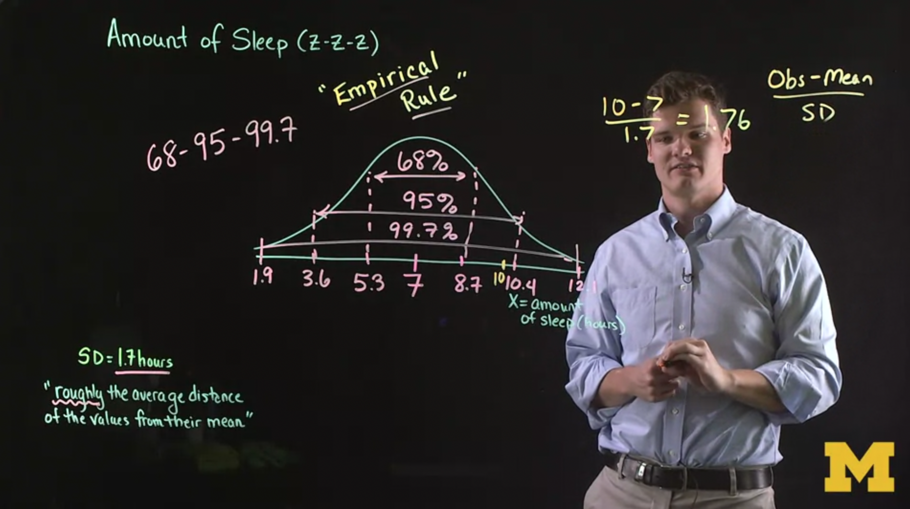
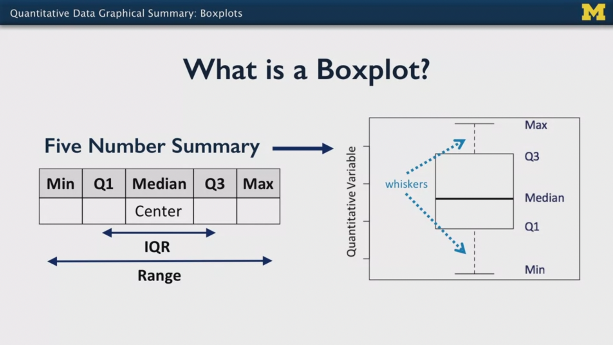
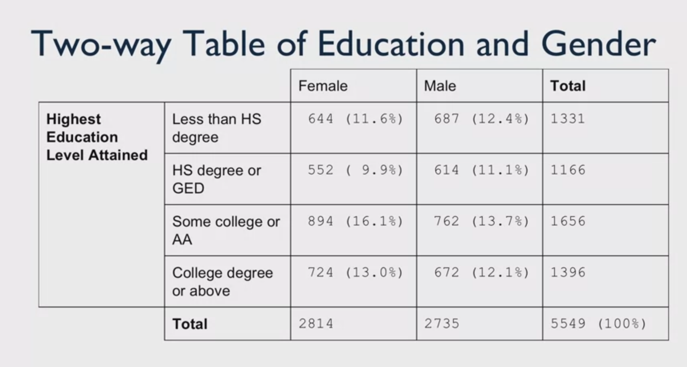
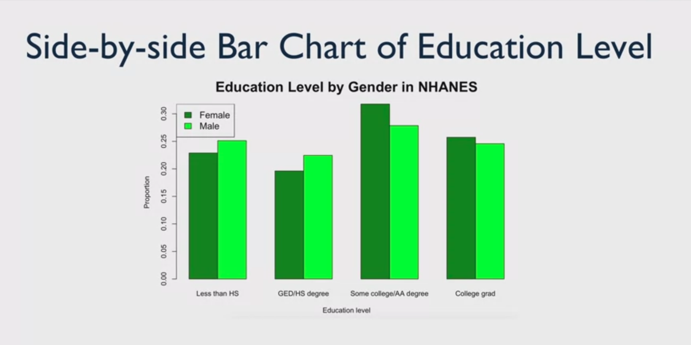
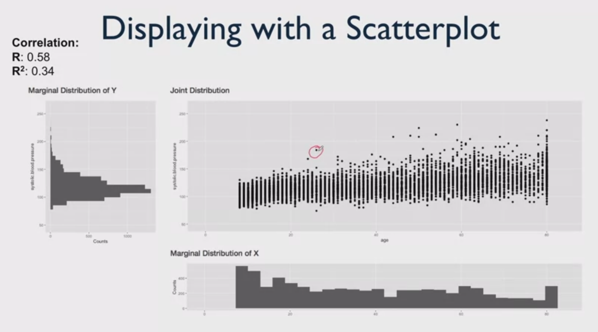
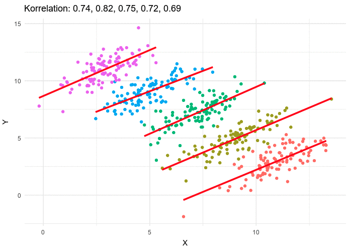

# Statistics with Python: Understanding and Visualizing Data with Python

My personal notes taken while following the Coursera Specialization ["Statistics with Python"](https://www.coursera.org/specializations/statistics-with-python), from the University of Michingan, hosted by Prof. Dr. Brenda Gunderson and colleagues.

The Specialization is divided in three courses and each one has a subfolder with the course notes.

1. [Understanding and Visualizing Data with Python](https://www.coursera.org/learn/understanding-visualization-data?specialization=statistics-with-python): `01_Visualization` 
2. [Inferential Statistical Analysis with Python](https://www.coursera.org/learn/inferential-statistical-analysis-python?specialization=statistics-with-python): `02_Inference`
3. [Fitting Statistical Models to Data with Python](https://www.coursera.org/learn/fitting-statistical-models-data-python?specialization=statistics-with-python): `03_Fitting_Models`

The present file is a guide or compilation of notes of the first course: **Understanding and Visualizing Data with Python**.

Mikel Sagardia, 2022.
No warranties.

Overview of contents:

1. What is Statistics?
2. What is Data?
   - 2.1 Where Do Data Come From? Data Sources: Organic vs. Designed
   - 2.2 Variable Types: Quantitative vs Categorical
   - 2.3 Study Design Types
   - 2.5 Power and Bias
   - 2.6 Data Management and Manipulation
3. Python Intro + Jupyter Notebooks: `./lab/01_DataManagement.ipynb`.
   - Pandas DataFrames: Intro with the Cartwheel Dataset
     - Selection
     - Group By
   - Pandas DataFrame - NHANES Dataset
   - Python guidelines
      - Cheatseets: NUmpy, Pandas, Scipy, Matplotlib
      - Style guidelines (based on Google)
4. What Can You Do with **Univariate** Data?
   - 4.1 Categorical Data: Tables, Bar Charts & Pie Charts
   - 4.2 Quantitative Data: Histograms
   - 4.3 Quantitative Data: Numerical Summaries = Quantiles
   - 4.4 Empirical Rule & Standard Score
   - 4.6 Commenting Graphs
   - 4.7 Links and Modern Infographics
5. Python for **Univariate** Data Analysis: Two **very important** Notebooks:
   - `02_PythonLibraries.ipynb`
     - Numpy
     - Scipy
     - Matplotlib
     - Seaborn
     - Extra Seaborn: Tables, Histograms, Boxplots
   - `03_CaseStudy_NHANES.ipynb`
     - Categorical Data: Frequency Tables
     - Quantitative Variables: Numerical Summaries
     - Graphical Summaries: Histograms & Boxplots
     - Stratification
     - Practice exercises: **Particularly the advanced stratifications with `groupby` are the most interesting**
6. What Can You Do with **Multivariate** Data?
   - 6.1 Multivariate Categorical Data: Associations
   - 6.2 Multivariate Quatitative Data: Associations
   - 6.3 Simpon's Paradox
   - 6.4 Interesting Links/Examples of Data Visualization
   - 6.5 Pizza Study Design Memo: Exercise / Assignment (Peer-Evaluated)
7. Python for **Multivariate** Data Analysis

## 1. What is Statistics?

Statistics is a set of methods that can be applied to learn insights from data.

A "statistic" is a numerical of graphical summary of the data: average, percentage, minimum, etc.

The field of statistics is evolving and new toold are appearing able to tackle problems impossible until recently; for instance: Big Data.

Note that data can be missleading; statistics has tools to avoid missunderstandings and inform for a better decision-making. For instance: data summarization for better uderstanding. Note that we often talk about central values (e.g., averages) when we summarize, but the variation is as important as the central value.

The different perspectives of statistics:
- summarizing
- science of uncertainty
- science of decisions
- science of variation
- art of forecasting
- science of measurement
- basis for principled data collection

Probability pre-dates statistics: it deals with probability distributions, randomness and uncertainty.
Data science uses statistics, but introduces new technical disciplines, such as databases, machine learning techniques, etc.

## 2. What is Data?

Data can be represented in numbers, images, words, audio.

Some cool visualizations from [https://flowingdata.com](https://flowingdata.com):

- [A Day in the Life of Americans](https://flowingdata.com/2015/12/15/a-day-in-the-life-of-americans/)
- [A Day in the Life: Work and Home](https://flowingdata.com/2017/05/17/american-workday/)
- [Most Common Use of Time, By Age and Sex](https://flowingdata.com/2015/11/30/most-common-use-of-time-by-age-and-sex/)

### 2.1 Where Do Data Come From? Data Sources: Organic vs. Designed

We distinguish two types of data:

1. Organic or process data: we collect data of phenomena that have occurred naturally: weather, etc.
   - Big Data uses these types of datasets, which can become enormous
   - In the case of Big Data, storing and accessing those data is a challenge and a research topic
2. "Designed" data collection: we collect data of experiments or samplings we have created
   - Individuals are sampled from the complete population and some data is collected
   - Usually, these datasets are smaller and much easier to work with, at least computationally

A general question for datasets is wether they are **i.i.d.** = **independent and identically distributed**. It is the case if

- Each observation of a sample is independent from all the others
- The values that we are observing arise from some common (same?) distribution

Having i.i.d. datasets allows us to make some assumptions and use some statistical tools. However, data is not always like that; examples in test scores:

- Students who sit next to each other tend to have similar scores
- Males and females might have different means
- Students from the same discussion section may have similar scores

In the case of not i.i.d data, we need to apply other statistical procedures.

We need to consider where data comes from in order to decide which assumptions and tools to apply.

### 2.2 Variable Types: Quantitative vs Categorical

- Quantitative variables:
  - continuous (height; also age is considered continuous)
  - discrete (members in a household).
- Categorical variables: 
  - ordinal: groups have ranking (role ranking: junior, senior, etc.)
  - nominal: groups have merely names (race)

### 2.3 Study Design Types

There are many types of study designs and sometimes it is hard to classify one study to belong to a type.

Some notions:
- **Exploratory vs Confirmatory** studies
  - Exploratory studies collect data without first pre-specifying questions
  - Confirmatory studies suggest a falsifiable hypothesis and they test it; so they collect data for that. That is more related to the scientific method
- **Comparative vs Non-Comparative** studies
  - We often compare different treatments of a thing: a medicine, etc.
  - But there are other studies that simply try to predict something without any comparison
- **Observational vs Experimental**
  - Observational studies treat the subjects in the same group and insights arise from observation; it is said that the subjects are exposed to conditions, whereas in experimental studies they are said to be assigned
  - Experimental studies are more structured and divide often subjects into groups for targeted experiments

### 2.5 Power and Bias

**Power analysis**: process to assess whether a given study design will lead to meaningful results.

**Bias**: Measurements that are systematically off-target or sample is not representative of population of interest. Observational studies are specially vulnerable to it.

### 2.6 Data Management and Manipulation

The general shape and properties of a dataframe table is explained in a text: subject x variables.
Nothing special to be noted here, except some terminology:
In *repeated measures* tests, data can be stored in *wide* or *long* format.
Repeated measures studies measure dependent variables of the same subject under different treatments or conditions:
- wide format refers to teh fact that each subject has a row with more columns, related to the outcomes of different treatments
- long format refers to the fact that each subject-treatment is a row

## 3. Python Intro + Jupyter Notebooks

Very few comments made here, since I have year-long experience with python and Jupyter.

Interesting link on Markdown: [Markdown reference/cheatsheet](https://github.com/adam-p/markdown-here/wiki/Markdown-Cheatsheet).

We can create our own notebooks in the course environment/workspace.

After a brief python introduction, `pandas` basics are shown and the two main datasets used throughout the course are tried. The following notebook summarizes it all:

`./lab/01_DataManagement.ipynb`.

The contents in the notebook:

1. Pandas DataFrames: Intro with the Cartwheel Dataset
   - Selection
   - Group By
2. Pandas DataFrame - NHANES Dataset
3. Python guidelines
   - Cheatseets: NUmpy, Pandas, Scipy, Matplotlib
   - Style guidelines (based on Google)

## 4. What Can You Do with Univariate Data?

### 4.1 Categorical Data: Tables, Bar Charts & Pie Charts

Categorical data classifies the samples into groups; e.g.: marital status in the NHANES dataset.
We can summarize this data with **frequency tables**: count & percept per group/class.
We can visualize these data with **bar charts** or **pie chart**.
- Pie charts are not recommended, since not so intuitive and small parts hard to see
- We can order nominal data from larger to smaller

### 4.2 Quantitative Data: Histograms

Whenever we can quantitative data (discrete: age, continuous: height), the **histogram** is a perfect tool to analyze the distribution of the data and get a first idea of what is happening. Four main aspects observed:
- **Shape**: symmetric, left/right skewed (skew side is where the tail is), bell-shaped, unimodal (one peak = mode) / bimodal, etc.
- **Center**: mean & median (1/2 area); note that the mean is on the side of the tail (it is sensitive to the extreme observations) and the median on the side of the peak (mode). In general, the median is considered a robust center estimation, in contrast to the mean.
- **Spread**: Range (max - min), Inter-Quartile Range, Standard deviation & variance. A standard deviation S means that on average samples are the about S points away from the mean (important insight).
- **Outliers**: data points far from the bulk. With skewed distributions they appear usually. If considerable outliers, we can also ay where most of the area/mass is.
s
These four aspects are summarized in 1-2 sentences if the data distribution is described in text.

### 4.3 Quantitative Data: Numerical Summaries = Quantiles

Five summary values are given for a distribution, which are the **min and max values** and **the quartiles 25% (Q1), 50% (Q2 = median), 75% (Q3)**. 

The IQR is: `IQR = Q3(75%)-Q1(25%)`. Typically, when the data is skewed, we provide the IQR, since it describes better where most of the data is.

### 4.4 Empirical Rule & Standard Score

In a bell-shaped curve we often have a normal distribution $N(\mu,\sigma)$.
The **empirical rule of 68-95-99.7** tells us the percentage of samples that lie in ranges:
- 68% of samples are 1 standard deviation away from the mean: $\mu \pm \sigma$; note that the range is $2\sigma$.
- 95% of samples are 2 standard deviations away from the mean: $\mu \pm 2\sigma$
- 99.7% of samples are 3 standard deviations away from the mean: $\mu \pm 3\sigma$

The **standard score** is also known as the **Z-score** for the normal distribution; it tells us how far away a measurement/sample is from the mean and on which side:

$Z = \frac{x - \mu}{\sigma}$

Note that SS tells precisely how many $\sigma$ units our sample is from the mean. Additionally, recall the empirical rule in that sense.

Thus:
- If SS is close to 0, we are close to the mean
- If SS < 0, we are below the mean, if SS > 0, above
- The bigger the absolute of SS, the further away from the mean



### 4.5 Quantitative Data: Box Plots

Any distribution of quantitative data can be visualized with a box plot.
A box plot is a graphical representation of the quartiles or the five-value summary: min, max, 25%, median, 50%, IQR.
Additionally, if the whiskers are not set in the min/max locations, outliers can be detected.
There is a technique for that.

Note on the outliers and the length of the whiskers:

- if no outliers plotted, whiskers are min and max
- if outliers plotted, whiskers are largest/lowest points inside the range defined by 1st or 3rd quartile + 1.5*IQR 

if there are no individual data points plotted, the whiskers indicate data’s minimum and maximum. If there are individual data points plotted, the whiskers indicate the largest/lowest points inside the range defined by 1st or 3rd quartile plus 1.5 times IQR.

Most interesting box plots appear when we plot different groups together, i.e., when we facet the same quantitative variable of different qualitative variables (groups). For example:
- Blood pressure by age ranges and gender.
- Iris dataset: sepal length by species.



Nice interactive plotting example: [https://markkurzejaumich.shinyapps.io/bivariate_analysis/](https://markkurzejaumich.shinyapps.io/bivariate_analysis/).

### 4.6 Commenting Graphs

Quiz/assignment in which several graphs were shown and they needed to be described, highlighting the insights in them.

### 4.7 Links and Modern Infographics

Interesting links from [The New York Times: What's Going on in This Graph?](https://www.nytimes.com/column/whats-going-on-in-this-graph), which encourages discussions on graphs:
- [Climate](https://www.nytimes.com/interactive/2018/05/03/learning/08WGOITGraphLN.html)
- [Nutrition](https://www.nytimes.com/2017/10/09/learning/whats-going-on-in-this-graph-oct-10-2017.html)
- [Essay publishing](https://www.nytimes.com/interactive/2018/02/08/learning/13WGOITGraphLN.html)

Infographics are increasing in popularity; a few caveats or points to assess their quality:
- Look at the scale of each dimension
- If areas/volumes are shown, be aware of missinterpretation due to the fact that areas/volumes grow quadratically/cubically in terms of the size variable

Some interesting links:
- [History of Infographics](https://www.smithsonianmag.com/history/surprising-history-infographic-180959563/)
- [How to Read Infograhics](https://www.themarginalian.org/2013/10/08/best-american-infographics-david-byrne/)

## 5. Python for Univariate Data Analysis

This section consists on lab sessions condensed in the following notebooks:

- `01_DataManagement.ipynb`
- `02_PythonLibraries.ipynb`
- `03_CaseStudy_NHANES.ipynb`

In the following, the most important commands/functions are summarized:

### 5.1 `01_DataManagement.ipynb`

```python
import numpy as np
import pandas as pd

### Cartwheel

url = "Cartwheeldata.csv"
df = pd.read_csv(url)

df.head()
df.describe()
df.columns
df.dtypes

df.loc[:,"CWDistance"]
df.loc[:,["CWDistance", "Height", "Wingspan"]]
df.loc[:9, ["CWDistance", "Height", "Wingspan"]]
df.loc[10:15]

df.iloc[:4]
df.iloc[1:5, 2:4]

df.Gender.unique()

df.groupby(['Gender','GenderGroup']).size()
df.groupby(['Gender','GenderGroup']).sum()

### NHANES

url = "nhanes_2015_2016.csv"
da = pd.read_csv(url)

w = da["DMDEDUC2"]
x = da.loc[:, "DMDEDUC2"]
y = da.DMDEDUC2
z = da.iloc[:, 9]

print(pd.isnull(da.DMDEDUC2).sum())
print(pd.notnull(da.DMDEDUC2).sum())

```

### 5.2 `02_PythonLibraries.ipynb`

```python

## -- Numpy

import numpy as np

a = np.array([1,2,3])
b = np.array([[1,2],[3,4]])
b.shape
print(b[0,0], b[0,1], b[1,1])

d = np.zeros((2,3))
e = np.ones((4,2))
f = np.full((2,2), 9)
g = np.random.random((3,3))

h = np.array([[1,2,3,4,], [5,6,7,8], [9,10,11,12]])
i = h[:2, 1:3]
i[0,0] = 1738

x = np.array([[1,2],[3,4]], dtype=np.float64)
y = np.array([[5,6],[7,8]], dtype=np.float64)
x+y
x-y
x*y
x/y

np.sqrt(x)
np.mean(x)

np.sum(x)
np.sum(x, axis=1)

## -- Scipy

from scipy import stats

np.random.seed(282629734)

v = stats.norm.rvs(size = 10)
x = stats.t.rvs(10, size=1000)

stats.norm.cdf(np.array([1,-1., 0, 1, 3, 4, -2, 6]))

## -- Matplotlib

import matplotlib.pyplot as plt

# One plot
x = np.arange(0, 3 * np.pi, 0.1)
y_sin = np.sin(x)
y_cos = np.cos(x)
plt.plot(x, y_sin)
plt.plot(x, y_cos)
plt.xlabel('x axis label')
plt.ylabel('y axis label')
plt.title('Sine and Cosine')
plt.legend(['Sine', 'Cosine'])
plt.show() # add it if not Jupyter, but python script

# Subplots
x = np.arange(0, 3 * np.pi, 0.1)
y_sin = np.sin(x)
y_cos = np.cos(x)
plt.subplot(2, 1, 1)
plt.plot(x, y_sin)
plt.title('Sine')
plt.subplot(2, 1, 2)
plt.plot(x, y_cos)
plt.title('Cosine')
plt.show()

## -- Seaborn

import seaborn as sns
import matplotlib.pyplot as plt
import pandas as pd

url = "Cartwheeldata.csv"
df = pd.read_csv(url)

# Linear regression
sns.lmplot(x='Wingspan', y='CWDistance', data=df)
# Scatterplot with hue
sns.lmplot(x='Wingspan', y='CWDistance', data=df,
           fit_reg=False, # No regression line
           hue='Gender')   # Color by evolution stage

# Swarmplot
sns.swarmplot(x="Gender", y="CWDistance", data=df)

# Boxplots: several variables with data
sns.boxplot(data=df.loc[:, ["Age", "Height", "Wingspan"]])
sns.boxplot(data=df.loc[df['Gender'] == 'M', ["Age", "Height", "Wingspan"]])
# Boxplots: one grouped variable with x & y
sns.boxplot(x = df['Age'], y = df['Gender'])

# Histograms
sns.distplot(df.CWDistance)
sns.histplot(df.CWDistance)

# Countplot
sns.countplot(x='Gender', data=df)

## -- Extra Seaborn: Tables, Histograms, Boxplots

import seaborn as sns
import matplotlib.pyplot as plt

tips_data = sns.load_dataset("tips")
# total_bill: amount
# tip: amount
# time: lunch, dinner
# smoker: yes, no

# One Histogram
p = sns.distplot(tips_data["total_bill"], kde = False)
p.set_title("Histogram of Total Bill")

# Two overlapping histograms
sns.distplot(tips_data["tip"], kde = False).set_title("Tip & Bill")
sns.distplot(tips_data["total_bill"], kde = False)
plt.xlabel('Total bill and tip')
plt.legend(['tip','total_bill'])
plt.show()

# Boxplot: One
sns.boxplot(tips_data["total_bill"])

# Boxplot: Two Overlapping
sns.boxplot(tips_data["total_bill"])
sns.boxplot(tips_data["tip"]).set_title("Bill & Tiü")
plt.show()

# Boxplot: grouping (y) of a variable (x)
sns.boxplot(x = tips_data["tip"], y = tips_data["smoker"])

# FacetGrid: create cells for the values of a categorical variable (time)
# and plot a cursom plt type (hist) of a variable (time)
g = sns.FacetGrid(tips_data, row = "time")
g = g.map(plt.hist, "tip")

```

### 5.3 `03_CaseStudy_NHANES.ipynb`

This is a **very important** notebook that should be read carefully.
The [NHANES Dataset](https://wwwn.cdc.gov/nchs/nhanes/Default.aspx) is analayzed as a case study.
The variable codenames can be found [here](https://wwwn.cdc.gov/Nchs/Nhanes/2015-2016/DEMO_I.htm).

Contents:

1. Categorical Data: Frequency Tables
2. Quantitative Variables: Numerical Summaries
3. Graphical Summaries: Histograms & Boxplots
4. Stratification
5. Practice exercises: **Particularly the advanced stratifications with `groupby` are the most interesting**

In the following, the most important commands are collected:

```python

## -- 1. Categorical Data: Frequency Tables

da.DMDEDUC2.value_counts()
da.DMDEDUC2.value_counts().sum()
pd.isnull(da.DMDEDUC2).sum()

# Replace categorical variable values/levels with more human-readable categories
da["RIAGENDRx"] = da.RIAGENDR.replace({1: "Male", 2: "Female"})

# Consider NA values if necessary
da["DMDEDUC2x"] = da.DMDEDUC2x.fillna("Missing")
x = da.DMDEDUC2x.value_counts()
# Percentage/Frequency
x / x.sum()

## -- 2. Quantitative Variables: Numerical Summaries

# Note: use dropna() before applying any describe()
da.BMXWT.dropna().describe()

# People with hypertension? Apply logical operators
a = (da.BPXSY1 >= 120) & (da.BPXSY2 <= 139)
b = (da.BPXDI1 >= 80) & (da.BPXDI2 <= 89)
print(np.mean(a | b))

## -- 3. Graphical Summaries: Histograms & Boxplots

# Histograms: watch out number of bins
sns.histplot(da.BMXWT.dropna(),kde=True,stat='density')

# Boxplots: data - several variables plotted
bp = sns.boxplot(data=da.loc[:, ["BPXSY1", "BPXSY2", "BPXDI1", "BPXDI2"]])
bp.set_ylabel("Blood pressure in mm/Hg")

## -- 4. Stratification

# Create age strata based on these cut points
da["agegrp"] = pd.cut(da.RIDAGEYR, [18, 30, 40, 50, 60, 70, 80])
da["agegrp"].value_counts()

# Boxplots: x & y -- variable in groups plotted, great for stratified data
# hue: additional grouping
plt.figure(figsize=(12, 5))
sns.boxplot(x="agegrp", y="BPXSY1", data=da)
sns.boxplot(x="agegrp", y="BPXSY1", hue="RIAGENDRx", data=da)

# Stratification for Categorical Variables
da.groupby("agegrp")["DMDEDUC2x"].value_counts()s

# Advanced stratifications for categorical variables
dx = da.loc[~da.DMDEDUC2x.isin(["Don't know", "Missing"]), :] 
dx = dx.groupby(["agegrp", "RIAGENDRx"])["DMDEDUC2x"]
dx = dx.value_counts()
dx = dx.unstack() # long vs wide
dx = dx.apply(lambda x: x/x.sum(), axis=1)
print(dx.to_string(float_format="%.3f"))

## -- 5. Practice exercises

# Advanced stratifications for categorical variables

dx = da[(da['RIDAGEYR']>30) & (da['RIDAGEYR']<=40)]
dx = dx.groupby(["RIAGENDRx","DMDEDUC2x"])["DMDHHSIZ"].median()
dx

dx = da.groupby(["SDMVSTRA","SDMVPSU","RIAGENDRx"])[["RIDAGEYR","BMXHT","BMXBMI"]].mean()
dx

dx1 = da.groupby(["SDMVSTRA","SDMVPSU","RIAGENDRx"])[["RIDAGEYR","BMXHT","BMXBMI"]].quantile(0.25)
dx2 = da.groupby(["SDMVSTRA","SDMVPSU","RIAGENDRx"])[["RIDAGEYR","BMXHT","BMXBMI"]].quantile(0.75)

dx=dx2-dx1
dx

dx.max()/dx.min()

```

## 6. What Can You Do with **Multivariate** Data?

A data set is multivariate when we **measure more than one thing** for each sample.

When we have multivariate data, instead of analyzing each variable separately, **we are interested in the relationships or associations between them!**

These associations are often analyzed or plotted by pairs of variables.

### 6.1 Multivariate Categorical Data: Associations

Example of a multivariate categorical dataset: samples that contain data on: `gender`, `education level`, `marital status`, `age group`.
It is multivariate because we measure more than one thing!

Now, our research question that analyzes an association: What factors influence the highest education level?

For that purpose, we can build table in which we compute the counts and frequencies of each education level (rows) against the levels of the other categorical variables one by one:



We can also plot a side-by-side **bar chart** (better percentages within a group than counts):



Similar charts/plots
- Stacked bar charts: stacked on top of each instead of side-by-side
- Mosaic plots: areas proportional to population percentages

### 6.2 Multivariate Quatitative Data: Associations

Example of a multivariate quantitative dataset: samples that contain data on: `body mass index`, `blood pressure`, `cholesterol level`, `age`.
It is multivariate because we measure more than one thing!

Instead of plotting the histogram of each variable independently, we plot a **scatteplot** for pairs of variables.

In a scatter plot we can further see associations:
- Type:
  - Linear
  - Quadratic
  - No association
- Direction (slope): sign of the Pearson correlation $R \in [-1,1]$
  - Positive (increases)
  - Negative (decreases)
- Strength: value of the Pearson correlation $R \in [-1,1]$
  - Weak: widde spread
  - Moderate: smaller spread
  - String: narrow spread

Notes:
- A high Pearson correlation $R \in [-1,1]$ value does not imply causation. The might be another variable associated to the analyzed pair which is causing their behavior.
- We might want to display relevant groups (categirical data) in the scatterplots to get further insights; for instance `age` vs `blood pressure` and points colored according to `gender`.



Tool for online plotting of bivariate continuous data:

[Scatterplot examples](https://markkurzejaumich.shinyapps.io/bivariate_analysis/)

### 6.3 Simpon's Paradox

[Simpson's Paradox](https://en.wikipedia.org/wiki/Simpson%27s_paradox): Pitfall in statistics "in which a trend appears in several groups of data but disappears or reverses when the groups are combined. This result is often encountered in **social-science and medical-science** statistics, and is particularly problematic when frequency data is unduly given causal interpretations. The paradox **can be resolved when confounding variables and causal relations are appropriately addressed** in the statistical modeling." (Wikipedia).

In other words, **a trend for your total data is different then the trend for the same data devided by groups**.

Image of the Simpson's paradox, from the Wikipedia:



See examples in Wikipedia:
- UC Berkley admissions, gender bias?
- Kidney stone treatment: one tratment seemed to be better than the other, but when cases separated into stone size, the other treatment had better success rations within each group.

I think that the kidney stone tratment is a good example. Within group ratios, one treatment seems to be better, but looking at the overall without group classification, the other treatment is. It seems to me that **when the sizes of the groups are quite different, the risk of having such reverse effects arises or becomes higher**.

### 6.4 Interesting Links/Examples of Data Visualization

- [Selfies](http://selfiecity.net/selfiexploratory/)
- [Income Inequality](https://ourworldindata.org/income-inequality)
- [Marrying age](https://flowingdata.com/2016/03/03/marrying-age/)
- [City rankings: Profit, Social, Environment](https://www.nationalgeographic.com/environment/graphics/sustainable-cities-graphic-urban-expeditions)

### 6.5 Pizza Study Design Memo: Exercise / Assignment (Peer-Evaluated)

Write Memorandum to small Pizza company CEO on a study design in which properties of their pizzas will be collected and contrasted against their main big competitor. Then, the study is published in marketing campaign. 300-500 words.

- Describe how to conduct study / collect data.
- Focus on 1-2 strengths: amount of toppings, speed of service, customer satisfaction.
- Include research questions + variables to be analyzed.
- How would data be summarized? Numerically and graphically.
- CEO has basic statistic literacy (peers).
- [Sample memorandum](https://owl.purdue.edu/owl/subject_specific_writing/professional_technical_writing/memos/sample_memo.html)
#### Memorandum Text (Submitted)

This document summarizes a study design which aims to compare our company (Small Pizza) with our biggest competitor, Big Pizza. The goal is to conduct the research and present the most important insights in a marketing campaign.

In the following, these aspects are covered:
- Study design: how will we collect the data?
- Research questions: which characteristics would we like to contrast and which variables are we going to collect for that purpose?
- Presentation proposals: how will the data be summarized and portrayed for the most impactful effects on the target audience?

**STUDY DESIGN**

The survey will be conducted on the first 3 Fridays and Saturdays of February, from 4 PM to 10 PM (6 days altogether). That time frame is the one with most visits in our restaurants, as well as with the most varied customer segments. That will guarantee independent and identically distributed data.

There will be an employee at the entrance/exit of each restaurant requesting customers to participate in a brief anonimous questionnaire (no more than 3 minutes). As a bonus, each participant will receive a lottery ticket for 10 pizzas at Small Pizza.

The design of the questionnaire will be
- confirmatory: the hypotheses built from our employee insights will be tested (see next section);
- constrastive: we will focus on our restaurant, but customers will be asked to evaluate our competitors, too;
- observational: customers should be picked randomly during the survey, but stratification or grouping should be tested during the exploratory analysis (i.e., insights according to customer background, such as age and gender).

**RESEARCH QUESTIONS**

In past exploratory studies our direct client service employees have collected the feedback of our customers. We will focus on three key observations that have appeared frequently:
- Our pizza dough is the most authetic our customers have tasted: thin and crispy.
- Our employees are very friedly.

These remarks are aligned with the soul and mission of Small Pizza: we are a family-run chain of pizza restaurants which aims to bring real Italian pizzas to our customers, making them have a great time in a friendly atmosphere -- as in the Toscana.

Questionnaire:
1. General backgroud: 1.1 Gender (M/F/D), 1.2 Age Range (10s, 20s, ...), 1.3 Number of clients
2. How often do you eat pizza every month?
3. For the following aspects related to eating pizza: Dough, Toppings, Variety of options, Friendly and helpful service, Fast service
  3.1 Which are the 2 most importantones for you? 
	3.2 Evaluate if we are one of the bests or the bests in each aspect (Not at all, No, Not sure, Yes, Yes definitely)
	3.2 Evaluate if our competitor(s) are/is one of the bests or the bests in each aspect (Not at all, No, Not sure, Yes, Yes definitely)

**PRESENTATION PROPOSALS**

An exploratory analysis will be performed with and without stratification or grouping (according to gender and age). Since most of the variables are categorical, the data presentation will consist in summary tables (with absolute and frequency values) as well as bar charts; the levels will be ordered, since we have ordinal variables.

The two most important insights (from question 3.1) aligned with our essence and mission will be chosen and presented in contrast to our competitors. A possible marketing pitch could be built following this scheme:

*We show the bar chart with frequencies from question 3.1 (important pizza aspects) and add the text/audio:*

*"The two most important characteristic our customers value in a pizza service are A and B. X% of our customers think we are one of the best in achieving them, if not the best, whereas our competitor(s)... "*

However, the concrete content and formulation is to be decided after looking at the data.

## 7. Python for **Multivariate** Data Analysis

`04_Multivariate_Data_Selection.ipynb`

`05_Multivariate_Distributions.ipynb`

`06_Unit_Testing.ipynb`

`07_Multivariate_Analysis_NHANES_Dataset.ipynb`

`08_Assingment_Cartwheel_Dataset.ipynb`

