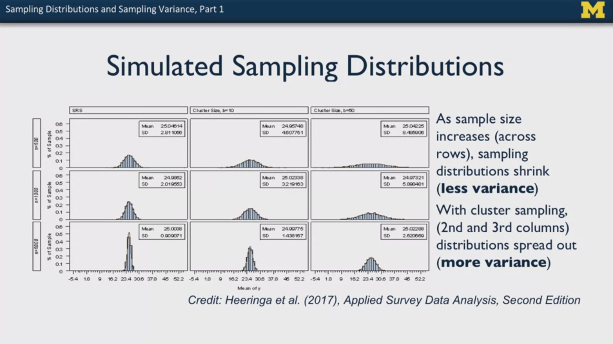

# Statistics with Python: Understanding and Visualizing Data with Python

My personal notes taken while following the Coursera Specialization ["Statistics with Python"](https://www.coursera.org/specializations/statistics-with-python), from the University of Michingan, hosted by Prof. Dr. Brenda Gunderson and colleagues.

The Specialization is divided in three courses and each one has a subfolder with the course notes.

1. [Understanding and Visualizing Data with Python](https://www.coursera.org/learn/understanding-visualization-data?specialization=statistics-with-python): `01_Visualization` 
2. [Inferential Statistical Analysis with Python](https://www.coursera.org/learn/inferential-statistical-analysis-python?specialization=statistics-with-python): `02_Inference`
3. [Fitting Statistical Models to Data with Python](https://www.coursera.org/learn/fitting-statistical-models-data-python?specialization=statistics-with-python): `03_Fitting_Models`

The present file is a guide or compilation of notes of the first course: **Understanding and Visualizing Data with Python**.

Mikel Sagardia, 2022.
No warranties.

Overview of contents:

1. What is Statistics?
2. What is Data?
   - 2.1 Where Do Data Come From? Data Sources: Organic vs. Designed
   - 2.2 Variable Types: Quantitative vs Categorical
   - 2.3 Study Design Types
   - 2.5 Power and Bias
   - 2.6 Data Management and Manipulation
3. Python Intro + Jupyter Notebooks: `./lab/01_DataManagement.ipynb`.
   - Pandas DataFrames: Intro with the Cartwheel Dataset
     - Selection
     - Group By
   - Pandas DataFrame - NHANES Dataset
   - Python guidelines
      - Cheatseets: NUmpy, Pandas, Scipy, Matplotlib
      - Style guidelines (based on Google)
4. What Can You Do with **Univariate** Data?
   - 4.1 Categorical Data: Tables, Bar Charts & Pie Charts
   - 4.2 Quantitative Data: Histograms
   - 4.3 Quantitative Data: Numerical Summaries = Quantiles
   - 4.4 Empirical Rule & Standard Score
   - 4.6 Commenting Graphs
   - 4.7 Links and Modern Infographics
5. Python for **Univariate** Data Analysis: Two **very important** Notebooks:
   - `02_PythonLibraries.ipynb`
     - Numpy
     - Scipy
     - Matplotlib
     - Seaborn
     - Extra Seaborn: Tables, Histograms, Boxplots
   - `03_CaseStudy_NHANES.ipynb`
     - Categorical Data: Frequency Tables
     - Quantitative Variables: Numerical Summaries
     - Graphical Summaries: Histograms & Boxplots
     - Stratification
     - Practice exercises: **Particularly the advanced stratifications with `groupby` are the most interesting**
6. What Can You Do with **Multivariate** Data?
   - 6.1 Multivariate Categorical Data: Associations
   - 6.2 Multivariate Quatitative Data: Associations
   - 6.3 Simpson's Paradox
   - 6.4 Interesting Links/Examples of Data Visualization
   - 6.5 Pizza Study Design Memo: Exercise / Assignment (Peer-Evaluated)
7. Python for **Multivariate** Data Analysis
   - `04_Multivariate_Data_Selection.ipynb`
   - `05_Multivariate_Distributions.ipynb`
   - `06_Unit_Testing.ipynb`
   - `07_Multivariate_Analysis_NHANES_Dataset.ipynb`: **very important summary on multivariate data analysis**
     - Imports and Dataset Loading
     - Bivariate Plotting: Scatterplots & Co.
     - Stratification: Plot Quantitative Variables Grouped in Category Levels
     - Categorical Bivariate Data: Tables with Category Levels
     - Mixed Categorical and Quantitative Data: Boxplots
     - Exercises: Application of Previous Sections to New Variables
   - `08_Assingment_Cartwheel_Dataset.ipynb`
8. Populations and Samples
   - 8.1 Sampling from Well-Defined Populations: Options 1, 2, 3
   - 8.2 Probability Sampling (Option 1)
     - 8.2.1 Simple Random Sampling (SRS): `n/N`
     - 8.2.2 Compley Probability Sampling: Grouping in Stages
   - 8.3 Non-Probability Sampling (Option 3)
     - 8.3.1 Pseudo-Randomization
     - 8.3.2 Calibration
     - 8.3.3 Examples
       - Twitter
       - Google Flue Trends
       - Xbox user survey
9.  Probability Samples and Sampling Distributions
    - 9.1 Sampling Variance & Sampling Distributions
      - The Importance of Sampling Variance
      - Demo: Interactive Sampling Distribution
    - 9.2 Beyond Means: Sampling Distributions of Other Common Statistics
10. Inference in Practice
11. Python for **Sampling Distrubutions**

## 1. What is Statistics?

Statistics is a set of methods that can be applied to learn insights from data.

A "statistic" is a numerical of graphical summary of the data: average, percentage, minimum, etc.

The field of statistics is evolving and new toold are appearing able to tackle problems impossible until recently; for instance: Big Data.

Note that data can be missleading; statistics has tools to avoid missunderstandings and inform for a better decision-making. For instance: data summarization for better uderstanding. Note that we often talk about central values (e.g., averages) when we summarize, but the variation is as important as the central value.

The different perspectives of statistics:
- summarizing
- science of uncertainty
- science of decisions
- science of variation
- art of forecasting
- science of measurement
- basis for principled data collection

Probability pre-dates statistics: it deals with probability distributions, randomness and uncertainty.
Data science uses statistics, but introduces new technical disciplines, such as databases, machine learning techniques, etc.

## 2. What is Data?

Data can be represented in numbers, images, words, audio.

Some cool visualizations from [https://flowingdata.com](https://flowingdata.com):

- [A Day in the Life of Americans](https://flowingdata.com/2015/12/15/a-day-in-the-life-of-americans/)
- [A Day in the Life: Work and Home](https://flowingdata.com/2017/05/17/american-workday/)
- [Most Common Use of Time, By Age and Sex](https://flowingdata.com/2015/11/30/most-common-use-of-time-by-age-and-sex/)

### 2.1 Where Do Data Come From? Data Sources: Organic vs. Designed

We distinguish two types of data:

1. Organic or process data: we collect data of phenomena that have occurred naturally: weather, etc.
   - Big Data uses these types of datasets, which can become enormous
   - In the case of Big Data, storing and accessing those data is a challenge and a research topic
2. "Designed" data collection: we collect data of experiments or samplings we have created
   - Individuals are sampled from the complete population and some data is collected
   - Usually, these datasets are smaller and much easier to work with, at least computationally

A general question for datasets is wether they are **i.i.d.** = **independent and identically distributed**. It is the case if

- Each observation of a sample is independent from all the others
- The values that we are observing arise from some common (same?) distribution

Important note on nomenclature: **a sample is a subset in the population which is composed by units**. That differs from the Machine Learning speak.

Having i.i.d. datasets allows us to make some assumptions and use some statistical tools. However, data is not always like that; examples in test scores:

- Students who sit next to each other tend to have similar scores
- Males and females might have different means
- Students from the same discussion section may have similar scores

In the case of not i.i.d data, we need to apply other statistical procedures.

We need to consider where data comes from in order to decide which assumptions and tools to apply.

### 2.2 Variable Types: Quantitative vs Categorical

- Quantitative variables:
  - continuous (height; also age is considered continuous)
  - discrete (members in a household).
- Categorical variables: 
  - ordinal: groups have ranking (role ranking: junior, senior, etc.)
  - nominal: groups have merely names (race)

### 2.3 Study Design Types

There are many types of study designs and sometimes it is hard to classify one study to belong to a type.

Some notions:
- **Exploratory vs Confirmatory** studies
  - Exploratory studies collect data without first pre-specifying questions
  - Confirmatory studies suggest a falsifiable hypothesis and they test it; so they collect data for that. That is more related to the scientific method
- **Comparative vs Non-Comparative** studies
  - We often compare different treatments of a thing: a medicine, etc.
  - But there are other studies that simply try to predict something without any comparison
- **Observational vs Experimental**
  - Observational studies treat the subjects in the same group and insights arise from observation; it is said that the subjects are exposed to conditions, whereas in experimental studies they are said to be assigned
  - Experimental studies are more structured and divide often subjects into groups for targeted experiments

### 2.5 Power and Bias

**Power analysis**: process to assess whether a given study design will lead to meaningful results.

**Bias**: Measurements that are systematically off-target or sample is not representative of population of interest. Observational studies are specially vulnerable to it.

### 2.6 Data Management and Manipulation

The general shape and properties of a dataframe table is explained in a text: subject x variables.
Nothing special to be noted here, except some terminology:
In *repeated measures* tests, data can be stored in *wide* or *long* format.
Repeated measures studies measure dependent variables of the same subject under different treatments or conditions:
- wide format refers to teh fact that each subject has a row with more columns, related to the outcomes of different treatments
- long format refers to the fact that each subject-treatment is a row

## 3. Python Intro + Jupyter Notebooks

Very few comments made here, since I have year-long experience with python and Jupyter.

Interesting link on Markdown: [Markdown reference/cheatsheet](https://github.com/adam-p/markdown-here/wiki/Markdown-Cheatsheet).

We can create our own notebooks in the course environment/workspace.

After a brief python introduction, `pandas` basics are shown and the two main datasets used throughout the course are tried. The following notebook summarizes it all:

`./lab/01_DataManagement.ipynb`.

The contents in the notebook:

1. Pandas DataFrames: Intro with the Cartwheel Dataset
   - Selection
   - Group By
2. Pandas DataFrame - NHANES Dataset
3. Python guidelines
   - Cheatseets: NUmpy, Pandas, Scipy, Matplotlib
   - Style guidelines (based on Google)

## 4. What Can You Do with Univariate Data?

### 4.1 Categorical Data: Tables, Bar Charts & Pie Charts

Categorical data classifies the samples into groups; e.g.: marital status in the NHANES dataset.
We can summarize this data with **frequency tables**: count & percept per group/class.
We can visualize these data with **bar charts** or **pie chart**.
- Pie charts are not recommended, since not so intuitive and small parts hard to see
- We can order nominal data from larger to smaller

### 4.2 Quantitative Data: Histograms

Whenever we can quantitative data (discrete: age, continuous: height), the **histogram** is a perfect tool to analyze the distribution of the data and get a first idea of what is happening. Four main aspects observed:
- **Shape**: symmetric, left/right skewed (skew side is where the tail is), bell-shaped, unimodal (one peak = mode) / bimodal, etc.
- **Center**: mean & median (1/2 area); note that the mean is on the side of the tail (it is sensitive to the extreme observations) and the median on the side of the peak (mode). In general, the median is considered a robust center estimation, in contrast to the mean.
- **Spread**: Range (max - min), Inter-Quartile Range, Standard deviation & variance. A standard deviation S means that on average samples are the about S points away from the mean (important insight).
- **Outliers**: data points far from the bulk. With skewed distributions they appear usually. If considerable outliers, we can also ay where most of the area/mass is.
s
These four aspects are summarized in 1-2 sentences if the data distribution is described in text.

### 4.3 Quantitative Data: Numerical Summaries = Quantiles

Five summary values are given for a distribution, which are the **min and max values** and **the quartiles 25% (Q1), 50% (Q2 = median), 75% (Q3)**. 

The IQR is: `IQR = Q3(75%)-Q1(25%)`. Typically, when the data is skewed, we provide the IQR, since it describes better where most of the data is.

### 4.4 Empirical Rule & Standard Score

In a bell-shaped curve we often have a normal distribution $N(\mu,\sigma)$.
The **empirical rule of 68-95-99.7** tells us the percentage of samples that lie in ranges:
- 68% of samples are 1 standard deviation away from the mean: $\mu \pm \sigma$; note that the range is $2\sigma$.
- 95% of samples are 2 standard deviations away from the mean: $\mu \pm 2\sigma$
- 99.7% of samples are 3 standard deviations away from the mean: $\mu \pm 3\sigma$

The **standard score** is also known as the **Z-score** for the normal distribution; it tells us how far away a measurement/sample is from the mean and on which side:

$Z = \frac{x - \mu}{\sigma}$

Note that SS tells precisely how many $\sigma$ units our sample is from the mean. Additionally, recall the empirical rule in that sense.

Thus:
- If SS is close to 0, we are close to the mean
- If SS < 0, we are below the mean, if SS > 0, above
- The bigger the absolute of SS, the further away from the mean


### 4.5 Quantitative Data: Box Plots

Any distribution of quantitative data can be visualized with a box plot.
A box plot is a graphical representation of the quartiles or the five-value summary: min, max, 25%, median, 50%, IQR.
Additionally, if the whiskers are not set in the min/max locations, outliers can be detected.
There is a technique for that.

Note on the outliers and the length of the whiskers:

- if no outliers plotted, whiskers are min and max
- if outliers plotted, whiskers are largest/lowest points inside the range defined by 1st or 3rd quartile + 1.5*IQR 

if there are no individual data points plotted, the whiskers indicate data’s minimum and maximum. If there are individual data points plotted, the whiskers indicate the largest/lowest points inside the range defined by 1st or 3rd quartile plus 1.5 times IQR.

Most interesting box plots appear when we plot different groups together, i.e., when we facet the same quantitative variable of different qualitative variables (groups). For example:
- Blood pressure by age ranges and gender.
- Iris dataset: sepal length by species.


Nice interactive plotting example: [https://markkurzejaumich.shinyapps.io/bivariate_analysis/](https://markkurzejaumich.shinyapps.io/bivariate_analysis/).

### 4.6 Commenting Graphs

Quiz/assignment in which several graphs were shown and they needed to be described, highlighting the insights in them.

### 4.7 Links and Modern Infographics

Interesting links from [The New York Times: What's Going on in This Graph?](https://www.nytimes.com/column/whats-going-on-in-this-graph), which encourages discussions on graphs:
- [Climate](https://www.nytimes.com/interactive/2018/05/03/learning/08WGOITGraphLN.html)
- [Nutrition](https://www.nytimes.com/2017/10/09/learning/whats-going-on-in-this-graph-oct-10-2017.html)
- [Essay publishing](https://www.nytimes.com/interactive/2018/02/08/learning/13WGOITGraphLN.html)

Infographics are increasing in popularity; a few caveats or points to assess their quality:
- Look at the scale of each dimension
- If areas/volumes are shown, be aware of missinterpretation due to the fact that areas/volumes grow quadratically/cubically in terms of the size variable

Some interesting links:
- [History of Infographics](https://www.smithsonianmag.com/history/surprising-history-infographic-180959563/)
- [How to Read Infograhics](https://www.themarginalian.org/2013/10/08/best-american-infographics-david-byrne/)

## 5. Python for Univariate Data Analysis

This section consists on lab sessions condensed in the following notebooks:

- `01_DataManagement.ipynb`
- `02_PythonLibraries.ipynb`
- `03_CaseStudy_NHANES.ipynb`

In the following, the most important commands/functions are summarized:

### 5.1 `01_DataManagement.ipynb`

```python
import numpy as np
import pandas as pd

### Cartwheel

url = "Cartwheeldata.csv"
df = pd.read_csv(url)

df.head()
df.describe()
df.columns
df.dtypes

df.loc[:,"CWDistance"]
df.loc[:,["CWDistance", "Height", "Wingspan"]]
df.loc[:9, ["CWDistance", "Height", "Wingspan"]]
df.loc[10:15]

df.iloc[:4]
df.iloc[1:5, 2:4]

df.Gender.unique()

df.groupby(['Gender','GenderGroup']).size()
df.groupby(['Gender','GenderGroup']).sum()

### NHANES

url = "nhanes_2015_2016.csv"
da = pd.read_csv(url)

w = da["DMDEDUC2"]
x = da.loc[:, "DMDEDUC2"]
y = da.DMDEDUC2
z = da.iloc[:, 9]

print(pd.isnull(da.DMDEDUC2).sum())
print(pd.notnull(da.DMDEDUC2).sum())

```

### 5.2 `02_PythonLibraries.ipynb`

```python

## -- Numpy

import numpy as np

a = np.array([1,2,3])
b = np.array([[1,2],[3,4]])
b.shape
print(b[0,0], b[0,1], b[1,1])

d = np.zeros((2,3))
e = np.ones((4,2))
f = np.full((2,2), 9)
g = np.random.random((3,3))

h = np.array([[1,2,3,4,], [5,6,7,8], [9,10,11,12]])
i = h[:2, 1:3]
i[0,0] = 1738

x = np.array([[1,2],[3,4]], dtype=np.float64)
y = np.array([[5,6],[7,8]], dtype=np.float64)
x+y
x-y
x*y
x/y

np.sqrt(x)
np.mean(x)

np.sum(x)
np.sum(x, axis=1)

## -- Scipy

from scipy import stats

np.random.seed(282629734)

v = stats.norm.rvs(size = 10)
x = stats.t.rvs(10, size=1000)

stats.norm.cdf(np.array([1,-1., 0, 1, 3, 4, -2, 6]))

## -- Matplotlib

import matplotlib.pyplot as plt

# One plot
x = np.arange(0, 3 * np.pi, 0.1)
y_sin = np.sin(x)
y_cos = np.cos(x)
plt.plot(x, y_sin)
plt.plot(x, y_cos)
plt.xlabel('x axis label')
plt.ylabel('y axis label')
plt.title('Sine and Cosine')
plt.legend(['Sine', 'Cosine'])
plt.show() # add it if not Jupyter, but python script

# Subplots
x = np.arange(0, 3 * np.pi, 0.1)
y_sin = np.sin(x)
y_cos = np.cos(x)
plt.subplot(2, 1, 1)
plt.plot(x, y_sin)
plt.title('Sine')
plt.subplot(2, 1, 2)
plt.plot(x, y_cos)
plt.title('Cosine')
plt.show()

## -- Seaborn

import seaborn as sns
import matplotlib.pyplot as plt
import pandas as pd

url = "Cartwheeldata.csv"
df = pd.read_csv(url)

# Linear regression
sns.lmplot(x='Wingspan', y='CWDistance', data=df)
# Scatterplot with hue
sns.lmplot(x='Wingspan', y='CWDistance', data=df,
           fit_reg=False, # No regression line
           hue='Gender')   # Color by evolution stage

# Swarmplot
sns.swarmplot(x="Gender", y="CWDistance", data=df)

# Boxplots: several variables with data
sns.boxplot(data=df.loc[:, ["Age", "Height", "Wingspan"]])
sns.boxplot(data=df.loc[df['Gender'] == 'M', ["Age", "Height", "Wingspan"]])
# Boxplots: one grouped variable with x & y
sns.boxplot(x = df['Age'], y = df['Gender'])

# Histograms
sns.distplot(df.CWDistance)
sns.histplot(df.CWDistance)

# Countplot
sns.countplot(x='Gender', data=df)

## -- Extra Seaborn: Tables, Histograms, Boxplots

import seaborn as sns
import matplotlib.pyplot as plt

tips_data = sns.load_dataset("tips")
# total_bill: amount
# tip: amount
# time: lunch, dinner
# smoker: yes, no

# One Histogram
p = sns.distplot(tips_data["total_bill"], kde = False)
p.set_title("Histogram of Total Bill")

# Two overlapping histograms
sns.distplot(tips_data["tip"], kde = False).set_title("Tip & Bill")
sns.distplot(tips_data["total_bill"], kde = False)
plt.xlabel('Total bill and tip')
plt.legend(['tip','total_bill'])
plt.show()

# Boxplot: One
sns.boxplot(tips_data["total_bill"])

# Boxplot: Two Overlapping
sns.boxplot(tips_data["total_bill"])
sns.boxplot(tips_data["tip"]).set_title("Bill & Tiü")
plt.show()

# Boxplot: grouping (y) of a variable (x)
sns.boxplot(x = tips_data["tip"], y = tips_data["smoker"])

# FacetGrid: create cells for the values of a categorical variable (time)
# and plot a cursom plt type (hist) of a variable (time)
g = sns.FacetGrid(tips_data, row = "time")
g = g.map(plt.hist, "tip")

```

### 5.3 `03_CaseStudy_NHANES.ipynb`

This is a **very important** notebook that should be read carefully.
The [NHANES Dataset](https://wwwn.cdc.gov/nchs/nhanes/Default.aspx) is analayzed as a case study.
The variable codenames can be found [here](https://wwwn.cdc.gov/Nchs/Nhanes/2015-2016/DEMO_I.htm).

Contents:

1. Categorical Data: Frequency Tables
2. Quantitative Variables: Numerical Summaries
3. Graphical Summaries: Histograms & Boxplots
4. Stratification
5. Practice exercises: **Particularly the advanced stratifications with `groupby` are the most interesting**

In the following, the most important commands are collected:

```python

## -- 1. Categorical Data: Frequency Tables

da.DMDEDUC2.value_counts()
da.DMDEDUC2.value_counts().sum()
pd.isnull(da.DMDEDUC2).sum()

# Replace categorical variable values/levels with more human-readable categories
da["RIAGENDRx"] = da.RIAGENDR.replace({1: "Male", 2: "Female"})

# Consider NA values if necessary
da["DMDEDUC2x"] = da.DMDEDUC2x.fillna("Missing")
x = da.DMDEDUC2x.value_counts()
# Percentage/Frequency
x / x.sum()

## -- 2. Quantitative Variables: Numerical Summaries

# Note: use dropna() before applying any describe()
da.BMXWT.dropna().describe()

# People with hypertension? Apply logical operators
a = (da.BPXSY1 >= 120) & (da.BPXSY2 <= 139)
b = (da.BPXDI1 >= 80) & (da.BPXDI2 <= 89)
print(np.mean(a | b))

## -- 3. Graphical Summaries: Histograms & Boxplots

# Histograms: watch out number of bins
sns.histplot(da.BMXWT.dropna(),kde=True,stat='density')

# Boxplots: data - several variables plotted
bp = sns.boxplot(data=da.loc[:, ["BPXSY1", "BPXSY2", "BPXDI1", "BPXDI2"]])
bp.set_ylabel("Blood pressure in mm/Hg")

## -- 4. Stratification

# Create age strata based on these cut points
da["agegrp"] = pd.cut(da.RIDAGEYR, [18, 30, 40, 50, 60, 70, 80])
da["agegrp"].value_counts()

# Boxplots: x & y -- variable in groups plotted, great for stratified data
# hue: additional grouping
plt.figure(figsize=(12, 5))
sns.boxplot(x="agegrp", y="BPXSY1", data=da)
sns.boxplot(x="agegrp", y="BPXSY1", hue="RIAGENDRx", data=da)

# Stratification for Categorical Variables
da.groupby("agegrp")["DMDEDUC2x"].value_counts()s

# Advanced stratifications for categorical variables
dx = da.loc[~da.DMDEDUC2x.isin(["Don't know", "Missing"]), :] 
dx = dx.groupby(["agegrp", "RIAGENDRx"])["DMDEDUC2x"]
dx = dx.value_counts()
dx = dx.unstack() # long vs wide
dx = dx.apply(lambda x: x/x.sum(), axis=1)
print(dx.to_string(float_format="%.3f"))

## -- 5. Practice exercises

# Advanced stratifications for categorical variables

dx = da[(da['RIDAGEYR']>30) & (da['RIDAGEYR']<=40)]
dx = dx.groupby(["RIAGENDRx","DMDEDUC2x"])["DMDHHSIZ"].median()
dx

dx = da.groupby(["SDMVSTRA","SDMVPSU","RIAGENDRx"])[["RIDAGEYR","BMXHT","BMXBMI"]].mean()
dx

dx1 = da.groupby(["SDMVSTRA","SDMVPSU","RIAGENDRx"])[["RIDAGEYR","BMXHT","BMXBMI"]].quantile(0.25)
dx2 = da.groupby(["SDMVSTRA","SDMVPSU","RIAGENDRx"])[["RIDAGEYR","BMXHT","BMXBMI"]].quantile(0.75)

dx=dx2-dx1
dx

dx.max()/dx.min()

```

## 6. What Can You Do with **Multivariate** Data?

A data set is multivariate when we **measure more than one thing** for each sample.

When we have multivariate data, instead of analyzing each variable separately, **we are interested in the relationships or associations between them!**

These associations are often analyzed or plotted by pairs of variables.

### 6.1 Multivariate Categorical Data: Associations

Example of a multivariate categorical dataset: samples that contain data on: `gender`, `education level`, `marital status`, `age group`.
It is multivariate because we measure more than one thing!

Now, our research question that analyzes an association: What factors influence the highest education level?

For that purpose, we can build table in which we compute the counts and frequencies of each education level (rows) against the levels of the other categorical variables one by one:


We can also plot a side-by-side **bar chart** (better percentages within a group than counts):


Similar charts/plots
- Stacked bar charts: stacked on top of each instead of side-by-side
- Mosaic plots: areas proportional to population percentages

### 6.2 Multivariate Quatitative Data: Associations

Example of a multivariate quantitative dataset: samples that contain data on: `body mass index`, `blood pressure`, `cholesterol level`, `age`.
It is multivariate because we measure more than one thing!

Instead of plotting the histogram of each variable independently, we plot a **scatteplot** for pairs of variables.

In a scatter plot we can further see associations:
- Type:
  - Linear
  - Quadratic
  - No association
- Direction (slope): sign of the Pearson correlation $R \in [-1,1]$
  - Positive (increases)
  - Negative (decreases)
- Strength: value of the Pearson correlation $R \in [-1,1]$
  - Weak: wide spread
  - Moderate: smaller spread
  - String: narrow spread

Notes:
- A high Pearson correlation $R \in [-1,1]$ value does not imply causation. The might be another variable associated to the analyzed pair which is causing their behavior.
- We might want to display relevant groups (categirical data) in the scatterplots to get further insights; for instance `age` vs `blood pressure` and points colored according to `gender`.


Tool for online plotting of bivariate continuous data:

[Scatterplot examples](https://markkurzejaumich.shinyapps.io/bivariate_analysis/)

### 6.3 Simpon's Paradox

[Simpson's Paradox](https://en.wikipedia.org/wiki/Simpson%27s_paradox): Pitfall in statistics "in which a trend appears in several groups of data but disappears or reverses when the groups are combined. This result is often encountered in **social-science and medical-science** statistics, and is particularly problematic when frequency data is unduly given causal interpretations. The paradox **can be resolved when confounding variables and causal relations are appropriately addressed** in the statistical modeling." (Wikipedia).

In other words, **a trend for your total data is different then the trend for the same data devided by groups**.

Image of the Simpson's paradox, from the Wikipedia:


See examples in Wikipedia:
- UC Berkley admissions, gender bias?
- Kidney stone treatment: one tratment seemed to be better than the other, but when cases separated into stone size, the other treatment had better success rations within each group.

I think that the kidney stone tratment is a good example. Within group ratios, one treatment seems to be better, but looking at the overall without group classification, the other treatment is. It seems to me that **when the sizes of the groups are quite different, the risk of having such reverse effects arises or becomes higher**.

### 6.4 Interesting Links/Examples of Data Visualization

- [Selfies](http://selfiecity.net/selfiexploratory/)
- [Income Inequality](https://ourworldindata.org/income-inequality)
- [Marrying age](https://flowingdata.com/2016/03/03/marrying-age/)
- [City rankings: Profit, Social, Environment](https://www.nationalgeographic.com/environment/graphics/sustainable-cities-graphic-urban-expeditions)

### 6.5 Pizza Study Design Memo: Exercise / Assignment (Peer-Evaluated)

Write Memorandum to small Pizza company CEO on a study design in which properties of their pizzas will be collected and contrasted against their main big competitor. Then, the study is published in marketing campaign. 300-500 words.

- Describe how to conduct study / collect data.
- Focus on 1-2 strengths: amount of toppings, speed of service, customer satisfaction.
- Include research questions + variables to be analyzed.
- How would data be summarized? Numerically and graphically.
- CEO has basic statistic literacy (peers).
- [Sample memorandum](https://owl.purdue.edu/owl/subject_specific_writing/professional_technical_writing/memos/sample_memo.html)
#### Memorandum Text (Submitted)

This document summarizes a study design which aims to compare our company (Small Pizza) with our biggest competitor, Big Pizza. The goal is to conduct the research and present the most important insights in a marketing campaign.

In the following, these aspects are covered:
- Study design: how will we collect the data?
- Research questions: which characteristics would we like to contrast and which variables are we going to collect for that purpose?
- Presentation proposals: how will the data be summarized and portrayed for the most impactful effects on the target audience?

**STUDY DESIGN**

The survey will be conducted on the first 3 Fridays and Saturdays of February, from 4 PM to 10 PM (6 days altogether). That time frame is the one with most visits in our restaurants, as well as with the most varied customer segments. That will guarantee independent and identically distributed data.

There will be an employee at the entrance/exit of each restaurant requesting customers to participate in a brief anonimous questionnaire (no more than 3 minutes). As a bonus, each participant will receive a lottery ticket for 10 pizzas at Small Pizza.

The design of the questionnaire will be
- confirmatory: the hypotheses built from our employee insights will be tested (see next section);
- constrastive: we will focus on our restaurant, but customers will be asked to evaluate our competitors, too;
- observational: customers should be picked randomly during the survey, but stratification or grouping should be tested during the exploratory analysis (i.e., insights according to customer background, such as age and gender).

**RESEARCH QUESTIONS**

In past exploratory studies our direct client service employees have collected the feedback of our customers. We will focus on three key observations that have appeared frequently:
- Our pizza dough is the most authetic our customers have tasted: thin and crispy.
- Our employees are very friedly.

These remarks are aligned with the soul and mission of Small Pizza: we are a family-run chain of pizza restaurants which aims to bring real Italian pizzas to our customers, making them have a great time in a friendly atmosphere -- as in the Toscana.

Questionnaire:
1. General backgroud: 1.1 Gender (M/F/D), 1.2 Age Range (10s, 20s, ...), 1.3 Number of clients
2. How often do you eat pizza every month?
3. For the following aspects related to eating pizza: Dough, Toppings, Variety of options, Friendly and helpful service, Fast service
  3.1 Which are the 2 most importantones for you? 
	3.2 Evaluate if we are one of the bests or the bests in each aspect (Not at all, No, Not sure, Yes, Yes definitely)
	3.2 Evaluate if our competitor(s) are/is one of the bests or the bests in each aspect (Not at all, No, Not sure, Yes, Yes definitely)

**PRESENTATION PROPOSALS**

An exploratory analysis will be performed with and without stratification or grouping (according to gender and age). Since most of the variables are categorical, the data presentation will consist in summary tables (with absolute and frequency values) as well as bar charts; the levels will be ordered, since we have ordinal variables.

The two most important insights (from question 3.1) aligned with our essence and mission will be chosen and presented in contrast to our competitors. A possible marketing pitch could be built following this scheme:

*We show the bar chart with frequencies from question 3.1 (important pizza aspects) and add the text/audio:*

*"The two most important characteristic our customers value in a pizza service are A and B. X% of our customers think we are one of the best in achieving them, if not the best, whereas our competitor(s)... "*

However, the concrete content and formulation is to be decided after looking at the data.

## 7. Python for **Multivariate** Data Analysis

The following notebooks work different aspects of mutivariate data analysis:

- `04_Multivariate_Data_Selection.ipynb`: selection, slicing, conditional selection.
- `05_Multivariate_Distributions.ipynb`: bivariate scatterplots give information missing in isolated historgrams; example plot.
- `06_Unit_Testing.ipynb`: Unit testing consists in performing checks on pieces of our code (e.g., functions, class methods, etc.) to see whether they return expected values given some inputs. The notebook from the course does not show a good example of that. Instead, my personal usage notes were added here, based on an example.
- `07_Multivariate_Analysis_NHANES_Dataset.ipynb`: This notebook is **very important since it summarizes the most important analysis we can perform with multivariate data.**
- `08_Assingment_Cartwheel_Dataset.ipynb`: This notebook is the assignment of week 3, related to multivariate data analysis; scatteplots and bar charts.

In the following, the summary code of the two most important lab notebooks is listed.

- `04_Multivariate_Data_Selection.ipynb`
- `07_Multivariate_Analysis_NHANES_Dataset.ipynb`

### `04_Multivariate_Data_Selection.ipynb`

This notebook deals with the topic of selecting multiple variables in `pandas` dataframes.

Basically, three major ways are used:

- `df['ColName']`
    - A view of the entire column is obtained
    - We cannot change sliced row values, unless we change the entire column
    - Equivalent to `df.ColName`
- `df.loc['a':'b','ColName']`
    - Locations are accessed through labels or **booleans**: rows, columns
    - No index numbers, but **labels** or **booleans**!
    - Specific cells can be changed
    - We can use it for changing sliced row values
- `df.iloc[1:5,3:7]`
    - Same as `loc`, but we use **index numbers** or **booleans** instead of labels
    - We can used to change sliced row values
    
Overview of contents:
1. Column Selection
2. Slicing
3. Selection by Conditions
4. Common Errors

```python
## -- 1. Column Selection

import numpy as np
import pandas as pd

# If we want to show ALL (100) columns
pd.set_option('display.max_columns', 100)
df = pd.read_csv("nhanes_2015_2016.csv")

# Get column names
col_names = df.columns

# Define col names to keep manually
keep = ['BMXWT', 'BMXHT', 'BMXBMI', 'BMXLEG', 'BMXARML', 'BMXARMC',
       'BMXWAIST']

# Define col names to keep with a list comprehension
keep = [column for column in col_names if 'BMX' in column]

df[keep].head()

## -- 2. Slicing

# All rows, keep cols
df.loc[:, keep].head()

# Which column (names) are in keep?
index_bool = np.isin(df.columns, keep)

# Indexing with booleans
df.iloc[:,index_bool].head()

## -- 3. Selection by Conditions

# df with all columns in keep: BMX*
df_BMX = df[keep]

waist_median = pd.Series.median(df_BMX['BMXWAIST'])

df_BMX[df_BMX['BMXWAIST'] > waist_median].head()

# df[]
# We specify the conditions of the ROW cell values we want to select
# Several conditions can be chained with
# & or |
condition1 = df_BMX['BMXWAIST'] > waist_median
condition2 = df_BMX['BMXLEG'] < 32
df_BMX[condition1 & condition2].head()

# df.loc[]
# ROWs to keep have been specified
df_BMX.loc[condition1 & condition2, :].head()

# Create a new df with only 5 rows (default output of head())
tmp = df_BMX.loc[condition1 & condition2, :].head()
# Change index
tmp.index = ['a', 'b', 'c', 'd', 'e']

# Specific loc[] row selection
tmp.loc[['a', 'b'],'BMXLEG']

# Specific iloc[] row selection
tmp.iloc[[0, 1],3]


## -- 4. Common Errors

# Error 1: `df[]` can access only to column names/labels
    
    # Wrong
    tmp[:, 'BMXBMI']
    # Correct
    tmp.loc[:, 'BMXBMI']
    tmp.loc[:, 'BMXBMI'].values
    
# Error 2: `df.iloc[]` can access only to row & column index numbers + booleans
    
    # Wrong
    tmp.iloc[:, 'BMXBMI']
    # Correct
    tmp.iloc[:, 1]
    
# Error 3: `df.loc[]` can access only to row & column labels/names + booleans
    
    # Wrong
    tmp.loc[:, 2]
    # Correct
    tmp.iloc[:, 2]
    
# Error 4: `df[]` can be used for changing entire column values, but `df.loc[]` or `df.iloc[]` should be used for changing sliced row values

    # Correct
    tmp = df[['BMXBMI', 'BMXLEG']]
    tmp['BMXBMI'] = range(5)
    
    # Wrong: values a set to a copy of tmp
    tmp[tmp.BMXBMI > 2]['BMXBMI'] = [10]*2 
    # Correct: values are set to tmp
    tmp.loc[tmp.BMXBMI > 2, 'BMXBMI']  = [10]*2

```

### `07_Multivariate_Analysis_NHANES_Dataset.ipynb`

This notebook is very important since it summarizes the most important analysis we can perform with multivariate data. The overview provides a good compendium of methods.

Overvie of contents:
1. Imports and Dataset Loading
2. Bivariate Plotting: Scatterplots & Co.
   - Regplot: scatterplot with additional regression information by default
   - Jointplots with histograms and density estimation plots (kde). **Important note: single isolated variable distributions DO NOT DEFINE THE JOINT DISTRIBUTION.**
   - Pearson correlation R. **Important note: correlation does not mean causation: having a long arm is not the cause of having a long leg.**
1. Stratification: Plot Quantitative Variables Grouped in Category Levels
2. Categorical Bivariate Data: Tables with Category Levels
3. Mixed Categorical and Quantitative Data: Boxplots
4. Exercises: Application of Previous Sections to New Variables

```python

## -- 1. Imports and Dataset Loading

%matplotlib inline
import matplotlib.pyplot as plt
import seaborn as sns
import pandas as pd
import numpy as np
from scipy import stats

da = pd.read_csv("nhanes_2015_2016.csv")

## -- 2. Bivariate Plotting: Scatterplots & Co.

# BMXLEG: leg length
# BMXARML: arm length
# We see the relationship between both: people with longer legs tend to have longer arms
# Whenever we have many samples, it makes sense using alpha for transparent points
sns.regplot(x="BMXLEG",
            y="BMXARML",
            data=da,
            fit_reg=False,
            scatter_kws={"alpha": 0.2})

# Same variables as before: leg length and arm length
# Pearson correlation R quantifies the degree of relationship
# With a jointplot we see histogram distributions + scatterplot/2D distribution
# Note that single isolated variable distributions DO NOT DEFINE THE JOINT DISTRIBUTION!
sns.jointplot(x="BMXLEG",
              y="BMXARML",
              kind='kde', data=da)
df = da[["BMXLEG","BMXARML"]].dropna()
df.columns = ['x','y']
print(stats.pearsonr(df['x'],df['y']))

# Variables: BPXSY1, BPXDI1 (systolic and istolic blood pressure measurements)
# Low correlation
sns.jointplot(x="BPXSY1",
              y="BPXDI1",
              kind='kde', data=da)
df = da[["BPXSY1","BPXDI1"]].dropna()
df.columns = ['x','y']
print(stats.pearsonr(df['x'],df['y']))

# Variables: BPXSY1, BPXSY2 (1st and 2nd systolic blood pressure measurement)
sns.jointplot(x="BPXSY1",
              y="BPXSY2",
              kind='kde', data=da)
df = da[["BPXSY1","BPXSY2"]].dropna()
df.columns = ['x','y']
print(stats.pearsonr(df['x'],df['y']))

## -- 3. Stratification: Plot Quantitative Variables Grouped in Category Levels

# Always try grouping variables according to their natural clusters (categorical variables) to see whether the relationships change.
# In our case grouping is applied to gender and ethncity.

# There seems to be a stringer correlation in arm & leg length among males
da["RIAGENDRx"] = da.RIAGENDR.replace({1: "Male", 2: "Female"}) 
sns.FacetGrid(da, col="RIAGENDRx").map(plt.scatter, "BMXLEG", "BMXARML", alpha=0.4).add_legend()

print(da.loc[da.RIAGENDRx=="Female", ["BMXLEG", "BMXARML"]].dropna().corr())
print(da.loc[da.RIAGENDRx=="Male", ["BMXLEG", "BMXARML"]].dropna().corr())

# Scatter plots with 2 categorical variables used to stratify: gender & ethnicity
# Note that ethnicity 5 (multiracial) seems to have higher correlation
# This is usual in groups with large heterogeneity: correlations emerge
# that are indiscernible in more homogenous data
_ = sns.FacetGrid(data=da,
                  col="RIDRETH1", 
                  row="RIAGENDRx").map(plt.scatter,
                                       "BMXLEG",
                                       "BMXARML",
                                       alpha=0.5).add_legend()


## -- 4. Categorical Bivariate Data: Tables with Category Levels

# Marital status and education level
da["DMDEDUC2x"] = da.DMDEDUC2.replace({1: "<9",
                                       2: "9-11",
                                       3: "HS/GED",
                                       4: "Some college/AA",
                                       5: "College", 
                                       7: "Refused",
                                       9: "Don't know"})
da["DMDMARTLx"] = da.DMDMARTL.replace({1: "Married",
                                       2: "Widowed",
                                       3: "Divorced",
                                       4: "Separated",
                                       5: "Never married",
                                       6: "Living w/partner",
                                       77: "Refused"})
# Remove samples that can confuse us
db = da.loc[(da.DMDEDUC2x != "Don't know") & (da.DMDMARTLx != "Refused"), :]

# Cross Table / Contingency Table: Count samples that belong to each category level pair
# VERY INTERESTING!
x = pd.crosstab(db.DMDEDUC2x, da.DMDMARTLx)
# Normalize: get percetanges
# Watch out: select to normalize in column/row with axis
# The most common (modal) marital status is married
# For college graduates, the proportion of marries is the highest across all education levels
x.apply(lambda z: z/z.sum(), axis=1) # axis = 1: apply to rows

# The following line does these steps, reading the code from left to right:
# 1 Group the data by every combination of gender, education, and marital status
# 2 Count the number of people in each cell using the 'size' method
# 3 Pivot the marital status results into the columns (using unstack)
# 4 Fill any empty cells with 0
# 5 Normalize the data by row
g = db.groupby(["RIAGENDRx", "DMDEDUC2x", "DMDMARTLx"])
g.size().unstack().fillna(0).apply(lambda x: x/x.sum(), axis=1)

# Stratifiable data should be grouped and displayed in tables and plots
# to for hypothesis of phenomena that are occurring.
# Here we see that the rate of married college educate women decreases from 40 to 60
# whereas it increases if they have only high school degrees
# Conclusion: marital status, gender, age, education: all have strong interactions
dx = db.loc[(db.RIDAGEYR >= 40) & (db.RIDAGEYR < 50)]
a = dx.groupby(["RIAGENDRx", "DMDEDUC2x", "DMDMARTLx"]).size().unstack().fillna(0).apply(lambda x: x/x.sum(), axis=1)

dx = db.loc[(db.RIDAGEYR >= 50) & (db.RIDAGEYR < 60)]
b = dx.groupby(["RIAGENDRx", "DMDEDUC2x", "DMDMARTLx"]).size().unstack().fillna(0).apply(lambda x: x/x.sum(), axis=1)

print(a.loc[:, ["Married"]].unstack())
print("")
print(b.loc[:, ["Married"]].unstack())

## -- 5. Mixed Categorical and Quantitative Data: Boxplots

# Boxplot
# Age distribution depending on marital status
plt.figure(figsize=(12, 4))
a = sns.boxplot(x="DMDMARTLx", y="RIDAGEYR", data=db)

# Violin plot: a boxplot with additional distribution information
# however, it makes sense to use it when we have many samples
plt.figure(figsize=(12, 4))
a = sns.violinplot(x="DMDMARTLx", y="RIDAGEYR", data=db)

## -- 6. Exercises: Application of Previous Sections to New Variables

# Scatterplot between first & second blood pressure distolic measurements
sns.regplot(data=da,
            x="BPXDI1",
            y="BPXDI2",
            fit_reg=False,
            scatter_kws={"alpha": 0.2})

# Correlation between first & second blood pressure distolic & systolic measurements
da[["BPXDI1","BPXDI2","BPXSY1","BPXSY2"]].corr()

# How any ethnicity groups do we have?
da["RIDRETH1"].unique()

# Scatterplots between the first systolic and the first diastolic blood pressure
# Stratify the plots by gender (rows) and by race/ethnicity groups (columns)
da["RIAGENDRx"] = da.RIAGENDR.replace({1: "Male", 2: "Female"})
_ = sns.FacetGrid(data=da,
                  col="RIDRETH1", 
                  row="RIAGENDRx").map(plt.scatter,
                                       "BPXSY1",
                                       "BPXDI1",
                                       alpha=0.5).add_legend()

# Make education level status human readable and remove confusing levels
da["DMDEDUC2x"] = da.DMDEDUC2.replace({1: "<9",
                                       2: "9-11",
                                       3: "HS/GED",
                                       4: "Some college/AA",
                                       5: "College", 
                                       7: "Refused",
                                       9: "Don't know"})
db = da.loc[(da.DMDEDUC2x != "Don't know"), :]

# Violin plots: distributions of ages within groups defined by gender and education level
plt.figure(figsize=(12, 4))
a = sns.violinplot(x="DMDEDUC2x", y="RIDAGEYR", data=db, hue="RIAGENDRx")

# Violin plots: distributions of BMI by of 10-year age bands and gender
db["agegrp"] = pd.cut(db.RIDAGEYR, [18, 30, 40, 50, 60, 70, 80])
plt.figure(figsize=(12, 4))
a = sns.violinplot(x="agegrp", y="BMXBMI", data=db, hue="RIAGENDRx")

# Frequency table for the joint distribution of ethnicity groups (RIDRETH1)
# and health-insurance status (HIQ210).
# HIQ210:
# 1: Yes, 2: No, 7: Refused, 9: Don't know, .: Missing
# Normalize the results so that the values within each ethnic group
db["HIQ210"] = db.HIQ210.replace({1: "Yes",
                                  2: "No",
                                  7: "Refused",
                                  9: "Don't know"})
x = pd.crosstab(db.RIDRETH1, db.HIQ210)
x.apply(lambda z: z/z.sum(), axis=1) # axis = 1: apply to rows

```

## 8. Populations and Samples

### 8.1 Sampling from Well-Defined Populations: Options 1, 2, 3

Before modern statistics, **census** methods were applied to measure populations, i.e., every unit was measured to make statements about the population. [Jerzy Neyman](https://en.wikipedia.org/wiki/Jerzy_Neyman) introduced the concept of randomly sampling a population and still be able to make statements of the population.

First, we need to very very concretely define the **target population**:

- Who? Anything we think might be relevant: Gender, ethnicity, age, etc.
- What time frame? Summer, winter, etc.
- Where? USA, EU, Spain, etc.

How can we make inferential statements about that population?

- Option 1: census = every single person from the population measured
  - Expensive for large populations, thu done only with small ones
- Option 2: **scientific probability sample** = samples from the population measured
  - Create a sampling frame: list of all units in the population
  - Determine probability of selection for every unit
  - Select units from list at random with sampling rates for different subgroups determined by probabilities of selection
  - Measure randomly seleted units
  - Example: From a classroom roster of 10 males and 20 females, a professor wishes to select a probability sample of 5 males and 5 females: probabilities of selection for males and females are 1/2 and 1/4.
- Option 3: non-probability sample = also with samples
  - No random selection performed
  - Probabilities of selection cannot be determined
  - Examples: web surveys (volunteers take part, we don't have a complete list), snowball sampling (friends recruit frieds over social media), convinient sampling (collect data from coworkers).
  - Obviously, population inferences are more difficult here, we have a high potential for bias (e.g., we recruit very specific type of people, etc.)

**Option 2: Scientific probability sample**: we should take that sampling because it has a very important property: Known propabilities of selection allow us to make unbiased statemets about both

- (1) population features
- and the (2) uncertainty in survey estimates.

Notes on nomenclature:
- *feature* refers to characteristics of the distribution (size, population mean, variance, etc.), not to the features or variables used in Machine Learning -- as I understand.
- *estimate* is a descriptive statistic that approximates to a feature, such as a sample mean, as I understand. In other words, feature is more general, estimate is an approximation of the feature.
- *statistic* is an an estimate; an estimate/statistic summarizes a property of the distirbution(s): mean, variance, correlation, etc.

All in all, we get a **representative, realistic, random** sampling with which we can infer the properties of the population.

Note that a population can be a closed group of units, not necessarily all units:
- All Facebook users is a population
- All US citizens is also a population
- All human beings is also a population

### 8.2 Probability Sampling (Option 1)

Two major methods for probability sampling are used:

1. Simple Random Sampling (SRS): `n` units are selected from a total population of `N`, having each unit a probability of seletion of `n/N`
2. Complex Probabiity Sampling: the population is hierarchically grouped (states, counties, etc.) and each level is sampled. The final units might have different probabilities of selection depending on their properties (e.g., socio-economic status).

The first (SRS) is used only with small populations in practice, because for large populations is logistacally expensive. The second is the common method for large studies.

#### 8.2.1 Simple Random Sampling (SRS): `n/N`

We have `N` population units and **randomly** select `n` units from the list.
Each unit has an equal probability of selection `n/N`.
Estimates of means, proportions, etc. are **unbiased** = equal to the population values on average!

Some properties of SRS:
- We can do it with or without replacement: with replacement means a unit can be selected several times; however, no matter how, each unit always has the probability of selection of `n/N`.
- SRS is used only if the population is small, because large populations make it logistically complex, thus, expensive.
- SRS produces i.i.d data = independent and identically distributed

Example: we want to know the average response time of `N=2,500` emails. Since the computation is manual, we select `n=100` manually and measure the response time.
- `n/N = 100 / 2,500`
- We cannot take the first 100 emails, because that sample might be biased: e.g., first 100 might come from staff
- We need to make the list of `2,500` and randomly select `100`

#### 8.2.2 Complex Probability Sampling: Grouping in Stages

Grouping is performed at several levels or stages:
- Population is divided into different **strata** and a part of the sample/sampling is allocated to each stratum (e.g., northeastern region of USA, etc.). Stratification reduces variance.
- **Clusters** of population units (e.g., counties) are randomly sampled (= selected) first (with known probability) within the strata. That saves costs of data collection.
- Units are randomly selected from clusters according to a probability of selection; that probability of selection doesn't need to be equal for all units, though.

The probability of selection of a unit is determined by
- Number of clusters sampled (= selected) in each stratum: `a`
- Total number of clusters in each stratum: `A`
- Number of units sampled (= selected) in each cluster: `b`
- Total number of units in population in each cluster: `B`

(Equal) Probability of selection of a unit: `(a/A) * (b/B)`

The probability of selection is a factor used during the population estimate computation!

Note that within a cluster, units might be assigned to subgroups that have different probabilities of selection! For instance, we might want to have a higher rate of certain socio-economic groups in given clusters/counties.

Designing sampling strategies for large populations is much more cost effective using complex probability sampling than SRS (simple randdom sampling). In the case of NHANES, a trailer is sent to the selected counties. That is much more efficient that having trailers travel around randomly.

Final remark: in a cluster of `B` units, the selected `b` represent those `B`!

### 8.3 Non-Probability Sampling (Option 3)

Properties:
- Probabilities of selection of units cannot be determined a priori
  - Thus, we cannot make inferences of the larger population
- There is no random selection of units
  - We have a string risk of bias
  - Non representative samples are often taken
- Grouping can be done (strata, clusters), but groups ar enot randomly selected
- Very cheap compared to probability sampling

Examples:
- Studies of volunteers (e.g., clinical trials)
- Opt-in web surveys (e.g., on social media)
- Snowball sampling: sampling grows virally because friends recruit friends
- Convenience samples: students selected by prof.
- Quota samples: we try to recruit a target size no matter what

Big Data analysis relies on convinience data obtained from a non-representative sampling. Therefore, we must be very careful as to which conclusions/statements we do with our analysis -- because in general, we cannot make inferences of the larger population!

So what can we do? There are two possible approaches to make statements:

1. Pseudo-Randomization
2. Calibration

#### 8.3.1 Pseudo-Randomization

We have our dataset with non-probability sampling.
We find a similar dataset but with a probability sampling: both need to have similar measurement variables, or at least an overlapping set.
A logistic regression model is trained with both datasets stacked together using the variables we have available for the units: the model predicts the probability of a sample to belong to the non-probablity sampling (y = 1).

The model is applied to the non-probability sampling units and the inferred probability is inverted to create a pseudo weight which replaces the weight we should have used to build a probability sampling.

More on that in Section 10.5.

#### 8.3.2 Calibration

Weights are used on units to mirror a distribution of a known population.
For that we need to select some variables from which know the population distributions.

Example:
- Non-probaility sample: 70% Female, 30% Male
- Probability sample: 50%, 50%
- Calibration: down-weight F, up-weight M

However, if the weighting factor/variable is not related to the vairable of interest, we will not reduce the sampling bias. For instance: we adjust for gender but the ultimate variable of interest is salary, which probably depends more in the country of origin.

#### 8.3.3 Examples

**Twitter Example:** Imagine we collect 100 of thousands of tweets of people related to the President. We classify them as support or not support. We have lots of data, but the approach is still a non-probability sampling and we cannot make inferences of the global population:
- The probability of a tweet being selected cannot be determined
- Twitter users are not a random sample of a larger population
- We have a high potential for bias, lack of representation

**Google Flu Trends:** in 2008 Google created Google Flu Trends. Their goal was to predict the number of flu infections from google searches 2 weeks ahead of the CDC in USA. It seemed to work for a window of time, but it soon started to fail: peaks undetected, seasonal effects missed, overfitting, etc. Basically, the samples were taken from a non-probability distribution; highly biased. See the [Wired article](https://www.wired.com/2015/10/can-learn-epic-failure-google-flu-trends/).

**Xbox user survey:** Thousands of Xbox user survey responses on the 2012 election predicted very accurately the election result. Although it was a non-rpobability sampling, the authors used a weighting calibration to infer population behavior. [Paper: Forecasting elections with non-representative polls](https://www.sciencedirect.com/science/article/abs/pii/S0169207014000879?via%3Dihub)

Therefore: **always ask what type of dataset is behind**: if it is a non-probability sampling, we need to question how representative of the population our sample is.

## 9. Probability Samples and Sampling Distributions

### 9.1 Sampling Variance & Sampling Distributions

A **sampling distribution** of an estimate arises when we estimate features (e.g., mean) of random samplings many times following the same methodology or design: same population, same probability of selection per unit/strata, etc. In other words:
- We have a pupulation of `N`
- We select `n`, measure a characteristic and compute the mean
- Then we repeat the process again with another random sampling of `n` units
- At the end, we have a **distribution of means**

Some important properties of sampling dirtibutions
- They a hypothetical: we seldom have the opportunity of repeating the measurements
- **The distribution of estimates (e.g., means) is different of the distribution of the characteric measured!**
- **Central Limit Theorem**: if we take a large enough probability sample size, **the sampling distribution of estimates will be normal**.
- The key idea is that the mean of the sampling distrbution will be the estimate of the population! I understand that the estimate does not need to be mean of a variable, but any measurement.

The **sampling variance** is the variability of the estimates in the sampling distribution, e.g., the variance of the distirbution of means. It is a measurement of the spread of the sampling distribution.

The **sampling error** is the difference of the sampling estimate mean and the mean of the sampling distribution = difference between the mean of the population and the mean of one sample. Obviously, the larger the sample size, the smaller the sampling error and sampling variance.

An interesting simulation of the effect the sample size and cluster size in the sampling distribution is shown in the following picture:
- With larger samples sizes (`n = 100, 500, 5000`) the variance of the sampling distrution becomes smaller
- With larger cluster sizes (`b = 1 (SRS), 10, 50`), i.e., less clusters altogether, the variance of the sampling distribution increases. The idea is that we select big clusters randomly and some are left apart; better to select more (distrubuted) smaller ones.



#### The Importance of Sampling Variance

In practice we have only one sample. But the sampling theory allows us to estimate features (mean and variance) of the sampling distribution based on one sample! For that, we need the probabilities of selection we used in our design.

Since we are able to estimate the variance of the sampling distribution, we can infer where most estimates will be based on a sample, i.e., we can estimate population features! That is analyzed in Section 10.

#### Demo: Interactive Sampling Distribution

Web app create with R Studio Shiny Apps:

[Demo: Interactive Sampling Distribution](https://markkurzejaumich.shinyapps.io/multiple_population_bias/)

In the demo, the sampling distributions of the weight amoung the students of the University of Michigan (UoM) are simulated.

We have two distinct target Populations:
1. All University of Michigan (UoM) students
2. Gym-goers of UoM

Both population distributions are provided for the body weight, being both normally distributed but the body weight of gym goers 20 pounds larger aproximately.

Then, simulations are done with parameters we can choose with a slider.
The ultimate point is to see how the sampling distributions vary.

Parameters:
- Target population
- Percentage of UoM students that are gym-goers
- Sample size
- Number of samples drawn

### 9.2 Beyond Means: Sampling Distributions of Other Common Statistics

After the **Central Limit Theorem**, sampling distirbutions of statistics tend to the normal distribution; as we increase the sample size, the distributions become more symmetric, more centered around the true value, and with less spread.

Note that it works not only for the means, but also for any other statistics of feture estimates: variance, correlation, linear regression slope, proportions, etc.

## 10. Inference in Practice: How Do We Infer Population Characteristics from One Sample?

We want to estimate parameters of interest of a population from one sample, without having the complete sampling distribution.

Parameters of interest can be
- A mean
- Proportion
- Regression coefficient
- Odds ratio
- ...

Approaches

- Confidence interval estimate of the parameter of interest
- Hypothesis testing of the parameter of interest

Key assumptions we do  for both approaches (always take them into account!):

1. We have a probability sampling.
2. The sampling distribution is normal, based on the Central Limit Theorem; for that, we need to have sample sizes which are large enough. **Question: does the variable itself need to be normally distributed?**
3. The sample is unbiased: each unit from the sample was taken with the correct probability of selection; we need to address that issue during the design, otherwise, we will have a biased estimate (sample mean or parameter shifted from the true population mean/parameter), and the approaches described below fail.

### 10.1 Confidence Interval

Given that we have an unbiased sample, we consider our point estimate of the parameter of interest to be **unbiased, i.e., close to the parameter of the population**. Similarly, other unbiased samples will also have their parameter close to the one of the population! In the same line of thought, the variance of the population will be similar to the variance of the sample.

We define the **95% Confidence Interval** as the spread of **2 standard deviations** around our sample estimate parameter; given a normal distribution, that will cover 95% of the possible measurements.

`95% Confidence Interval (CI) = Sample Parameter Estimate (e.g., Mean) +- Standard Deviation (SD= sqrt(Sample Variance))`

That `95% CI` is equivalent to the `0.05 Significance Level`, meaning only 5% might lie out from the interval.
Note that the **standard deviation** is also called the **standard error**.

Given the properties above, we conclude that most `CIs` of different samples will largely overlap so that the population estimate will be contained in all of them!

### 10.2 Hypothesis Test

We as the following question: Could the value of the parameter be X (= `H0 = Null Hypothesis`)?

To check that, we see how far away we are from that X, i.e., **how many standard deviations**:

`(Sample Estimate - Null Value) / SD Sample`

If the value is high, the null hypothesis is rejected.

### 10.3 [Seeing Theory](https://seeing-theory.brown.edu/index.html)

The [Seeing Theory](https://seeing-theory.brown.edu/index.html) is a very interesting website from the Brown University in which many concepts in statistics are explained visually with exeperiments. **Very nice!**

Have a look at: 

- Chapter 3: Probability Distributions (Discrete & Continuous), Central Limit Theorem
- Chapter 4: Confidence Interval
- Chapter 6: Regression Analysis, Correlation, ANOVA

### 10.4 Preventing Bad/Biased Samples

Even though Simple Random Sampling (SRS) is a probaility sampling expected to produce independent and identically distributed observations (i.d.d.), we might be introducing bias with it if we don't control the allocation of the ID pool we are using; for instance: if we choose 1000 random telephone numbers, but number pool is not uniformly distributed in our target pupulation.

An approach to avoid that is **stratification***: we differentiate strata (e.g., states) of a known size in which we define independent pools of telephone numbers. Stratification has also the nice propertiy that the variance between the strata is not incorporated into the variance within the strata. So, **when in doubt, stratify**.

**Selection bias**: that occurs when our sample has units that do not cover the complete population with their respective probailities of occurrence. Example: measure weight of gym-goers. Solution: stratify sample correctly and measure a representative sample pf the population.

**Unit Nonresponse**: that occurs when selected units (e.g., people) do not participate, breaking the equilibrium engineered in our design. In consequence, even with a perfect design, the measurements will be biased unless we try to get equivalent unit measurements.

**Nonresponse Bias**: when there is a tendency for units that provide a response to produce different data than the one that would come from units more likely to reject a response.

**Item Nonresponses**: Nonresponse bias focused on a particular measurement, e.g., income.

Biases related to nonresponse can be approached as follows:
- Ask for follow ups
- Provide alternative means to answer (web)
- Choose equivalent units
- Weight available measurements to match expected proportions
- ...

### 10.5 Inference for Non-Probability Samples

Section 10 has dealt with proobability samplings.
How can we infer population properties from non-probability samplings?
Two major approaches:

1. Quasi-Randomization or Pseudo-Randomization
2. Population Modelling

#### 10.5.1 Quasi-Randomization or Pseudo-Randomization

We combine data from the non-probability sample with data from another probability sample; both need to have an overlap of measured variables. However, **important note**: the non-probability sample might have some other variables not appearing in the probability sample, and those variables might the ones we're insterested in!

Example:

- Non-probability: blood pressure and cholesterol measurements on campus of people that stop by
- Probability: NHANES blood pressure measurements
- Interested in: cholesterol measurements, which are not available at NHANES

Both datasets are stacked taking the overlapping variables. Then, a logistic regression is built to predict the label `NPSAMPLE`: For the non-probability sample the true `NPSAMPLE = 1`, for the probability sample `NPSAMPLE = 0`. So `NPSAMPLE` tells the probability of a unit to belong to the non-probability sample by using the overlapping variables. However, weights are applied to the unit sin the sample!

- Units from the NP sample have weight 1
- Units from the probability sample have as weight their selection probability!

We apply the trained model to the non-probability sample and we compute the sampling weights of the units using the inverted value of the inferred `NPSAMPLE`:

`Non-probability Sample Correction Weight = 1 / predict probability of NPSAMPLE`

Then, we apply those weights to the non-probability sample, and we have our "adjusted" dataset which resembles a probability sample. The effect is that units resembling the probability sample are magnified, equilibrating the sample.

However, there is one issue: it is not possible to estimate the variance of the sampling distribution as we did with the probability sample. Therefore, it is not straightforaward to infer the `CI` of the populatiion. One possible solution is to simulate replications of measurements with subsets of the non-probability sample: we take subsets and repeat the above described approach; thus, a distribution of values is obtained. The variance (thus, standard deviation) of the sampling distribution is obtained from that distribution.

This is an on-going area of research; there is not a lot written on it.

For more, see "Elliot, M.R. and Vaillant, R. Inference for Non-Probability Samples. 2017".

#### 10.5.2 Population Modelling


## Feedback

Topics from the 4th week such as population sampling, sampling distributions, etc. are quite intuitive and can be very easily described graphically. However, the course allocates a lot of time for them and slides full of text are used -- which is confusing. Additionally, the slides do not even try to clearly differentiate similarly sounding concepts, e.g., sample as 'select', sampling as 'sample subset' and as 'selecting', probability sample, sampling/sample variance and error, etc. Also, sometimes more abstract (i.e., opaque) terms are employed without spending enough time in their definition, e.g., estimates in substitution of mean or other descriptive statistics, etc.

Therefore, one feels the course overcomplicates intuitive concepts, trying to be academically formal in the definitions.