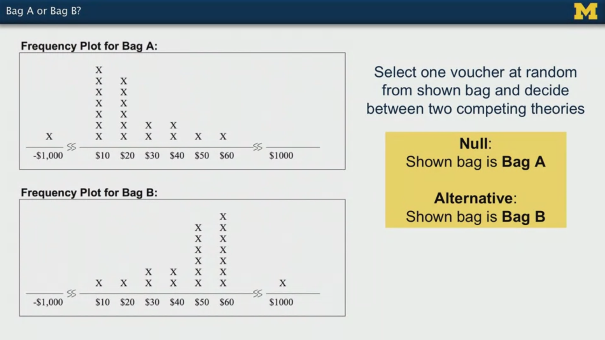
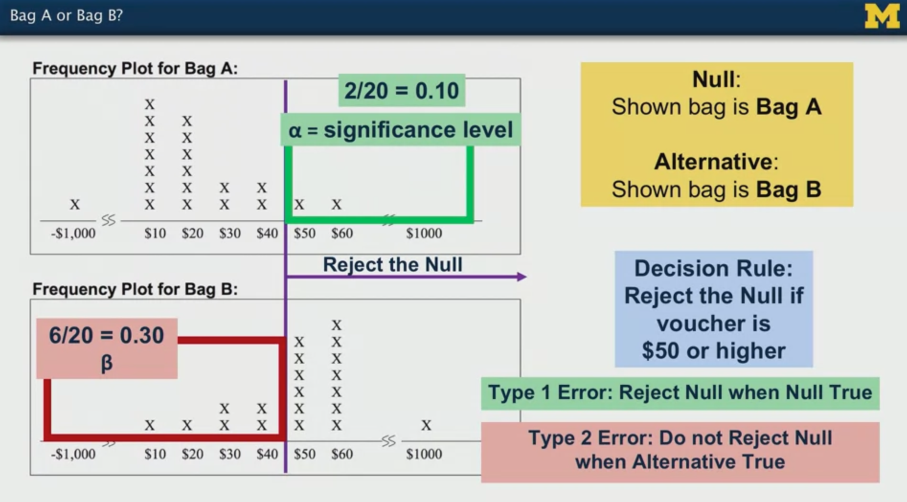

# Statistics with Python: Inferential Statistical Analysis with Python

My personal notes taken while following the Coursera Specialization ["Statistics with Python"](https://www.coursera.org/specializations/statistics-with-python), from the University of Michingan, hosted by Prof. Dr. Brenda Gunderson and colleagues.

The Specialization is divided in three courses and each one has a subfolder with the course notes.

1. [Understanding and Visualizing Data with Python](https://www.coursera.org/learn/understanding-visualization-data?specialization=statistics-with-python): `01_Visualization` 
2. [Inferential Statistical Analysis with Python](https://www.coursera.org/learn/inferential-statistical-analysis-python?specialization=statistics-with-python): `02_Inference`
3. [Fitting Statistical Models to Data with Python](https://www.coursera.org/learn/fitting-statistical-models-data-python?specialization=statistics-with-python): `03_Fitting_Models`

The present file is a guide or compilation of notes of the second course: **Inferential Statistical Analysis with Python**.

Mikel Sagardia, 2022.
No warranties.

Overview of contents:
1. Inference Procedures
   - 1.1 Example: Choosing Between Two Bags: A or B?
   - 1.2 Bayesian vs. Frequentist Statistics
   - 1.3 Statistical Notation
2. Python Lab: `./lab/01_PythonLab.ipynb` - Lists vs. Numpy Arrays, Dictionaries, (Lambda) Functions

## 1. Inference Procedures

Inference consists in:

1. Determining a parameter value with confidence (a mean, proportion, etc.), or
2. Testing theories about parameters: is the parameters higher than a value or not.

We usually have a **research question** we would like to answer which matches with one of those two approaches.

### 1.1 Example: Choosing Between Two Bags: A or B?

Example used in the course: we have two bags, A & B, which contain vouchers of chips of values `-1000, 10, 20, 30, 40, 50, 60, 1000`.

- A contains 20 chips amounting to a total sum of -560 USD
- B contains 20 chips amounting to a total sum of 1890 USD

The two different distributions of bags A & B chips are known. Our task is the following: we can draw only one chip and we need to decide which bag we'd like to keep; obviously, we want to predict which is bag B.

By having a look at the distributions, we see that some decisions are easier than other:

- If we draw `-1000` or `1000`, we know clearly which bag is A or B.
- If we draw `60`, we know B is more likely than A.
- If we draw `30`, the decision is difficult, since likelihoods seem similar.

The example is used to introduce the following concepts:

- **Null hypothesis** and the **alternative hypothesis**: these are theories we want to test.
  - The null hypothesis is the hypothesis we are going to try to reject. In our case, we choose: "bag is A".
  - The alternate hypothesis is the hypothesis that is taken when the alternate is rejected; it is complementary to  the null. In our case: "bag is B".
  - Both hypothesis have a distribution!
- Decision rule: we overlap the distributions of both hypothesis and select a boundary to reject the null hypothesis; that boundary introduces two errors: one related to the null hypothesis (type I) and the other related to the alternate hypothesis (type II).
- Type I error: reject null when null is true: false positive (conservative).
- Type II error: we do not reject null when the alternative is true: false negative (catastrophic error).
- Significance level `alpha` = `p(Type I error)`; `alpha` is the probability of wrongly not rejecting the null hypothesis (Type I error); it is computed as the total probability accumulation beyond the decision boundary in the distribution of the null hypothesis (bag A).
- Power `beta` = `p(Type II error)`; `beta` is the probability of sticking to the null hypothesis when the alternate is true (Type II error); it is computed as the total probability accumulation bellow the decision boundary in the distribution of the alternate hypothesis (bag B).
- Note that `alpha` and `beta` are areas from different distributions but they share the same decision boundary (decision value).
- `p-value`: **probability of belonging to the null hypothesis distirbution**. We usually want to reject the null hypothesis, thus we want to have a small `p-value`. The threshold is often given by `alpha`, defined by the decision boundary. We know that if `p =< alpha`, the error of incorrect rejection is smaller than `alpha`. By convention, if `p > alpha`, we say we don't have enough evidence to reject the null hypothesis.

### 1.2 Bayesian vs. Frequentist Statistics

There are two frameworks or approaches in statistics:

- Frequentist: it measures events that have happened, thus the computations are unique an immutable; numbers are integers or boolean (correct or incorrect). Probabilities are made in the real world.
- Bayesian: computations are done considering that several scenarios could happen, and these are updated as we get more information; thus, numbers are more fractional. For instance, we select and answer and give to it a probability we think being correct. Probabilities are made in our minds.

These two different reasoning might lead to different probabilities. We need to understand them both.

### 1.3 Statistical Notation

- Mean of population vs sample: $\mu$ vs. $\overline{x}$ or $\hat{\mu}$
- Standard deviation: $\sigma$ vs. $s$ or $\hat{\sigma}$
- Proportions: $\pi$ or $p$ vs $\hat{\pi}$ or $\hat{p}$
- Confidence interval: the empirical rule states tha roughly the `2x sigma` spread covers the 95% of the total distribution; however, the exact multiplier is `1.96`.
- Prefer to use the term **standard error** to denote the true variability of a statistic, computed as its standard deviation.

See the colocated file `./Notation_Definitions.pdf`.

## 2. Python Lab: `./lab/01_PythonLab.ipynb` - Lists vs. Numpy Arrays, Dictionaries, (Lambda) Functions

This notebook summarizes some of the concepts contained in the python lab of the second* course. These are very basic things, although in the course they're introduced as intermediate.

It is supposed that these concepts build up on the concepts introduced in the previous first course.

Overview:

1. Lists vs. Numpy Arrays
2. Dictionaries
3. Functions
4. Lambda Functions
5. Reading Help Files
6. Assessment Code

