# Statistics with Python: Inferential Statistical Analysis with Python

My personal notes taken while following the Coursera Specialization ["Statistics with Python"](https://www.coursera.org/specializations/statistics-with-python), from the University of Michingan, hosted by Prof. Dr. Brenda Gunderson and colleagues.

The Specialization is divided in three courses and each one has a subfolder with the course notes.

1. [Understanding and Visualizing Data with Python](https://www.coursera.org/learn/understanding-visualization-data?specialization=statistics-with-python): `01_Visualization` 
2. [Inferential Statistical Analysis with Python](https://www.coursera.org/learn/inferential-statistical-analysis-python?specialization=statistics-with-python): `02_Inference`
3. [Fitting Statistical Models to Data with Python](https://www.coursera.org/learn/fitting-statistical-models-data-python?specialization=statistics-with-python): `03_Fitting_Models`

The present file is a guide or compilation of notes of the second course: **Inferential Statistical Analysis with Python**.

Mikel Sagardia, 2022.
No warranties.

Overview of contents:
1. Inference Procedures
   - 1.1 Example: Choosing Between Two Bags: A or B?
   - 1.2 Bayesian vs. Frequentist Statistics
   - 1.3 Statistical Notation
2. Python Lab: `./lab/01_PythonLab.ipynb` - Lists vs. Numpy Arrays, Dictionaries, (Lambda) Functions
3. Confidence Intervals -- Categorical Data: One Proportion
   - 3.1 Estimating a Population Proportion with Confidence
   - 3.2 Understanding Confidence Intervals
   - 3.3 Assumptions for a Single Population Proportion Confidence Interval
   - 3.4 Conservative Approach & Sample Size Consideration
4. Confidence Intervals -- Categorical Data: Two Proportions
   - Interpretation & Assumptions
5. Confidence Intervals -- Quantitative Data: One Mean -- Estimating Population Mean with Confidence
   - Interpretation
6. Confidence Intervals -- Quantitative Data: Two Means -- Estimating a Mean Difference for Paired Data
   - Interpretation & Assumptions
7. Confidence Intervals -- Quantitative Data: Two Means -- Estimating a Mean Difference for Independent Groups
   - Interpretation & Assumptions
8. Confidence Intervals -- Other Inference Considerations
   - 8.1 Confidence Intervals
   - 8.2 Challenging Cases: What Should We Do if the Sample Distribution is not Bell-Shaped?
   - 8.3 Question for the Forum
     - Question 1: Multiplier for the Margin of Error: T or Z?
     - Question 2: Why Should the Sample Distribution Be Bell-Shaped?
   - 8.4 What Affects the Standard Error of An Estimate?
9. Confidence Intervals -- Python Lab
   - `./lab/02_ConfidenceIntervals_Examples.ipynb`
   - `./lab/03_ConfidenceIntervals_NHANES_Practice.ipynb`
   - `./lab/04_Assessment_ToddlersNap_ConfidenceIntervals.ipynb`
10. Hypothesis Testing -- 

## 1. Inference Procedures

Inference consists in:

1. Determining a parameter value with confidence (a mean, proportion, etc.), or
2. Testing theories about parameters: is the parameters higher than a value or not.

We usually have a **research question** we would like to answer which matches with one of those two approaches.

### 1.1 Example: Choosing Between Two Bags: A or B?

Example used in the course: we have two bags, A & B, which contain vouchers of chips of values `-1000, 10, 20, 30, 40, 50, 60, 1000`.

- A contains 20 chips amounting to a total sum of -560 USD
- B contains 20 chips amounting to a total sum of 1890 USD

The two different distributions of bags A & B chips are known. Our task is the following: we can draw only one chip and we need to decide which bag we'd like to keep; obviously, we want to predict which is bag B.


By having a look at the distributions, we see that some decisions are easier than other:

- If we draw `-1000` or `1000`, we know clearly which bag is A or B.
- If we draw `60`, we know B is more likely than A.
- If we draw `30`, the decision is difficult, since likelihoods seem similar.

The example is used to introduce the following concepts:

- **Null hypothesis** and the **alternative hypothesis**: these are theories we want to test.
  - The null hypothesis is the hypothesis we are going to try to reject. In our case, we choose: "bag is A".
  - The alternate hypothesis is the hypothesis that is taken when the alternate is rejected; it is complementary to  the null. In our case: "bag is B".
  - Both hypothesis have a distribution!
- Decision rule: we overlap the distributions of both hypothesis and select a boundary to reject the null hypothesis; that boundary introduces two errors: one related to the null hypothesis (type I) and the other related to the alternate hypothesis (type II).
- Type I error: reject null when null is true: false positive (conservative).
- Type II error: we do not reject null when the alternative is true: false negative (catastrophic error).
- Significance level `alpha` = `p(Type I error)`; `alpha` is the probability of wrongly not rejecting the null hypothesis (Type I error); it is computed as the total probability accumulation beyond the decision boundary in the distribution of the null hypothesis (bag A).
- Power `beta` = `p(Type II error)`; `beta` is the probability of sticking to the null hypothesis when the alternate is true (Type II error); it is computed as the total probability accumulation bellow the decision boundary in the distribution of the alternate hypothesis (bag B).
- Note that `alpha` and `beta` are areas from different distributions but they share the same decision boundary (decision value).
- `p-value`: **probability of belonging to the null hypothesis distirbution**. We usually want to reject the null hypothesis, thus we want to have a small `p-value`. The threshold is often given by `alpha`, defined by the decision boundary. We know that if `p =< alpha`, the error of incorrect rejection is smaller than `alpha`. By convention, if `p > alpha`, we say we don't have enough evidence to reject the null hypothesis.


### 1.2 Bayesian vs. Frequentist Statistics

There are two frameworks or approaches in statistics:

- Frequentist: it measures events that have happened, thus the computations are unique an immutable; numbers are integers or boolean (correct or incorrect). Probabilities are made in the real world.
- Bayesian: computations are done considering that several scenarios could happen, and these are updated as we get more information; thus, numbers are more fractional. For instance, we select and answer and give to it a probability we think being correct. Probabilities are made in our minds.

These two different reasoning might lead to different probabilities. We need to understand them both.

### 1.3 Statistical Notation

- Mean of population vs sample: $\mu$ vs. $\overline{x}$ or $\hat{\mu}$
- Standard deviation: $\sigma$ vs. $s$ or $\hat{\sigma}$
- Proportions: $\pi$ or $p$ vs $\hat{\pi}$ or $\hat{p}$
- Confidence interval: the empirical rule states tha roughly the `2x sigma` spread covers the 95% of the total distribution; however, the exact multiplier is `1.96`.
- Prefer to use the term **standard error** to denote the true variability of a statistic, computed as its standard deviation.

See the colocated file `./Notation_Definitions.pdf`.

## 2. Python Lab: `./lab/01_PythonLab.ipynb` - Lists vs. Numpy Arrays, Dictionaries, (Lambda) Functions

This notebook summarizes some of the concepts contained in the python lab of the second* course. These are very basic things, although in the course they're introduced as intermediate.

It is supposed that these concepts build up on the concepts introduced in the previous first course.

Overview:

1. Lists vs. Numpy Arrays
2. Dictionaries
3. Functions
4. Lambda Functions
5. Reading Help Files
6. Assessment Code

## 3. Confidence Intervals -- Categorical Data: One Proportion

### 3.1 Estimating a Population Proportion with Confidence

When working with confidence intervals, our values are reported in a range:

`Best Estimate +- Margin of Error`

The `Best Estimate` refers to the population, but is actually computed from the sample: `p_hat`.

The `Margin of Error = MoE` is defined as "a few" estimated standard errors; if we have a **significance** of `0.05`, i.e., a **confidence interval** of `95 %` which would cover `95 %` of the possible values, 

`Margin of Error = 1.96 x SE`, with 

`SE = Standard Error = Standard Deviation of the Sample Proportion in the Sampling Distribution`. Note that:

- `SE` is not the standard deviation of the sample, but the standard deviation of the sampling distribution. However, it is computed using the standard deviation of our sample!
- The variance of the Bernoulli distribution is `p x (p-1)`.
- Thus the standard error or a proportion estimate is `SE = sqrt(Variance of sample / n sample)`.

`Z*(95%) = 1.96`: that "a few" multiplier = Z value in the normal distribution to cover 95% of the density area.

Example: a hospital polls toddler parents whether they use a car seat. The estimated parameter is the proportion of parents who use a car seat. Data:

- `n = 659` parents sampled.
- 540 responded 'yes'.

Proportion (sample): `p_hat = 540 / 659 = 0.82`.

**Standard error of a proportion**: `sigma = sqrt(p_hat x (1-p_hat)/n) = 0.014`

`95 % CI = 1.96 x SE = 0.029`

Solution (note formulation): Based on our sample of 659 parents with toddlers, with 95% confidence, we estimate that between `0.82 +- 0.03 = [0.79, 0.85]` of their total population uses car seats.

So, the sample is used to make an estimation of the population parameter! That's the magic of the confidence interval: while the best estimate refers to the sample, the region of confidence refers to the population.

### 3.2 Understanding Confidence Intervals

Confidence intervals are used to report **population** estimates based on computations performed with **sample** measurements.

The `95% CI` is not `95%` the chance or probability of the population proportion being in that interval! Instead the `95% CI` relates to the level of confidence we have in the statistical procedure we used: if we draw samples and compute the CI with this procedure, the real parameter will be in the predicted range `95%` of the time!

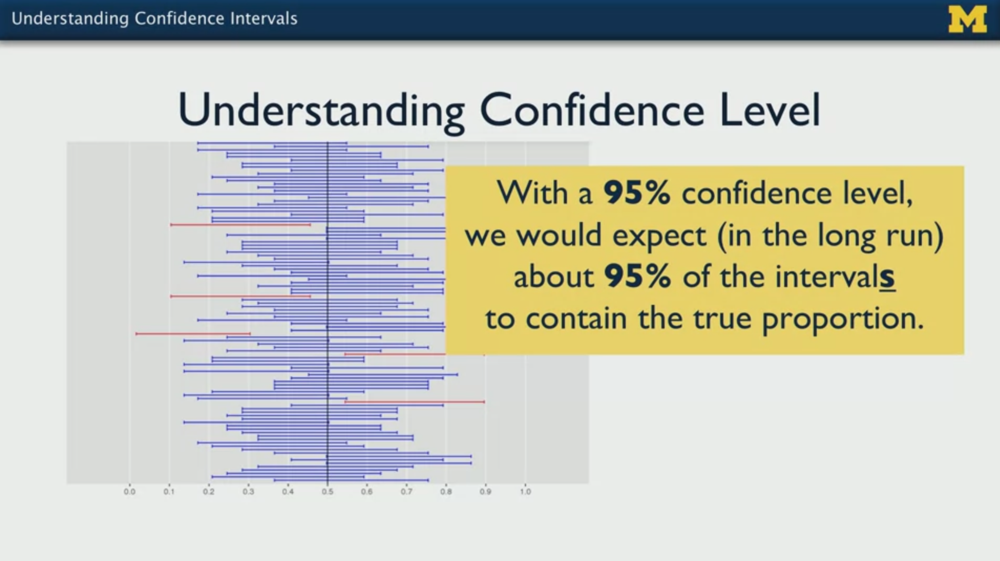

The more confident we want to be, the larger the multiplier is, increasing the range we report.

Some insights after playing with the [Chapter 4: Frequentist Inference - Section 2: Confidence Interval](https://seeing-theory.brown.edu/frequentist-inference/index.html#section2) from the [Seeing Theory](https://seeing-theory.brown.edu) website.

- A larger sample size reduces the value of the standard error (standard deviation of the sample), thus the range is decreased.
- A larger confidence interval `1 - alpha` requires a larger multiplier of the standard error; the increase is exponential. A larger multiplier leads to a larger range.

### 3.3 Assumptions for a Single Population Proportion Confidence Interval

We have the following assumptions:

- We have a **simple random sample (SRS)**: a representative subset of the population made by observations/subjects that have equal probability of being chosen. To check that, analyze how the data was collected and consider at least whether the sample is representative.
- We need to have a **large enough sample size**; that way, the distribution of sample proportions will tend to be normal. By convention, large enough is considered to be at least 10 observations of each class/category; example with car seat usage: at least 10 "yes" and at least 10 "no".

### 3.4 Conservative Approach & Sample Size Consideration

If we are not sure if the sample is SRS we can take a larger or **conservative** standard error as if the estimated proportion were `p_hat = 0.5` (maximum standard deviation).

Then, with a `95% CI` (`MoE = 0.05`), we have:

`estimated p +- (1.96) * (0.5 / sqrt(n))`

which is approximately (cancelling 2):

`estimated p +- 1 / sqrt(n)`

That formula is very handy, because the range depends only on the sample size! To be more accurate, the **conservative margin of error** depends on

1. the sample size `n`
2. and the confidence interval (multiplier `Z*`) we choose.

We can further use that concept for computing the sample size required to have a margin or error of `0.03` (3%, since we are estimating proportions) in the proportion estimation with a confidence of `99%`:

`MoE = 0.03`
`Z*(99%) = 2.576`
`p_hat = 0.5`
`MoE = Z*(97%)/2 * 1 / sqrt(n)`
`n = ((Z*(97%) / 2) / MoE)^2 = 1843.27`
`-> n >= 1844`

## 4. Confidence Intervals -- Categorical Data: Two Proportions

Example: What is the difference in population proportions of parents reporting that their children age 6-18 have had swimming lessons, between white children and black children?

Population: all parents with white children and all parents with black children.

Our parameter of interest is the different in population proportions: `p1 (white) - p2 (black)`; we want to compute the best estimate and its `95% CI`.

Collected data:
- Sample black: 247; 91 had swimming lessons.
- Sample white: 988; 543 had swimming lessons.

Formula:

`Best Estimate +- Margin of Error`

`Best Estimate = p_1_hat - p_2_hat`

`Margin of Error = Z*(95%) x SE(p_1_hat - p_2_hat)`

`Z*(95%) = 1.96`

`SE(p_1_hat - p_2_hat) = sqrt((p_1_hat x (1 - p_1_hat))/(n_1) + (p_2_hat x (1 - p_2_hat))/(n_2))`: The Standard Error of a difference of proportions is the sum of the variances (divided by the sample size of each group), square-rooted.

Result:

`p_1_hat = 0.55`

`p_2_hat = 0.37`

Thus: `0.18 +- 0.0677 = (0.1123, 0.2477)`.

### Interpretation & Assumptions

With 95% confidence, the population proportion of parents with white children who have taken swimming lessons is 11.23% to 24.77% higher than the population of parents with black children who have taken swimming lessons.

**If 0 is contained in the interval, we cannot say there are differences**; since in our case 0 is not in the interval, we can say that both proportions are different!

Assumptions:
- We have two independent random samples.
- We have large enough samples: we need to have at least 10 measurements for each of the 4 categories (black-yes, black-no, white-yes, white-no).

## 5. Confidence Intervals -- Quantitative Data: One Mean -- Estimating Population Mean with Confidence

Example (Cartwheel dataset): What is the **average** cartwheel distance (in inches) for adults? (distance from the forward foot before performing the cartwheel to the final foot after performing it).

Population: all adults.
Parameter of interest: population mean Cartwheel distance.
Sample size: 25.

We want to construct a `95% CI`.

Even though the data is not normally distributed (see QQ-plots and historgram in figure), we can still compute the `95% CI` if we fulfill our regular assumptions: (1) independent random collection of measurements, (2) large enough sample size.

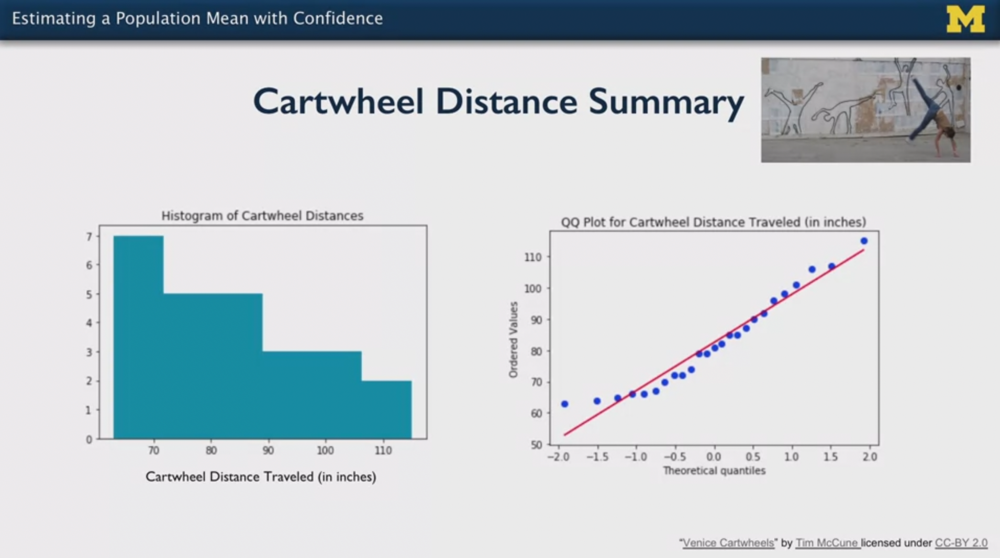

The descriptive summary variables are used:

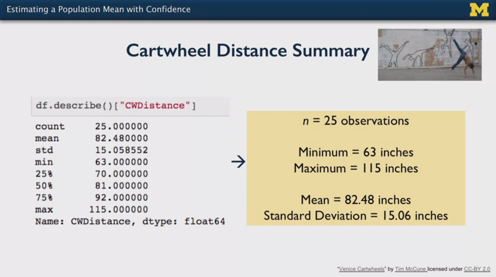

`Best estimate +- Margin of Error`

`Best estimate = Mean(Sample Measurements)`

`Margin of Error = T*(95%, n= 25) x Estimated SE`

`Estimated SE = Estimated Standard Error = sqrt(Estimated Variance / n) = StdDev(Sample Measurements) / sqrt(n sample)`. Note that the standard error is the spread of the sampling distribution, i.e., the error of the sample in the sampling distribution of samples. Our estimated value is computed by taking the measurements of our sample.

`T*(95%, df = n-1 = 24)` is the multiplier, as before; in this case, instead of using the normal/standard distribution, we take the **Student's T Distribution**. This distribution depends on the sample size used. That variable is called **degree of freedom** (df).

`95% CI`

`n = 25 -> T*(95%, df = n-1 = 24) = 2.064`

`n = 1000 -> T*(95%, df = n-1 = 999) = 1.962`

The T Distribution approximates to the normal distribution as the sample size increases.

Computing all terms:

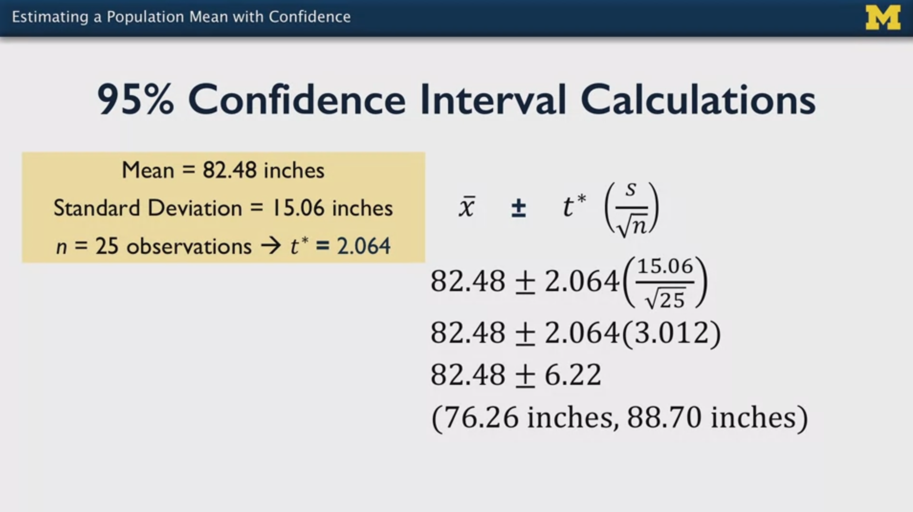

### Interpretation

With 95% confidence, the population mean cartwheel distance for all adults is estimated to be between 76.26 and 88.70 inches.

Recall the confidence refers to our procedure: if we repeat the measurements with different samples using the same methods, 95% of the intervals will contain the real mean!

## 6. Confidence Intervals -- Quantitative Data: Two Means -- Estimating a Mean Difference for Paired Data

**Paired data** arises when collected measurements are related, e.g.:

- Pre and post treatment measurements on the same subjects
- Measurements of twins
- Measurements of family members
- Measurements within the same lot/batch of production
- etc.

Example: What is the average difference between the older twin's and younger twin's self-reported education?

Population: all identical twins.
Parameter of interest: population mean difference of self-reported education.

We want to construct a `95% CI` fort he mean difference.

We have the following data:

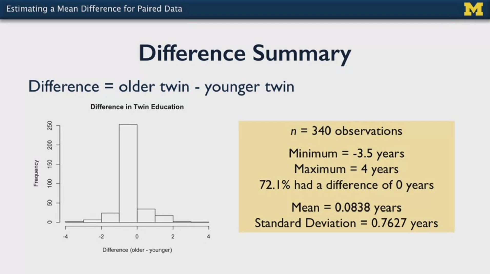

The formulas is the same as before, but we use the difference as the measurement, often notes with subscript `d`. Thus, the mean of the differences is taken and the standard deviation of the differences is used:

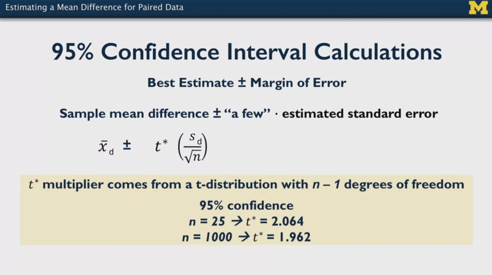

`Best Estimate +- Margin of Error`

`mean(differences) +- T*(95%, df = n-1) x (std(differences) / sqrt(n))`

Result:

`0.084 +- 0.0814 = (0.0025, 0.1652)`

### Interpretation & Assumptions

With 95% confidence, the population mean difference between the two paired groups is estimated to be between 0.0025 and 0.1652 years.

Since the reasonable range is on the positive side (i.e., 0 not contained), we conclude that the older twins have more education years on average. However, note that the interval almost contains 0. The key idea is that we need to check whether the 0 value is inside the range.

Assumptions:
- Random sample of identical twins.
- Population differences normal or large enough sample size.

## 7. Confidence Intervals -- Quantitative Data: Two Means -- Estimating a Mean Difference for Independent Groups

Now, we don't have paired data, but measurements of two unrelated groups.

Example: Do male and female BMI means differ significantly for the USA mexican-american adutls age 18-29? BMI = body mass index = kg/m^2.

Population: all male & female mexican-american adults age 18-29 in the USA.
Parameter of interest: difference of BMI means: `mu_1 - mu_2`.

Data summary:

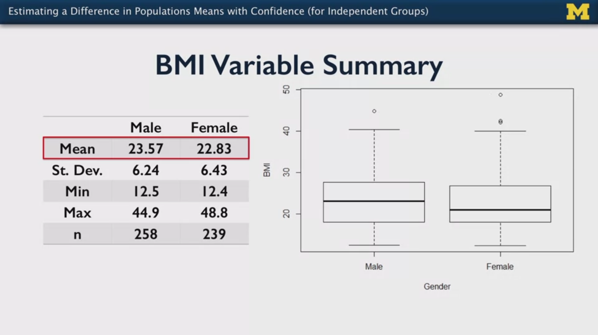

In general, we have two approaches:

1. The pooled approach: the standard deviations of the two population groups are assumed to be equal.
2. The unpooled approach: the standard deviations of the two population groups are assumed to **not** be equal.

Formulas for the **unpooled approach**:

`Best estimate +- Margin of Error`

`Best estimate = Difference Means = mean(Group 1) - mean(Group 2)`

`Margin of Error = T*(95%, df = min(n_1-1, n_2-1)) x Estimated SE`

`Estimated SE = sqrt(std(Group 1)^2 / n_1 + std(Group 2)^2 / n_2)`

For the **pooled approach**, (1) the estimated standard error and (2) the df change:

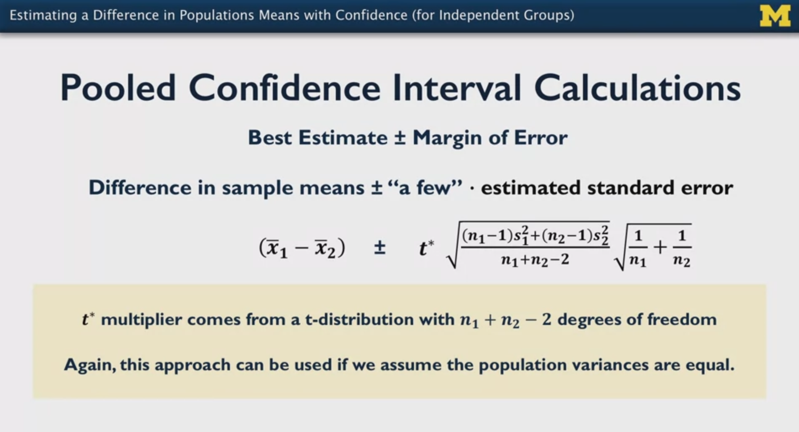

Our example case is pooled:

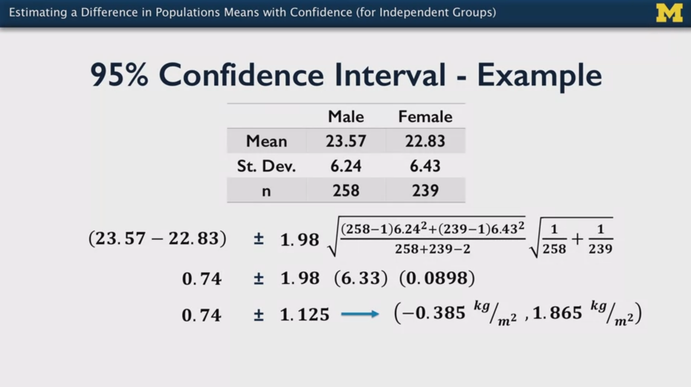

### Interpretation & Assumptions

With 95% confidence, the difference of means of the two population groups is estimated to be between -0.385 and 1.865 kh/m^2.

Since the value 0 is within the range, the is no significant difference between both groups. If we would repeat the measurements with the same method having different samples, 95% of the samples would contain the real difference mean; thus, since 0 is inside the region, there might be really no difference in the means!

Assumptions:

- We have a Simple Random Sample for each group
- Groups are independent
- Measurements have approximately a normal distribution: plot histogram + QQ-plots; even when the plots are not perfect, with large sample sizes we can accept that assumption. The perfect situation would be: bell-shaped historgram and points (at lest the most central ones) close to the normal line.
- We need to check the standard deviations of the two groups: if they are very similar, we use the formulas for the pooled approach, else, the ones for the unpooled; recall two things change:
  - The estimated standard error
  - The df of the T distribution

## 8. Confidence Intervals -- Other Inference Considerations

**Important notes**
- For proportions, we use the Z distribution (normal, standard: `Z = N(0,1)`).
- For means, we use the T distribution (Stundent's).
### 8.1 Confidence Intervals

The purpose of a confidence interval is to cover a **population parameter** with high probability. We have the **lower confidence bound** (LCB) and the **upper confidence bound** (UCB), such that for a `CI 95%`:

`P(LCB <= parameter <= UCB) = 0.95`

If we repeat the sample measurements with the same method, the sought parameter will be in the CI 95% of the time. However, note that:

- If we have low power and high uncertainty, that CI might be too large to convey meaningful data
- If we do not fulfill the assumptions, the real parameter might outside from that CI
- 95% does not refer to the current sample, but to the method

The confidence interval has this general form:

`Best Estimate +- Margin of Error`
`Parameter of the Sample +- K x Estimated Standard Error`
`Estimated Standard Error = sqrt(Variance of Sample / Sample Size)`
`K: T* or Z* values for 95% or the selected significance: a value between 1.96 and 2.5`

There is no rule on the sample size, but

- if we have categorical data, at least 10 instances of each need to be covered
- if we have quantitative data, we need to have a bell-shaped distribution; it doesn't need to be normal, but at least bell-shaped and a QQ-plot should have its central points close to the line

As far as I understand, the bell-shape/normality assumption is due to the fact that the sampling standard error is **estimated** using the variance or standard deviation of the sample. If the sample distribution is not bell-shaped, it won't yield standard deviation characteristic of a bell-shaped distribution; thus, using it to compute the standard error of the the sampling distribution (which is expected to be normal according to the Central Limit Theorem (CLT)), would be misleadingly.

### 8.2 Challenging Cases: What Should We Do if the Sample Distribution is not Bell-Shaped?

1. Categorical data: **Agresti-Coull interval: add two extra values to each category before calculating the proportion**. For instance, if we have 15 yes and 17 no, then: the proportion would be (15 + 2) / (15 + 2 + 17 + 2). This applies to the proportion and the standard error computation.
2. Quantitative data: If the distribution keeps far from a bell shape even with more measurements, **apply a transformation, for instance `log()`**, which transforms the distribution to be more normal. Compute LCB & UCB and undo the transformation (`exp()`, in the example) of these bounds.

### 8.3 Question for the Forum

#### Question 1: Multiplier for the Margin of Error: T or Z?

In week 2, the multiplier for the computation of the margin of error is different depending on the parameter. For proportions, the standard distribution Z is used, whereas for means the Student's T distribution is employed. Shouldn't we rather use always the T distribution?

The reason behind is that the sample size regulates the correct choice: if n is small, T is correct; if n is large, T tends to become Z, so T is still correct.

##### Answer

Hi Mikel :)

Let me make sure that I understand your correctly...

If we want to calculate a CI for a proportion, for example, you're asking why we don't use the t-distribution all of the time, instead of switching to the z-distribution as the sample size become large?

If that's what you're asking, then I have to confess that I'd not heard of this before.  I've only used the z-distribution approximation with proportions, never the t-distribution.

I think that the primary reason for this is that with proportions, the distribution of the estimate does not "pass through" the t-distribution on its way to the z-distribution.  That's not the way the theory works.

That said, the sample sizes and the proportion *definitely* impact the performance of the z-distribution approximation.  Here is a great paper on the topic.  (and it might address your question more fully as well)

https://projecteuclid.org/journals/statistical-science/volume-16/issue-2/Interval-Estimation-for-a-Binomial-Proportion/10.1214/ss/1009213286.full

But I looked around a bit and did find that some textbooks and perhaps some disciplines use the t-distribution instead of the z-distribution as a sort of "hedge" against those approximation performance concerns.  One learns something new every day!

However, I never found an explanation of why or when the t-distribution is a better choice.  Doesn't mean that there isn't one.  I just couldn't find anything.  Do you have something?

I actually think that using the t-distribution with proportions might be well-intentioned (to address the approximation performance issue or coverage performance issue) but it is not really appropriate as it lacks a theory underpinning.  What I have seen instead is using some of the other intervals described in the paper.

Sorry if I've misunderstood again.  Let me know if this is helpful or not!

Best, Brian

#### Question 2: Why Should the Sample Distribution Be Bell-Shaped?

In week 2, a strong emphasis is done in the need of having bell-shaped sample distributions for quantitative data for which mean confidence intervals are to be computed.

However, it is not clearly explained why. That need of quasi-normality is specially confusing, because the Central Limit Theorem (CLT) doesn't require the sample measurement distribution to be normal fo rit to hold -- no matter the underlying population/samples distributions, the sampling distribution will tend to be normal.

Along this lines, my interpretation of the need of the bell-shape/normality assumption is the following:

The sampling standard error is **estimated** using the variance or standard deviation of the sample. If the sample distribution is not bell-shaped, it won't yield standard deviation characteristic of a bell-shaped distribution; thus, using it to compute the standard error of the the sampling distribution (which is expected to be normal according to the Central Limit Theorem (CLT)), would be misleadingly.

Is that correct?

##### Answer

Hi Mikel :)

No worries! Sorry that I misunderstood the first time.

The sample distribution - literally the distribution of data in our sample - does *not* have to be normal/bell shaped.  It should roughly reflect the population distribution, whatever that is.

Now there is truth that a sample from a normal population distribution will be normal as well, even before we consider the CLT.  So the closer that the data are to normal/symmetrical the more efficient the CLT support for the "distribution of the sample means" (aka the sampling distribution) being normal.

But the sample data don't *have* to be normal/bell shaped or come from a normal population.  The CLT still works with a large sample  size even when the data are most definitely not normal.

That said, extreme skew or outliers can influence results, especially with regression. Which is one reason why someone might perform a transform on the sample data to something more "normal" before analysis.  Sometimes people confuse this to mean that the data *need* to be normal.

I do have a reference that is more eloquent that I am about all this.  Could you tell me if it speaks to your question?   And apologies if I've misunderstood again!

http://courses.washington.edu/b511/handouts/Lumley%20Normality%20Assumption.pdf

Best, Brian


### 8.4 What Affects the Standard Error of An Estimate?

The Standard Error of an estimate is an estimate of the standard deviation of the sampling distribution. Thus, smaller standard errors are associated with more precise ranges for the estimate.

The following factors affect the standard error (the more precise we want it, the more expensive it becomes):

1. The **variance of the variables of interest**: the more, the less precise. Thus, precise measurements are encouraged.
2. The **sample size**. The larger, the more precise. However, outliers might appear, affecting the data.
3. The amount of **dependence in the observations, possibly due to cluster sampling**. Measurements of subjects that belong to an underlying group are not independent anymore, which reduces the effective sample size; the same happens with repeated measures along the time in longitudinal studies. Thus, the standard error increases. We need to increase the number of clusters instead of the number or measurements in each cluster to decrease the standard error.
4. The **stratification of the target sample**: stratifying during analysis reduces total variance, because we are removing the between-strata variance.
5. The use of **sampling weights** to compute our estimates. Sometimes we need weights to compute unbiased population estimates. But when the variability of the weights is high, the parameter variance increases.

## 9. Confidence Intervals -- Python Lab
   
I completed three notebooks during the python lab sessions:

- `./lab/02_ConfidenceIntervals_Examples.ipynb`: **most important notebook**. Examples of the theory are constructed.
- `./lab/03_ConfidenceIntervals_NHANES_Practice.ipynb`: this notebook uses the methods from the previous one.
- `./lab/04_Assessment_ToddlersNap_ConfidenceIntervals.ipynb`: notebook of the week 2 assessment; it uses the techniques from the previous notebooks.

In the following, the most important notebook is summarized.

### `./lab/02_ConfidenceIntervals_Examples.ipynb`

This notebook collects practical exercises of the concepts introduced in the course videos. I extended the notebook with relevant material not included in the course.

**Not all sections are summarized -- the reader should open and look at the notebook!**
**In particular, sections related to two proportion/means comparisons are missing here.**
These sections build up on the ones shown here.

Overview of contents:

1. Definitions
2. Personal Notes: Using Distributions with Scipy - PDFs, CDFs
    - 2.1 List of Functions to Handle Distributions
    - 2.2 PDFs and CDFs: Examples
3. CI of One Proportion
    - Manual
    - With Statsmodels
4. CI of One Mean
    - QQ-Plot to Check Normality
    - Manual
    - With Statsmodels
5. **Cleaning and Preparing Datasets (for Two Groups): `crosstab`, `groupby.agg`**
6. CI of Two Proportions: Smokers vs Non-Smokers in Males & Females
    - Manual
    - With Statsmodels (One Proportion)
    - 6.1 Confidence Intervals for Subpopulations: Age Stratification
7. CI of Two Means (Independent Data): BMI mean in Males & Females
    - QQ-Plot to Check Normality
    - Manual
    - With Statsmodels (One Mean)
    - 7.1 Confidence Intervals for Subpopulations: Age Stratification
    - 7.2 Confidence Intervals and Samples Size

```python

#### ---  2. Personal Notes: Using Distributions with Scipy - PDFs, CDFs

from scipy.stats import norm,t

dist = norm(mean, std)
dist = t(df=n-1)

dist.rvs(N) # N random variables of the distribution
dist.pmf(x) # Probability Mass Function at values x for discrete distributions
dist.pdf(x) # Probability Density Function at values x for continuous distributions
dist.cdf(x) # Cumulative Distribution Function at values x for any distribution
dist.ppf(q) # Percent point function (inverse of `cdf`) at q (% of accumulated area) of the given RV

# Confidence 95% (n=10) -> significance level alpha = 0.05
# Since we have two sides, we need to consider: alpha/2 = 0.05/2
# Thus, the percentage we look is: 1 - alpha/2 = 0.975
T_star_95 = t(df=n-1).ppf(0.975)

#### ---  3. CI of One Proportion

import numpy as np

# T*: See above, on more notes on how to compute it with scipy
#T_star_95 = 1.96
from scipy.stats import norm,t
T_star_95 = t(df=n-1).ppf(0.975)
# Sample size
n = 659.0
# Proportion
p = 540.0/n
# Standard Error
se = np.sqrt((p * (1 - p))/n)

# Lower and Upper Bounds
lcb = p - T_star_95 * se
ucb = p + T_star_95 * se

# With Statsmodels
import statsmodels.api as sm
sm.stats.proportion_confint(n * p, n)

#### ---  4. CI of One Mean

from matplotlib import pyplot as plt
import numpy as np
import pandas as pd
import scipy.stats as stats
import seaborn as sns
%matplotlib inline

df = pd.read_csv("Cartwheeldata.csv")

## QQ-Plot: Normality Check
stats.probplot(df["CWDistance"], dist="norm", plot=plt)

# Mean, std, n
mean = df["CWDistance"].mean()
sd = df["CWDistance"].std()
n = len(df)

# T*, Standard Error
#T_star_95 = 2.064
from scipy.stats import norm,t
T_star_95 = t(df=n-1).ppf(0.975)
se = sd/np.sqrt(n)

# Lower and Upper Bounds
lcb = mean - T_star_95 * se
ucb = mean + T_star_95 * se

# With Statsmodels
sm.stats.DescrStatsW(df["CWDistance"]).zconfint_mean()

#### ---  5. Cleaning and Preparing Datasets (for Two Groups): `crosstab`, `groupby.agg`

# For comparisons of two proportions / means, often cleaning and grouping is necessary

da = pd.read_csv("nhanes_2015_2016.csv")

# Recode SMQ020 from 1/2 to Yes/No into new variable SMQ020x
da["SMQ020x"] = da.SMQ020.replace({1: "Yes", 2: "No", 7: np.nan, 9: np.nan})
# Recode RIAGENDR from 1/2 to Male/Female into new variable RIAGENDRx
da["RIAGENDRx"] = da.RIAGENDR.replace({1: "Male", 2: "Female"})

# Cross-Table: Very useful for counting/frequencies of different groups
dx = da[["SMQ020x", "RIAGENDRx"]].dropna()
pd.crosstab(dx.SMQ020x, dx.RIAGENDRx)

# Recode (again) SMQ020x from Yes/No to 1/0 into existing variable SMQ020x
# We recode is again because with 1/0, the mean yields the proportion :)
dx["SMQ020x"] = dx.SMQ020x.replace({"Yes": 1, "No": 0})

# Group By + Aggregate: Very Useful for porportionas and means of different groups
# groupby().agg() creates a new table with aggregated summary values
# in groupby we say which category groups we want in the rows
# and with agg() we say the aggregate function to be applied in the columns
dy = dx.groupby("RIAGENDRx").agg({"SMQ020x": [np.mean, np.size]})
dy.columns = ["Proportion", "n"]

dz = da.groupby("RIAGENDRx").agg({"BMXBMI": [np.mean, np.std, np.size]})
dz.columns = ["BMI_mean", "BMI_std", "BMI_n"]

```

## 10. Hypothesis Testing -- Categorical Data: One Proportion

A hypothesis test answers a question like: "could the value of the parameter be X?"
And we use the data to help support that claim.

Example: study of lack of sleep in teens. In previous years 52% of parents believed that electronics and social media caused that lack of sleep. Now, we have a new larger proportion. Has there been an increase of that believe?

Population: parents with teens
Parameter of interest: proportion, `p`
New sample size: 1018
New proportion: 56% of parents believe that electronics and social media produced lack of sleep in teens.

We define the hypotheses:
- The **null or not hypothesis** `H0` is the one that is contrary to our believe, i.e., there are not significant differences and the proportions/means belong to the same distribution
- The **alternative hypothesis** `Ha` is our believe, and it can be accepted only if the null hypothesis is rejected.

`H0: p0 = 0.52`: The `H0` hypothesis has always a `=` sign.

`Ha: p_hat > p0`: bigger because our research question is posed like that. Depending on the research question, we can have `<`, `!=`. Note that `>` and `<` are directional, whereas `!=` is not.

Significance level: `alpha`; typically `alpha = 0.05`. That is the threshold with which consider we have not enough evidence to support `H0`, so we reject it and accept `Ha`. The significance level must be set before collecting any of the data.

Assumptions:
- Random sample of parents.
- Large enough sample size; at least 10 measurements of each class. That must be true for both propotions, so we check also: `n*p0, n*(1-p0) > 10`. Note that the sample size is of the new survey, while the proportion is from the old one.
- If the assumptions are not met, we need to use another approach.

Test Hypothesis:

`Z = (Best Estimate - Hypothesis Estimate) / Standard Error of Estimate`

`Z = (p_hat - p0) / SE(p_hat)`

The `hypothesis estimate` is in the `H0`, after the `=` symbol: `p0`.

`SE(p_hat) = sqrt(p0*(1-p0)/n)`: The standard error of the estimate is measured with the `p0` proportion! The reason is that we don't really know `p`, we have the best estimate of it. This is our **null standard error**.

`Z = 2.555` -> we need to check the standard distribution `N(0,1)`; note that it is centered and scaled.

Which is the p-value for it? `p-value = 0.0053` Since `p-value < alpha` (shaded are in figure), we reject `H0` and conclude that the new proportion is larger than the previous. The difference is significant, there is sufficient evidence. Note that since the `Ha` contains the directional operator `>`, we need to account for only one tail/side of the `Z` distribution.

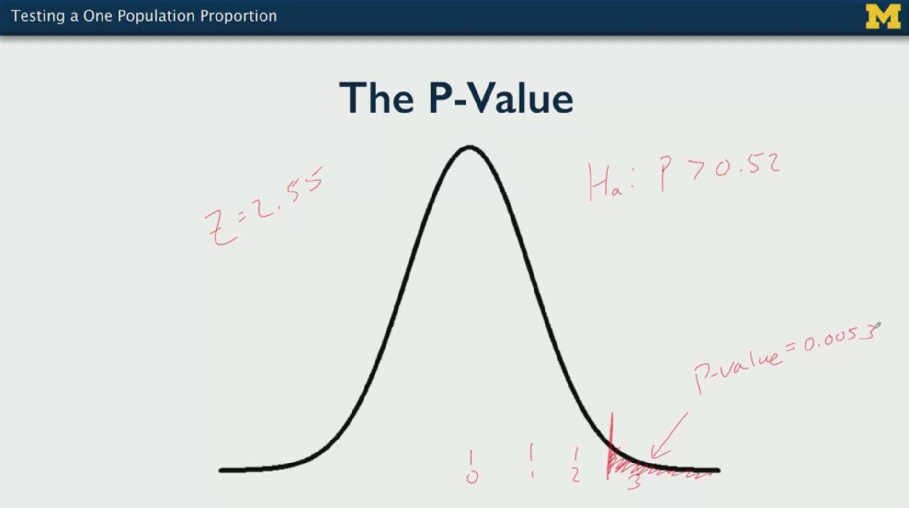

## 11. Hypothesis Testing -- Categorical Data: Two Proportions

Example: parents who report their children 6-18 years old have had swimming lessons; is there a significant difference between proportions of black and hispanic children?

Population: parents, black & hispanic
Parameter of interest: p1 - p2 (difference in population proportions; 1: black, 2 hispanic)
Significance level: `alpha = 0.1`.

`H0: p1 - p2 = 0`

`Ha: p1 - p2 != 0` We choose `!=` because we don't care the direction; we could have chosen `>` or `<`, though. Note that `>` and `<` are directional, whereas `!=` is not.

Data:
- 247 black children, 91 had swimming lessons
- 308 hispanic children, 120 has swimming lessons

Assumptions:
- Two i.i.d. samples
- Large enough sample size; at least 10 for each of the 4 categories. We can check that also with the common proportion: `p_hat = all yes values / all measurements`; then, `n*p_hat, n*(1-p_hat) > 10` for all categories.
- If the assumptions are not met, we need to use another approach.

Proportions:

`p1_hat = 91/247 = 0.37` (black)

`p2_hat = 120/308 = 0.39` (hispanic)

`p1_hat - p2_hat = -0.02`


Hypothesis test:

`Z = (Best Estimate - Hypothesis Estimate) / Standard Error of Estimate`

The `hypothesis estimate` is in the `H0`, after the `=` symbol: `0`.

`Z = (p1_hat - p2_hat - 0) / SE(p_hat)`

`SE(p_hat) = sqrt(p_hat*(1-p_hat_) * (1/n1 + 1/n2))`: The standard error of the estimate is measured with the `p_hat` common proportion!

`Z = -0.48` -> Our observed difference in sample proportions is 0.48 standard errors below our hypothesis mean of equal proportions. We look at the `Z = N(0,1)` which `p-value` that is; recall that since `!=` is non-directional, two sides need to be accounted for.

`p-value = 0.65 > alpha = 0.1` -> We cannot reject `H0`: there is not enough evidence rejecting the equal proportions. Thus, there is not significant difference between proportions.

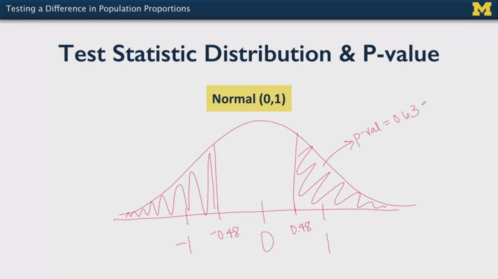

There are two alternatives for dealing with two proportions:

- Chi-Square test: for two-sided hypothesis
- Fisher's exact test: for one-sided hypothesis, typically for small sample sizes

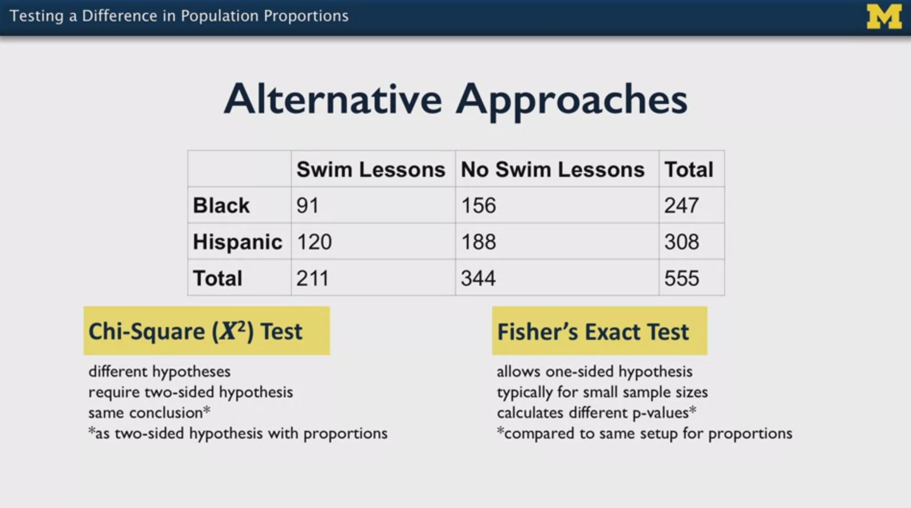

## 12. P-Values, P-Hacking

### 12.1 P-Values

In the context of hypothesis testing, the `p-value` is:
- If the `H0` is true, the `p-value` is the probability of getting the statistic we obtained from our data.
- A `p-value` is a measure of surprise of `H0` being true, not a real measure of evidence. The higher the `p-value` the less surprise there should be that the `H0` is true, the lower the `p-value` the more surprise there should be that `H0` is true. Being surprised means the the data is not reflecting the `H0`.
- So the `p-value` is a measure of the probability of the data supporting `H0`.

The `p-value` is not the probability of `H0` being true! It is the probability of the data supporting `H0`. That is an important distinction.

The `p-value` does not measure the effect. We can have a very low `p-value` but the difference is very small. In fact, you get smaller `p-values` when large samples are collected.

The `p-value` is not small only when `H0` is false; it depends on other factors:
- How much power do we have?
- Which sampling?
- Which test/analysis?

To start doing serious claims, we need to repeat/replicate the study and come to similar conclusions that the `H0` is not a good predictor.

### 12.2 P-Hacking

P-Hacking can occur willingly or unknowingly, when the definition and the assumptions of the hypothesis test are not fulfilled. It creates misleading information: we don't know anymore how to interpret the data when p-hacking is present, although sometimes that is unknown. So it is really dangerous and a waste of energy and time.

Some ways of producing p-hacking:

- We perform several tests/analysis and select one
- When we conduct a study with some research questions but analyze statistically some other later on, observing sub-groups, etc. So we deviate from the design.

As long as we do not follow the assumptions and definitions, we can hack anything. For instance, when we take the outliers and analyze them: we are selecting them! When some assumptions / definitions are not met or we deviate from them, not only the p-values are wrong, also other metrics can be hacked: effect sizes, etc.

In general, the more exploratory an experiment is, the higher is the probability of hacking. We should try to define precise protocols and follow them, to have more confirmatory studies.

It has been argued that the p-values should not be used because there might be p-hacking behind. That seems to be similar to advocating for not using percentages, because people don't use them correctly. Instead, it is better to ask for precise protocols before (design), during (conduction logs) and after (analysis) the experiments. Proper inference requires full reporting and transparency.

### 12.3 Good Practices

- If there are several methods/techniques/tests available, use several of them and see if the results differ; if they don't, we're on the good side
- Publish the data and the used methods: data and code!
- Peer-reviewers don't get access to the data; that should be changed, because verifying should be done!
- Look for replications; don't focus on individual papers.

Statistics is useless if the assumptions and definitions are not fulfilled.