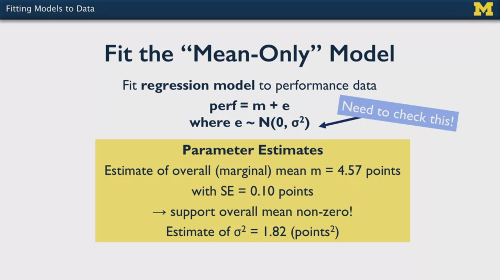
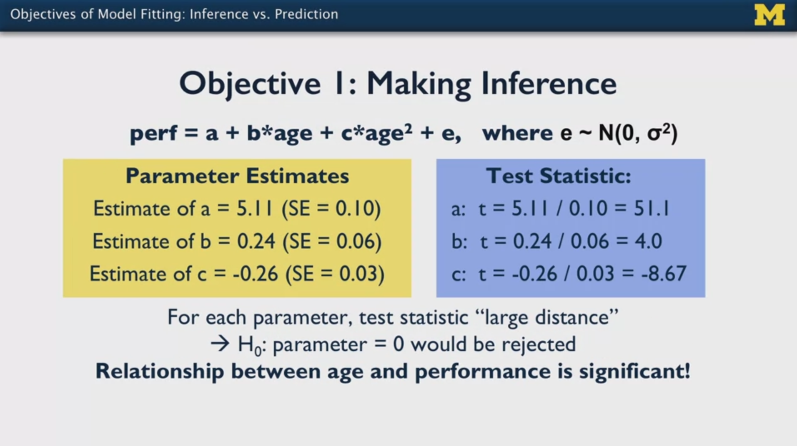
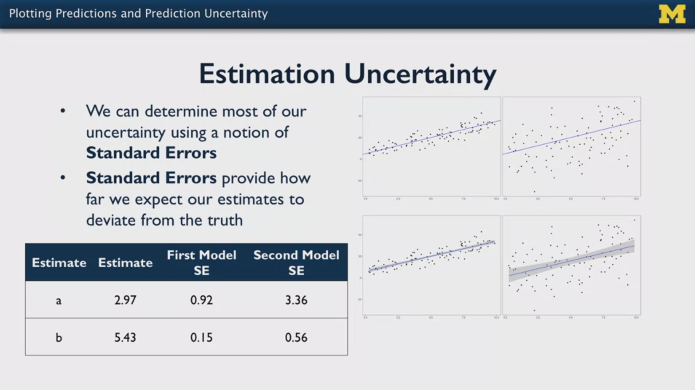
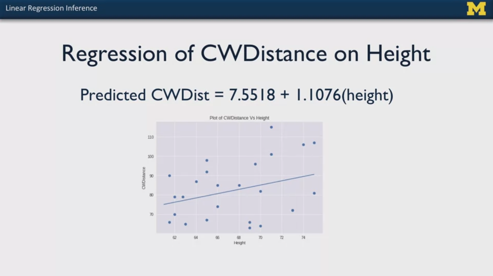
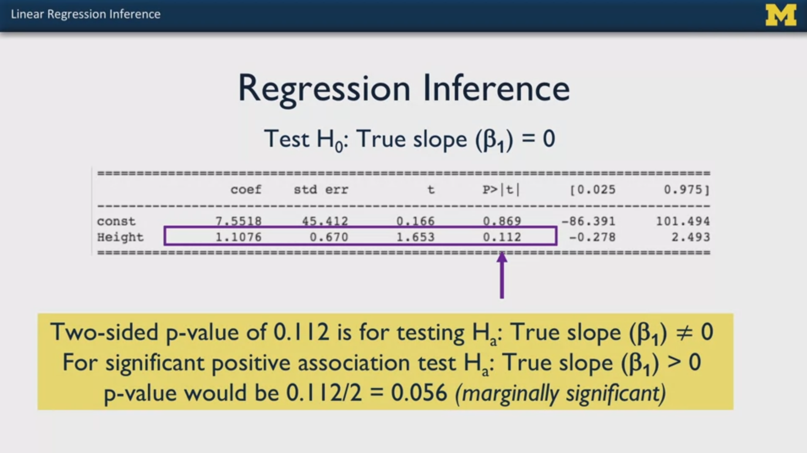
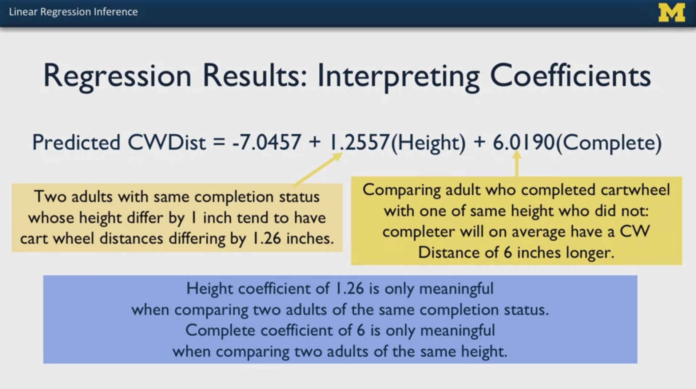
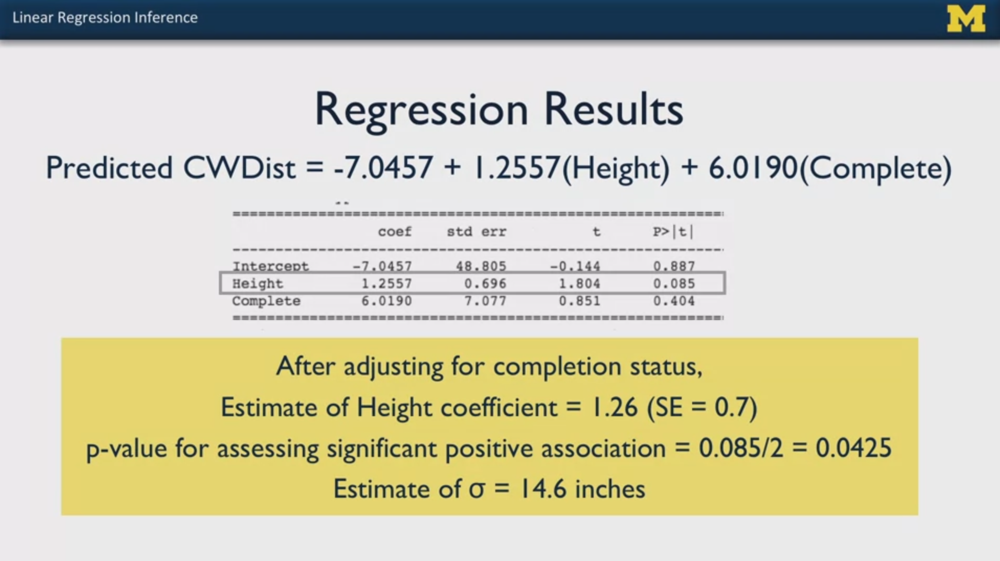
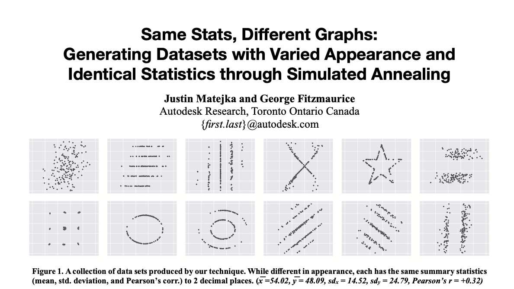
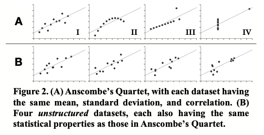

# Statistics with Python: Inferential Statistical Analysis with Python

My personal notes taken while following the Coursera Specialization ["Statistics with Python"](https://www.coursera.org/specializations/statistics-with-python), from the University of Michingan, hosted by Prof. Dr. Brenda Gunderson and colleagues.

The Specialization is divided in three courses and each one has a subfolder with the course notes.

1. [Understanding and Visualizing Data with Python](https://www.coursera.org/learn/understanding-visualization-data?specialization=statistics-with-python): `01_Visualization` 
2. [Inferential Statistical Analysis with Python](https://www.coursera.org/learn/inferential-statistical-analysis-python?specialization=statistics-with-python): `02_Inference`
3. [Fitting Statistical Models to Data with Python](https://www.coursera.org/learn/fitting-statistical-models-data-python?specialization=statistics-with-python): `03_Fitting_Models`

The present file is a guide or compilation of notes of the second course: **Fitting Statistical Models to Data with Python**.

Mikel Sagardia, 2022.
No warranties.

Overview of contents:

1. Considerations for Statistical Modeling
   - 1.1 Fitting Models to Data
   - 1.2 Types of Variables in Statistical Modeling
   - 1.3 Different Study Design Generate Different Data
   - 1.4 Objectives of Model Fitting: Inference vs. Prediction
   - 1.5 Plotting Predictions and Prediction Uncertainty
   - 1.6 Links & Readings
   - 1.7 Python Lab - `01_ModelFitting_Introduction.ipynb`
2. Fitting Models to Independent Data: Linear & Logistic Regression

## 1. Considerations for Statistical Modeling

### 1.1 Fitting Models to Data

We fit models to data, not the other way around!

We want to fit models to the data to

- estimate distribution properties of variables
- summarize relationships between variables
- predict values of variables.

We are going to use parametric models: the model is expressed in parameters; we find the parameter values that best fit the data. We are basically making inferences of parameters; thus, we can also compute their confidence intervals or we can perform hypothesis tests on them.

It is fundamental to assess how well the model fits the data; we're going to see techniques for that.

Example: test performance of students vs. student age; can age predict the test performance? Two major hypothesis are analyzed, which are subclasses of polynomial regression:

1. Mean-only model: `performance = mean + error`
2. Curvi-linear model: `performance = a + b*age + c*age^2 + error`

In both cases, `error = N(0, sigma^2)`. Thus, we estimate

1. 2 parameters for the first model: `mean`, `sigma^2`,
2. 4 parameters for the second model: `a`, `b`, `c`, `sigma^2`.

Note that:
- We can compute the standard error of the parameters (except `sigma`)
- We need to check the assumption `error = N(0, sigma^2)`; for that: we plot for the residuals
  - scatterplot
  - histogram
  - QQ-plot

If the errors are clearly not normally distributed, the model does not represent the data.




Personal notes:

- In both models, we are predicting the mean performance; however, the second model has polynomial terms of the variable age of higher order, whereas the first model does not have a variable of dependence: simply a mean is computed.
- The `error` term is `error = real performance - prediction`.


### 1.2 Types of Variables in Statistical Modeling

Roughly, we have these types of variables

- Categorical vs. Continuous: that relates to the type.
- Dependent Variables and Independent Variables: we want to find their relationship.

**Independent Variables** (IV; aka. predictors, regressors): these are the variables we want to predict.

- They can be manipulated, i.e., groups randomly assigned in the study, or observed.
- If observed, we can find relationships
- If manipulated/controlled, we can predict and in some situations make causal inferences.
- Can be categorical, continuos; if categorical (e.g., ethnicity), we cannot make functional relationships, instead we compare groups.

**Dependent Variables** (DV; aka. outcome, response, variables of interest):

- We select a reasonable distribution (e.g., normal) or the predicting variables and define its parameters (e.g., mean) as a function of the IVs (independent variables)
- Can be continuous, categorical

**Control variables**: control variables are independent variables added to the model in cases where we know they have a relationship with another independent variable used as a predictor. For instance: predict blood pressure as a a function of gender; since weight means are expected to be different for both genders and weight might be related to blood pressure, we add it to the model. That way, we can adjust for confounding.

**Missing data**: before any model fitting, we need to check for missing data:

- Perform bi-variate analyses on IVs and DVs
- We say a unit is a data-point with all independent variables or measurements and its associated dependent variable(s).
- By default, if a unit of analysis has a missing dependent variable, the entire unit is dropped; thus, we introduce bias, which will be larger the more different the dropped unit is
- Therefore, we should analyze how different the dropped units are.
- If there are differences, a possible approach is to predict the missing data with **imputation**.

### 1.3 Different Study Design Generate Different Data

We need to be well informed before staring to fit models.

Simple Random Samples (SRS) typically produce independent and identically distributed data (i.i.d.); thus, we can use the assumption that the observations are independent from each other. Thus, the standard error is going to be smaller, i.e., we're going to have more precise estimates.

Clustered Samples are related to measurements in randomly selected groups; it is to be expected that each group will have more similar data. Thus, there is going to be a correlation, i.e., they are not independent from each other, and we need to take that into account! In fact, we're going to have larger standard errors, i.e., the estimates are going to be less accurate.

In longitudinal studies, repeated measures of the same variable collected from the same unit (e.g., subject) are done over time; thus, they are expected to be correlated. The recorded variables are not independent from each other!

### 1.4 Objectives of Model Fitting: Inference vs. Prediction

When fitting a model, we have two major objectives:

1. We want to make and inference about relationships: which is the relationship?
2. We want to predict/forecast future outcomes using historical data.

Let's analyze each objective in the model:

`performance = a + b*age + c*age^2 + error`

**Objective 1**: Making Inferences

We compute the standard error of each and the `T-Statistic` using the `H0` that `a = b = c = 0`, i.e., there is no model. For instance, for the parameter `a`:

`Ta = (a - 0) / SE(a) = (5.11 - 0) / 0.10 = 51.1` -> `p-value = 0` -> `H0` is rejected, `a` is significant!



Now, each coefficient has a meaning:

- `a` represents the mean test performance when the age is equal to the mean of the dataset.
- `b` represents the rate of increase in performance with age.
- `c` represents the acceleration of increase with age.

If any of the parameters is non-significant, it drops from the model; and I understand we need to re-compute/fit it?

**Objective 2**: Making Predictions

To predict, we apply the model formula to an independent set of variables (in this case, `age`) and we get the estimate mean of the dependent variable (`performance`). We can also predict something different to a mean, such as a percentile.

However, we need to account for the `error`, or the uncertainty associated to the prediction: we need to report it, too, since it's part of the prediction model! I understand that we would report something similar to a confidence interval?

### 1.5 Plotting Predictions and Prediction Uncertainty

When we fit a model we get its parameter values; as important as the parameter values is their uncertainty, which is given by the **standard error** of the computed parameters. With that standard error, we can test any `H0` hypothesis with a `T-Test`:

`T = (Parameter Value - H0) / SE(Parameter Value)`

`H0` is selected usually to be `0`, but we can take any value! Then we would reject or not that value.

Note that the same model with the same parameter values can have a very different underlying dataset. An example is given for two datasets in which the same model is fit `Y = a + b*X`. Additionally, the parameters `a, b` have the same values:



However, the points of the second dataset are much more spread away from the model!

Lessons:

- We need to always plot the dataset and the model.
- We need to compute the standard error of each parameter, as well as its `p-value`.
- The standard error needs to be plotted too: that's the gray area around the model.
- Large standard errors denote cases in which our estimates deviate too much from the data points.

### 1.6 Links & Readings

[Mixed effects models: Is it time to go Bayesian by default?](http://babieslearninglanguage.blogspot.com/2018/02/mixed-effects-models-is-it-time-to-go.html)

Blog post by Michael Frank in which the alternative to linear mixed effects modelling (frequentist approach) is contrasted against Bayesian modelling. Frank argues that R packages have appeared recently that make the work much easier. Additionally, these are more robust (converge easier) and provide the interpretation which is usually sought: we want the probability of the hypothesis given the data. In contrast, frequentist approaches provide `p-values`, which are the probability of the data under the null hypothesis.

### 1.7 Python Lab - `01_ModelFitting_Introduction.ipynb`

The notebook `./lab/01_ModelFitting_Introduction.ipynb` provides a short introduction of the topics learned in the sections below.

This notebook has two parts:

1. Basic Statsmodels Functionalities for Fitting Models. Functions for hypothesis testing as well as for linear and logistic regression modelling are introduced.
2. Exploratory Data Analysis before Modelling: Boston Housing Dataset. After loading the standard Boston Housing dataset, its variables are plotted, correlations computed and transformations applied.

Overview of sections:

1. Basic Statsmodels Functionalities for Fitting Models
    - 1.1 Descriptive Statistics
    - 1.2 Confidence Intervals: Proportions & Means
    - 1.3 Hypothesis Testing: Proportions & Means
    - 1.4 Fitting Models: OLS, GLM, GEE, MIXEDLM
        - 1.4.1 OLS: Ordinary Least Squares - Linear Regression
        - 1.4.2 GLM: Generalized Linear Model - Logistic Regression
        - 1.4.3 GEE: Generalized Estimated Equations
        - 1.4.4 MIXEDLM: Multilevel Models
2. Exploratory Data Analysis before Modelling: Boston Housing Dataset
    - 2.1 Load and Understand Dataset
    - 2.2 Exploratory Data Analysis (EDA)

In the following, the most relevant python snippets from the notebook are presented:

```python

### --- 1. Basic Statsmodels Functionalities for Fitting Models

import statsmodels.api as sm
import numpy as np
import pandas as pd

## 1.1 Descriptive Statistics

# Draw random variables from a normal distribution with numpy
normalRandomVariables = np.random.normal(0, 1, 1000)

# Create object that has descriptive statistics as variables
x = sm.stats.DescrStatsW(normalRandomVariables)

# Mean
print(x.mean)

# Standard deviation
print(x.std)

# Variance
print(x.var)

## 1.2 Confidence Intervals: Proportions & Means

# Observer population proportion
p = 0.85

# Size of population
n = 659

# Construct confidence interval: 95% by default
sm.stats.proportion_confint(n * p, n)

# Import data that will be used to construct confidence interval of population mean
df = pd.read_csv('Cartwheeldata.csv')

# Generate confidence interval for a population mean
sm.stats.DescrStatsW(df["CWDistance"]).zconfint_mean()

## 1.3 Hypothesis Testing: Proportions & Means

# Population size
n = 1018

# Null hypothesis for one population proportion
pnull = 0.52

# Observed population proportion
phat = 0.56

# Calculate test statistic and p-value;
# output: statistic, p-value
sm.stats.proportions_ztest(phat * n, n, pnull)

# Using the dataframe imported above,
# perform a hypothesis test for one population mean;
# output: statistc, p-value
sm.stats.ztest(df["CWDistance"], value = 80, alternative = "larger")

## 1.4 Fitting Models: OLS, GLM, GEE, MIXEDLM

# Load NHANES dataset
da = pd.read_csv("nhanes_2015_2016.csv")

# Drop unused columns, drop rows with any missing values.
vars = ["BPXSY1", "RIDAGEYR", "RIAGENDR", "RIDRETH1", "DMDEDUC2", "BMXBMI",
        "SMQ020", "SDMVSTRA", "SDMVPSU"]
da = da[vars].dropna()
# Rename/replace gender
da["RIAGENDRx"] = da.RIAGENDR.replace({1: "Male", 2: "Female"})

# OLS: Ordinary Least Squares - Linear Regression
# Linear Regression: continuous outcome
# Note how that the model is described as in R
model = sm.OLS.from_formula("BPXSY1 ~ RIDAGEYR + RIAGENDRx", data=da)
res = model.fit()
print(res.summary())

# GLM: Generalized Linear Model - Logistic Regression
# Logistic regression: binary outcome (0, 1)
# Rename/replace smoking: this will be our outcome or dependent variable
da["smq"] = da.SMQ020.replace({2: 0, 7: np.nan, 9: np.nan})
# Smoking yes/no predicted with gender
model = sm.GLM.from_formula("smq ~ RIAGENDRx", family=sm.families.Binomial(), data=da)
res = model.fit()
print(res.summary())

# GEE: Generalized Estimated Equations
# Linear models for cluster samples or repeated measures,
# i.e., observations that might be correlated within a cluster,
# but uncorrelated across clusters
da["group"] = 10*da.SDMVSTRA + da.SDMVPSU
model = sm.GEE.from_formula("BPXSY1 ~ 1", groups="group", cov_struct=sm.cov_struct.Exchangeable(), data=da)
res = model.fit()
print(res.cov_struct.summary())

# MIXEDLM: Multilevel Models
# Similar to GEE: used when there is potential of outcomes to be grouped together
for v in ["BPXSY1", "RIDAGEYR", "BMXBMI", "smq", "SDMVSTRA"]:
    model = sm.GEE.from_formula(v + " ~ 1", groups="group",
           cov_struct=sm.cov_struct.Exchangeable(), data=da)
    result = model.fit()
    print(v, result.cov_struct.summary())

### --- 2. Exploratory Data Analysis before Modelling: Boston Housing Dataset

import warnings
warnings.filterwarnings('ignore')
import numpy as np
import matplotlib.pyplot as plt 
import pandas as pd  
import seaborn as sns 
%matplotlib inline

## 2.1 Load and Understand Dataset

from sklearn.datasets import load_boston
# Boston Housing Dataset: provided by Scikit Learn
boston_dataset = load_boston() 
boston = pd.DataFrame(data=boston_dataset.data, columns=boston_dataset.feature_names)
boston["MEDV"] = boston_dataset.target

boston.shape

boston.columns

# Read always the description and backgroud
# In this case:
# - 506 data points
# - 13 independent variables
# - 1 dependent variable / target: MEDV = Median value of owner-occupied homes in $1000's
print(boston_dataset.DESCR)

## 2.2 Exploratory Data Analysis (EDA)

boston.head()

# Check missing data: we are lucky this time, since there are no missing values
boston.isnull().sum()
boston.isna().sum()

# Always plot the target / outcome
# In our case, we that MEDV is quite normally distributed,
# except the outliers in the upper quartile
sns.set(rc={'figure.figsize':(11.7,8.27)})
sns.distplot(boston["MEDV"], bins = 25)
plt.show()

# If we have many independent variables, we should:
# - check their correlations to choose the ones for our model
# - check the scatterplots of the selected ones
# In this example, the variables that are most correlated with MEDV (dependent) are:
# CRIM, INDUS, NOX, RM, AGE, RAD, TAX, PTRATIO, LSTAT
correlation_matrix = boston.corr().round(2)
sns.set(rc={'figure.figsize':(11.7,8.27)})
sns.heatmap(data=correlation_matrix, annot=True)
plt.show()

# We should plot pairwise scatterplots of the selected variables:
# independent vs dependent
# We exemplary select: RM, CRIM
# RM: it seems that a linear model could fit the point cloud
# CRIM: there is no clear linear relationship, most values are grouped in the begining
plt.figure(figsize=(20, 5))
features = ['RM', 'CRIM']
target = boston['MEDV']
for i, col in enumerate(features):
    plt.subplot(1, len(features) , i+1)
    x = boston[col]
    y = target
    plt.scatter(x, y, marker='o')
    plt.title(col)
    plt.xlabel(col)
    plt.ylabel('MEDV')

# In cases which the scatterplot reveals non-linear agglutinations
# we can try applying transformations.
# In this case: log(CRIM)
# The transformed data reveals a better linear relationship to MEDV (DV)
# We should use log(CRIM) instead of CRIM
plt.figure(figsize=(20, 5))
boston["logCRIM"] = np.log(boston["CRIM"])
features = ['CRIM', 'logCRIM']
target = boston['MEDV']
for i, col in enumerate(features):
    plt.subplot(1, len(features) , i+1)
    x = boston[col]
    y = target
    plt.scatter(x, y, marker='o')
    plt.title(col)
    plt.xlabel(col)
    plt.ylabel('MEDV')

```

## 2. Fitting Models to Independent Data: Linear & Logistic Regression

### 2.1 Linear Regression: Continuous Dependent Variables

Example used from the Cartwheel dataset: predict cartwheel distance (`CWDistance`) based on:

- Height of the person (`Height`)
- Whether they fully completed the cartwheel (`CompleteGroup = 0,1`)

First, the `CWDistance ~ Height` relationship is analyzed. Steps:

- Check distribution of `CWDistance`: histogram, QQ-plot, range, mean, std, etc.
- Visualize the scatter-plot.
- Compute correlation, R2: `CWDistance` vs `Height`
  - `corr = 0.33`
  - `R2 = 0.107`: only 11% of the variation in `CWDistance` can be explained by the linear relationship with height.
- Obtain the parameters of the best fitting line: linear regression: `y_hat = b_0 + b_1 * x`
  - `b_0 = 7.55`: intercept: offset when the dependent variable is 0.
  - `b_1 = 1.11`: slope: increase in response when the independent variable increases one unit.

The regression line is found by minimizing the squared error from the data points to the model or parametrized line; that is called the **least squares** technique, or regression.

Note that when the parameters of the model are solved:

- The line predicts the estimation of the mean for a given independent variable value: `E[y|x]`
- If we go out of the range of our dataset, we are extrapolating, which is dangerous; the model fits the current data, nothing else!



As important as the values of the parameters is the **inference of the linear regression**. With the inference, we conclude if the result can be transferred from our sample to the population; in other words, the significance of the parameters and their confidence intervals are obtained. In a linear regression, the most important parameter is `b_1`, since it's the one that measures the relationship between the dependent and the independent parameter. For that, we follow the usual methods:

- Obtain standard error: `SE`
- Obtain the `T` statistic for the parameter(s): `T = (Parameter Value - H0) / SE`.
- Get the `p-value` of the `T` statistic (1- or 2-sided, depending on the `H0` definition; remember that the 1-sided value must be halved!).



The confidence interval of `95%` is equivalently computed and can be seen next to the `p-value` in the results table. Although in the video and in the slide the slope is considered marginally significant, I think it should not be considered significant - in fact, the confidence interval contains the value 0, i.e., with 95% confidence, the mean slope can be indeed 0!

Finally, the main assumption must be checked: the residuals must be normally distributed with a variance independent from the `Height`: `e ~ N(0,s^2)`. That is checked with a QQ-plot, as well a scatterplot.

Note that `95%` confidence interval bands can be plotted: these are the narrowest in the mean `Height` and spread as we go further away from that average; the formula is beyond the scope of the course.

Next, we could add other variables, such as the binary variable `Complete = {0,1}`, which captures whether the cartwheel was completely done or not. With that, the model changes, and the parameters and their significances are different! Note that each parameter mus be interpreted as if the other variables were constant.





We see that taking the 1-sided hypothesis, the slope of the `Height` turns out to be significant: `p-value = 0.0425 < 0.05`.

How is that possible? See Forum questions in the dedicated section below.

### 2.2. Linear Regression: Reading - `Stats_with_Python_Linear-Regression-Overview.pdf`

Notes I made while reading the PDF.

The "linear" word of linear regression refers to the linearity of the parameters `b_i`, not the linearity of the variables; in fact, we can have linear regression with polynomial terms of the variables. When these polynomial terms are `x_1*x_2`, we have **interactions**. When including interactions, it is good to normalize the variable values (substract the mean).

Note that linear regression computes **estimated** parameters `b_i` which are inferred to the real parameters of the population model; one should differentiate between `b_hat` and `b`.

With linear regression we compute th expected value or mean of `y`: `E[y|x]`. However, as important as the mean, is the variance: `Var[y|x]`, which is not reported. It is usually assumed that the variance is constant: **homoscedasticity**; although that is not a had condition, most methods work better if it is fulfilled.

Even though we have a clear and significant linear model, we cannot talk about "causality"; instead, prefer "association". Causal relationship require often experimental and very well designed studies. A good example that shows that association is not causation is the relationship between use of social media and anxiety: people that use more social media are more anxious, why is that?
- More young people use social media and young people are more anxious?
- Introverts use more social media and are more anxious?
- ... there can be many hidden causes behind, social media does not need to cause anxiety.

The major factor for the uncertainty of a parameter estimation is the sample size. However, the variances in the data also affect. We have different variances that affect the model differently:

- The variance or scatter of the dependent variable around its predicted mean is bad
- The variance or the scatter of the independent variables around their mean is good
- The less correlated the independent variables are the better, because that way more variability can be clearly explained

The pearson correlation `r` squared is `R^2`; `R^2 in [0,1]` is the proportion of explained variance: it should be as big as possible. However, very high `R^2` values might be related to **overfitting**; in that case, the model cannot generalize well.

Categorical variables can be used in linear regression if we encode them as **indicator variables**: `0,1`. These are dummy variables or the one-hot encoding; the category that is dropped is called the reference level.

**Residuals** are the differences `e = y - y_hat`, and we should always plot them against the fitted values `y_hat`. The scatterplot should be completely random; if there is any relationship: the variance changes! The linear model does not capture the data correctly. For instance, that could happen if we fit a line in a U-shaped point cloud.

### 2.3 The Importance of Data Visualization

A paper is referenced and provided which displays how it is possible to have completely different datasets which lead to the same statistics: mean, std., correlation, etc. The lesson is: always try to visualize the data!

`./MatejkaFitzmaurice_SameStatsDifferentGraphs_2017.pdf`

[Same Stats, Different Graphs: Generating Datasets with Varied Appearance and Identical Statistics through Simulated Annealing](https://www.autodesk.com/research/publications/same-stats-different-graphs)





### 2.X Forum Questions
#### Question 1

In week two, the Cartwheel dataset is used to introduce the methods around linear regression. When the significance of the parameters is checked, the `Height` variable becomes significant when the variable `Complete` is introduced to the model.

How is that possible? It seems to me that this example shows how unreliable the methods used for inference are in general -- or at least, that we should always take the conclusions with a grain of salt. If we add another variable to our model, significances of the previous parameters might change; thus, we can take a model with non-significant parameters and add variables until we make one of the previous ones significant.

Or where is the error in the logic of my thoughts?

Additionally, the scatterplot `Height vs. CWDistance` is already dubious: if the two units with the largest `CWDistance` are removed, the point cloud seems completely random. The R^2 value already accounts for it with all the units of the dataset: shouldn't we stop doing any analysis after seeing this low R^2 value?

