# Statistics with Python: Inferential Statistical Analysis with Python

My personal notes taken while following the Coursera Specialization ["Statistics with Python"](https://www.coursera.org/specializations/statistics-with-python), from the University of Michingan, hosted by Prof. Dr. Brenda Gunderson and colleagues.

The Specialization is divided in three courses and each one has a subfolder with the course notes.

1. [Understanding and Visualizing Data with Python](https://www.coursera.org/learn/understanding-visualization-data?specialization=statistics-with-python): `01_Visualization` 
2. [Inferential Statistical Analysis with Python](https://www.coursera.org/learn/inferential-statistical-analysis-python?specialization=statistics-with-python): `02_Inference`
3. [Fitting Statistical Models to Data with Python](https://www.coursera.org/learn/fitting-statistical-models-data-python?specialization=statistics-with-python): `03_Fitting_Models`

The present file is a guide or compilation of notes of the second course: **Fitting Statistical Models to Data with Python**.

Mikel Sagardia, 2022.
No warranties.

Overview of contents:

1. Considerations for Statistical Modeling
   - 1.1 Fitting Models to Data
   - 1.2 Types of Variables in Statistical Modeling
   - 1.3 Different Study Design Generate Different Data
   - 1.4 Objectives of Model Fitting: Inference vs. Prediction
   - 1.5 Plotting Predictions and Prediction Uncertainty
   - 1.6 Links & Readings
   - 1.7 Python Lab - `01_ModelFitting_Introduction.ipynb`
2. Fitting Models to Independent Data: Linear & Logistic Regression
   - 2.1 Linear Regression: Continuous Dependent Variables
     - Inference with Linear Regression: Hypothesis Tests and Confidence Intervals of the Parameters
   - 2.2. Linear Regression: Reading - `Stats_with_Python_Linear-Regression-Overview.pdf`
   - 2.3 The Importance of Data Visualization
   - 2.4 Multicolinearity (Personal Notes)
   - 2.5 Forum Questions
   - 2.6 Logistic Regression: Binary (Categorical) Dependent Variables
     - Inference with Logistics Regression: Hypothesis Tests and Confidence Intervals of the Parameters
   - 2.7 Logistic Regression: Reading - `Stats_with_Python_Logistic-Regression-Overview.pdf`
   - 2.8 Python Lab - `02_LinearLogisticRegression_NHANES.ipynb`
3. Fitting Models to Dependent Data: Multilevel and Marginal Models
   - 3.1 Multilevel Linear Regression Models - Continuous Dependent Variables (Outcome)
     - Example: European Social Survey (ESS) Dataset
   - 3.2 Multilevel Logistic Regression Models - Binary Dependent Variables (Outcome)
   - 3.3 Hiearchical Models Web App from Cal Poly
   - 3.4 What are Marginal Models and Why Do We Fit Them?
   - 3.5 Marginal Linear Regression Models - Continuous Dependent Variables (Outcome)
   - 3.6 Marginal Logistic Regression - Binary Dependent Variables (Outcome)
   - 3.7 Python Lab: Multi-Level and Marginal Models for Dependent Data
     - `./lab/03_Marginal_and_Multilevel_Models.ipynb`
     - `./lab/04_Marginal_and_Multilevel_Models_NHANES.ipynb`
4. Special Topics

## 1. Considerations for Statistical Modeling

### 1.1 Fitting Models to Data

We fit models to data, not the other way around!

We want to fit models to the data to

- estimate distribution properties of variables
- summarize relationships between variables
- predict values of variables.

We are going to use parametric models: the model is expressed in parameters; we find the parameter values that best fit the data. We are basically making inferences of parameters; thus, we can also compute their confidence intervals or we can perform hypothesis tests on them.

It is fundamental to assess how well the model fits the data; we're going to see techniques for that.

Example: test performance of students vs. student age; can age predict the test performance? Two major hypothesis are analyzed, which are subclasses of polynomial regression:

1. Mean-only model: `performance = mean + error`
2. Curvi-linear model: `performance = a + b*age + c*age^2 + error`

In both cases, `error = N(0, sigma^2)`. Thus, we estimate

1. 2 parameters for the first model: `mean`, `sigma^2`,
2. 4 parameters for the second model: `a`, `b`, `c`, `sigma^2`.

Note that:
- We can compute the standard error of the parameters (except `sigma`)
- We need to check the assumption `error = N(0, sigma^2)`; for that: we plot for the residuals
  - scatterplot
  - histogram
  - QQ-plot

If the errors are clearly not normally distributed, the model does not represent the data.


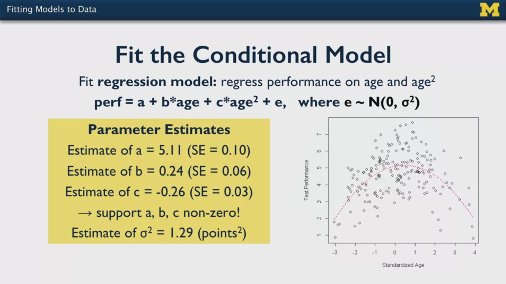

Personal notes:

- In both models, we are predicting the mean performance; however, the second model has polynomial terms of the variable age of higher order, whereas the first model does not have a variable of dependence: simply a mean is computed.
- The `error` term is `error = real performance - prediction`.


### 1.2 Types of Variables in Statistical Modeling

Roughly, we have these types of variables

- Categorical vs. Continuous: that relates to the type.
- Dependent Variables and Independent Variables: we want to find their relationship.

**Independent Variables** (IV; aka. predictors, regressors): these are the variables we want to predict.

- They can be manipulated, i.e., groups randomly assigned in the study, or observed.
- If observed, we can find relationships
- If manipulated/controlled, we can predict and in some situations make causal inferences.
- Can be categorical, continuos; if categorical (e.g., ethnicity), we cannot make functional relationships, instead we compare groups.

**Dependent Variables** (DV; aka. outcome, response, variables of interest):

- We select a reasonable distribution (e.g., normal) or the predicting variables and define its parameters (e.g., mean) as a function of the IVs (independent variables)
- Can be continuous, categorical

**Control variables**: control variables are independent variables added to the model in cases where we know they have a relationship with another independent variable used as a predictor. For instance: predict blood pressure as a a function of gender; since weight means are expected to be different for both genders and weight might be related to blood pressure, we add it to the model. That way, we can adjust for confounding.

**Missing data**: before any model fitting, we need to check for missing data:

- Perform bi-variate analyses on IVs and DVs
- We say a unit is a data-point with all independent variables or measurements and its associated dependent variable(s).
- By default, if a unit of analysis has a missing dependent variable, the entire unit is dropped; thus, we introduce bias, which will be larger the more different the dropped unit is
- Therefore, we should analyze how different the dropped units are.
- If there are differences, a possible approach is to predict the missing data with **imputation**.

### 1.3 Different Study Design Generate Different Data

We need to be well informed before staring to fit models.

Simple Random Samples (SRS) typically produce independent and identically distributed data (i.i.d.); thus, we can use the assumption that the observations are independent from each other. Thus, the standard error is going to be smaller, i.e., we're going to have more precise estimates.

Clustered Samples are related to measurements in randomly selected groups; it is to be expected that each group will have more similar data. Thus, there is going to be a correlation, i.e., they are not independent from each other, and we need to take that into account! In fact, we're going to have larger standard errors, i.e., the estimates are going to be less accurate.

In longitudinal studies, repeated measures of the same variable collected from the same unit (e.g., subject) are done over time; thus, they are expected to be correlated. The recorded variables are not independent from each other!

### 1.4 Objectives of Model Fitting: Inference vs. Prediction

When fitting a model, we have two major objectives:

1. We want to make and inference about relationships: which is the relationship?
2. We want to predict/forecast future outcomes using historical data.

Let's analyze each objective in the model:

`performance = a + b*age + c*age^2 + error`

**Objective 1**: Making Inferences

We compute the standard error of each and the `T-Statistic` using the `H0` that `a = b = c = 0`, i.e., there is no model. For instance, for the parameter `a`:

`Ta = (a - 0) / SE(a) = (5.11 - 0) / 0.10 = 51.1` -> `p-value = 0` -> `H0` is rejected, `a` is significant!


Now, each coefficient has a meaning:

- `a` represents the mean test performance when the age is equal to the mean of the dataset.
- `b` represents the rate of increase in performance with age.
- `c` represents the acceleration of increase with age.

If any of the parameters is non-significant, it drops from the model; and I understand we need to re-compute/fit it?

**Objective 2**: Making Predictions

To predict, we apply the model formula to an independent set of variables (in this case, `age`) and we get the estimate mean of the dependent variable (`performance`). We can also predict something different to a mean, such as a percentile.

However, we need to account for the `error`, or the uncertainty associated to the prediction: we need to report it, too, since it's part of the prediction model! I understand that we would report something similar to a confidence interval?

### 1.5 Plotting Predictions and Prediction Uncertainty

When we fit a model we get its parameter values; as important as the parameter values is their uncertainty, which is given by the **standard error** of the computed parameters. With that standard error, we can test any `H0` hypothesis with a `T-Test`:

`T = (Parameter Value - H0) / SE(Parameter Value)`

`H0` is selected usually to be `0`, but we can take any value! Then we would reject or not that value.

Note that the same model with the same parameter values can have a very different underlying dataset. An example is given for two datasets in which the same model is fit `Y = a + b*X`. Additionally, the parameters `a, b` have the same values:


However, the points of the second dataset are much more spread away from the model!

Lessons:

- We need to always plot the dataset and the model.
- We need to compute the standard error of each parameter, as well as its `p-value`.
- The standard error needs to be plotted too: that's the gray area around the model.
- Large standard errors denote cases in which our estimates deviate too much from the data points.

### 1.6 Links & Readings

[Mixed effects models: Is it time to go Bayesian by default?](http://babieslearninglanguage.blogspot.com/2018/02/mixed-effects-models-is-it-time-to-go.html)

Blog post by Michael Frank in which the alternative to linear mixed effects modelling (frequentist approach) is contrasted against Bayesian modelling. Frank argues that R packages have appeared recently that make the work much easier. Additionally, these are more robust (converge easier) and provide the interpretation which is usually sought: we want the probability of the hypothesis given the data. In contrast, frequentist approaches provide `p-values`, which are the probability of the data under the null hypothesis.

### 1.7 Python Lab - `01_ModelFitting_Introduction.ipynb`

The notebook `./lab/01_ModelFitting_Introduction.ipynb` provides a short introduction of the topics learned in the sections below.

This notebook has two parts:

1. Basic Statsmodels Functionalities for Fitting Models. Functions for hypothesis testing as well as for linear and logistic regression modelling are introduced.
2. Exploratory Data Analysis before Modelling: Boston Housing Dataset. After loading the standard Boston Housing dataset, its variables are plotted, correlations computed and transformations applied.

Overview of sections:

1. Basic Statsmodels Functionalities for Fitting Models
    - 1.1 Descriptive Statistics
    - 1.2 Confidence Intervals: Proportions & Means
    - 1.3 Hypothesis Testing: Proportions & Means
    - 1.4 Fitting Models: OLS, GLM, GEE, MIXEDLM
        - 1.4.1 OLS: Ordinary Least Squares - Linear Regression
        - 1.4.2 GLM: Generalized Linear Model - Logistic Regression
        - 1.4.3 GEE: Generalized Estimated Equations
        - 1.4.4 MIXEDLM: Multilevel Models
2. Exploratory Data Analysis before Modelling: Boston Housing Dataset
    - 2.1 Load and Understand Dataset
    - 2.2 Exploratory Data Analysis (EDA)

In the following, the most relevant python snippets from the notebook are presented:

```python

### --- 1. Basic Statsmodels Functionalities for Fitting Models

import statsmodels.api as sm
import numpy as np
import pandas as pd

## 1.1 Descriptive Statistics

# Draw random variables from a normal distribution with numpy
normalRandomVariables = np.random.normal(0, 1, 1000)

# Create object that has descriptive statistics as variables
x = sm.stats.DescrStatsW(normalRandomVariables)

# Mean
print(x.mean)

# Standard deviation
print(x.std)

# Variance
print(x.var)

## 1.2 Confidence Intervals: Proportions & Means

# Observer population proportion
p = 0.85

# Size of population
n = 659

# Construct confidence interval: 95% by default
sm.stats.proportion_confint(n * p, n)

# Import data that will be used to construct confidence interval of population mean
df = pd.read_csv('Cartwheeldata.csv')

# Generate confidence interval for a population mean
sm.stats.DescrStatsW(df["CWDistance"]).zconfint_mean()

## 1.3 Hypothesis Testing: Proportions & Means

# Population size
n = 1018

# Null hypothesis for one population proportion
pnull = 0.52

# Observed population proportion
phat = 0.56

# Calculate test statistic and p-value;
# output: statistic, p-value
sm.stats.proportions_ztest(phat * n, n, pnull)

# Using the dataframe imported above,
# perform a hypothesis test for one population mean;
# output: statistc, p-value
sm.stats.ztest(df["CWDistance"], value = 80, alternative = "larger")

## 1.4 Fitting Models: OLS, GLM, GEE, MIXEDLM

# Load NHANES dataset
da = pd.read_csv("nhanes_2015_2016.csv")

# Drop unused columns, drop rows with any missing values.
vars = ["BPXSY1", "RIDAGEYR", "RIAGENDR", "RIDRETH1", "DMDEDUC2", "BMXBMI",
        "SMQ020", "SDMVSTRA", "SDMVPSU"]
da = da[vars].dropna()
# Rename/replace gender
da["RIAGENDRx"] = da.RIAGENDR.replace({1: "Male", 2: "Female"})

# OLS: Ordinary Least Squares - Linear Regression
# Linear Regression: continuous outcome
# Note how that the model is described as in R
model = sm.OLS.from_formula("BPXSY1 ~ RIDAGEYR + RIAGENDRx", data=da)
res = model.fit()
print(res.summary())

# GLM: Generalized Linear Model - Logistic Regression
# Logistic regression: binary outcome (0, 1)
# Rename/replace smoking: this will be our outcome or dependent variable
da["smq"] = da.SMQ020.replace({2: 0, 7: np.nan, 9: np.nan})
# Smoking yes/no predicted with gender
model = sm.GLM.from_formula("smq ~ RIAGENDRx", family=sm.families.Binomial(), data=da)
res = model.fit()
print(res.summary())

# GEE: Generalized Estimated Equations
# Linear models for cluster samples or repeated measures,
# i.e., observations that might be correlated within a cluster,
# but uncorrelated across clusters
da["group"] = 10*da.SDMVSTRA + da.SDMVPSU
model = sm.GEE.from_formula("BPXSY1 ~ 1", groups="group", cov_struct=sm.cov_struct.Exchangeable(), data=da)
res = model.fit()
print(res.cov_struct.summary())

# MIXEDLM: Multilevel Models
# Similar to GEE: used when there is potential of outcomes to be grouped together
for v in ["BPXSY1", "RIDAGEYR", "BMXBMI", "smq", "SDMVSTRA"]:
    model = sm.GEE.from_formula(v + " ~ 1", groups="group",
           cov_struct=sm.cov_struct.Exchangeable(), data=da)
    result = model.fit()
    print(v, result.cov_struct.summary())

### --- 2. Exploratory Data Analysis before Modelling: Boston Housing Dataset

import warnings
warnings.filterwarnings('ignore')
import numpy as np
import matplotlib.pyplot as plt 
import pandas as pd  
import seaborn as sns 
%matplotlib inline

## 2.1 Load and Understand Dataset

from sklearn.datasets import load_boston
# Boston Housing Dataset: provided by Scikit Learn
boston_dataset = load_boston() 
boston = pd.DataFrame(data=boston_dataset.data, columns=boston_dataset.feature_names)
boston["MEDV"] = boston_dataset.target

boston.shape

boston.columns

# Read always the description and backgroud
# In this case:
# - 506 data points
# - 13 independent variables
# - 1 dependent variable / target: MEDV = Median value of owner-occupied homes in $1000's
print(boston_dataset.DESCR)

## 2.2 Exploratory Data Analysis (EDA)

boston.head()

# Check missing data: we are lucky this time, since there are no missing values
boston.isnull().sum()
boston.isna().sum()

# Always plot the target / outcome
# In our case, we that MEDV is quite normally distributed,
# except the outliers in the upper quartile
sns.set(rc={'figure.figsize':(11.7,8.27)})
sns.distplot(boston["MEDV"], bins = 25)
plt.show()

# If we have many independent variables, we should:
# - check their correlations to choose the ones for our model
# - check the scatterplots of the selected ones
# In this example, the variables that are most correlated with MEDV (dependent) are:
# CRIM, INDUS, NOX, RM, AGE, RAD, TAX, PTRATIO, LSTAT
correlation_matrix = boston.corr().round(2)
sns.set(rc={'figure.figsize':(11.7,8.27)})
sns.heatmap(data=correlation_matrix, annot=True)
plt.show()

# We should plot pairwise scatterplots of the selected variables:
# independent vs dependent
# We exemplary select: RM, CRIM
# RM: it seems that a linear model could fit the point cloud
# CRIM: there is no clear linear relationship, most values are grouped in the begining
plt.figure(figsize=(20, 5))
features = ['RM', 'CRIM']
target = boston['MEDV']
for i, col in enumerate(features):
    plt.subplot(1, len(features) , i+1)
    x = boston[col]
    y = target
    plt.scatter(x, y, marker='o')
    plt.title(col)
    plt.xlabel(col)
    plt.ylabel('MEDV')

# In cases which the scatterplot reveals non-linear agglutinations
# we can try applying transformations.
# In this case: log(CRIM)
# The transformed data reveals a better linear relationship to MEDV (DV)
# We should use log(CRIM) instead of CRIM
plt.figure(figsize=(20, 5))
boston["logCRIM"] = np.log(boston["CRIM"])
features = ['CRIM', 'logCRIM']
target = boston['MEDV']
for i, col in enumerate(features):
    plt.subplot(1, len(features) , i+1)
    x = boston[col]
    y = target
    plt.scatter(x, y, marker='o')
    plt.title(col)
    plt.xlabel(col)
    plt.ylabel('MEDV')

```

## 2. Fitting Models to Independent Data: Linear & Logistic Regression

### 2.1 Linear Regression: Continuous Dependent Variables

Example used from the Cartwheel dataset: predict cartwheel distance (`CWDistance`) based on:

- Height of the person (`Height`)
- Whether they fully completed the cartwheel (`CompleteGroup = 0,1`)

First, the `CWDistance ~ Height` relationship is analyzed. Steps:

- Check distribution of `CWDistance`: histogram, QQ-plot, range, mean, std, etc.
- Visualize the scatter-plot.
- Compute correlation, R2: `CWDistance` vs `Height`
  - `corr = 0.33`
  - `R2 = 0.107`: only 11% of the variation in `CWDistance` can be explained by the linear relationship with height.
- Obtain the parameters of the best fitting line: linear regression: `y_hat = b_0 + b_1 * x`
  - `b_0 = 7.55`: intercept: offset when the dependent variable is 0.
  - `b_1 = 1.11`: slope: increase in response when the independent variable increases one unit.

The regression line is found by minimizing the squared error from the data points to the model or parametrized line; that is called the **least squares** technique, or regression.

Note that when the parameters of the model are solved:

- The line predicts the estimation of the mean for a given independent variable value: `E[y|x]`
- If we go out of the range of our dataset, we are extrapolating, which is dangerous; the model fits the current data, nothing else!


#### Inference with Linear Regression: Hypothesis Tests and Confidence Intervals of the Parameters

As important as the values of the parameters is the **inference of the linear regression**. With the inference, we conclude if the result can be transferred from our sample to the population; in other words, the significance of the parameters and their confidence intervals are obtained. In a linear regression, the most important parameter is `b_1`, since it's the one that measures the relationship between the dependent and the independent parameter. For that, we follow the usual methods:

- Obtain standard error: `SE`
- Obtain the `T` statistic for the parameter(s): `T = (Parameter Value - H0) / SE`.
- Get the `p-value` of the `T` statistic (1- or 2-sided, depending on the `H0` definition; remember that the 1-sided value must be halved!).


The confidence interval of `95%` is equivalently computed and can be seen next to the `p-value` in the results table. Although in the video and in the slide the slope is considered marginally significant, I think it should not be considered significant - in fact, the confidence interval contains the value 0, i.e., with 95% confidence, the mean slope can be indeed 0!

Finally, the main assumption must be checked: the residuals must be normally distributed with a variance independent from the `Height`: `e ~ N(0,s^2)`. That is checked with a QQ-plot, as well a scatterplot.

Note that `95%` confidence interval bands can be plotted: these are the narrowest in the mean `Height` and spread as we go further away from that average; the formula is beyond the scope of the course.

Next, we could add other variables, such as the binary variable `Complete = {0,1}`, which captures whether the cartwheel was completely done or not. With that, the model changes, and the parameters and their significances are different! Note that each parameter mus be interpreted as if the other variables were constant.


We see that taking the 1-sided hypothesis, the slope of the `Height` turns out to be significant: `p-value = 0.0425 < 0.05`.

How is that possible? See Forum questions in the dedicated section below.

### 2.2. Linear Regression: Reading - `Stats_with_Python_Linear-Regression-Overview.pdf`

Notes I made while reading the PDF.

The "linear" word of linear regression refers to the linearity of the parameters `b_i`, not the linearity of the variables; in fact, we can have linear regression with polynomial terms of the variables. When these polynomial terms are `x_1*x_2`, we have **interactions**. When including interactions, it is good to normalize the variable values (substract the mean).

Note that linear regression computes **estimated** parameters `b_i` which are inferred to the real parameters of the population model; one should differentiate between `b_hat` and `b`.

With linear regression we compute th expected value or mean of `y`: `E[y|x]`. However, as important as the mean, is the variance: `Var[y|x]`, which is not reported. It is usually assumed that the variance is constant: **homoscedasticity**; although that is not a had condition, most methods work better if it is fulfilled.

Even though we have a clear and significant linear model, we cannot talk about "causality"; instead, prefer "association". Causal relationship require often experimental and very well designed studies. A good example that shows that association is not causation is the relationship between use of social media and anxiety: people that use more social media are more anxious, why is that?
- More young people use social media and young people are more anxious?
- Introverts use more social media and are more anxious?
- ... there can be many hidden causes behind, social media does not need to cause anxiety.

The major factor for the uncertainty of a parameter estimation is the sample size. However, the variances in the data also affect. We have different variances that affect the model differently:

- The variance or scatter of the dependent variable around its predicted mean is bad
- The variance or the scatter of the independent variables around their mean is good
- The less correlated the independent variables are the better, because that way more variability can be clearly explained

The pearson correlation `r` squared is `R^2`; `R^2 in [0,1]` is the proportion of explained variance: it should be as big as possible. However, very high `R^2` values might be related to **overfitting**; in that case, the model cannot generalize well.

Categorical variables can be used in linear regression if we encode them as **indicator variables**: `0,1`. These are dummy variables or the one-hot encoding; the category that is dropped is called the reference level.

**Residuals** are the differences `e = y - y_hat`, and we should always plot them against the fitted values `y_hat`. The scatterplot should be completely random; if there is any relationship: the variance changes! The linear model does not capture the data correctly. For instance, that could happen if we fit a line in a U-shaped point cloud.

### 2.3 The Importance of Data Visualization

A paper is referenced and provided which displays how it is possible to have completely different datasets which lead to the same statistics: mean, std., correlation, etc. The lesson is: always try to visualize the data!

`./MatejkaFitzmaurice_SameStatsDifferentGraphs_2017.pdf`

[Same Stats, Different Graphs: Generating Datasets with Varied Appearance and Identical Statistics through Simulated Annealing](https://www.autodesk.com/research/publications/same-stats-different-graphs)


### 2.4 Multicolinearity (Personal Notes)

I made these notes after watching some videos related to multicolinearity, pointed out by Brian from the course forum, after my questions.

[What is Multicollinearity?](https://www.youtube.com/watch?v=Cba9LJ9lS8s)

In short, multicolinearity occurs when independent variables are correlated. When that happens, the standard error of them increases and their significance decreases. Thus, although the prediction model is correct, the siginificance of each parameter is lower.

When variables are perfectly correlated, the solution cannot be found. As a rule of thumb, a correlation of 0.9 is given as a threshold.

Possible methods to deal with multicolinearity (after having computed the correlation matrix):

- Remove or combine the variables that are correlated
- If one-hot-encoding is applied, remove the reference dummy variable
- Apply PCA
- Use ridge regression = regularized regression

However, recall that the prediction model is correct if the prarmeters can be solved. The multicolinearity issue is more relate to the inference: hypothesis tests and confidence intervals.

### 2.5 Forum Questions
#### Question 1

In week two, the Cartwheel dataset is used to introduce the methods around linear regression. When the significance of the parameters is checked, the `Height` variable becomes significant when the variable `Complete` is introduced to the model.

How is that possible? It seems to me that this example shows how unreliable the methods used for inference are in general -- or at least, that we should always take the conclusions with a grain of salt. If we add another variable to our model, significances of the previous parameters might change; thus, we can take a model with non-significant parameters and add variables until we make one of the previous ones significant.

Or where is the error in the logic of my thoughts?

Additionally, the scatterplot `Height vs. CWDistance` is already dubious: if the two units with the largest `CWDistance` are removed, the point cloud seems completely random. The R^2 value already accounts for it with all the units of the dataset: shouldn't we stop doing any analysis after seeing this low R^2 value?

#### Answer 1

Hi Mikel :)

Many thanks for sharing these questions.

I think that you might want to explore multicollinearity, which definitely leads to the regression issues that you noted.

Please let me know if any of this is helpful (or not)!

Although not mathematical, this video from Zed Statistics is a nice overview...

https://www.youtube.com/watch?v=Cba9LJ9lS8s

And this Stackexchange post does a great job of presenting a geometric perspective...

https://stats.stackexchange.com/questions/70899/what-correlation-makes-a-matrix-singular-and-what-are-implications-of-singularit/

And this PDF from a course at CMU gives a matrix algebra perspective on multicollinearity...

https://www.stat.cmu.edu/~larry/=stat401/lecture-17.pdf

This technical document from NCSS is also a very nice review of sources of multicollinearity, and presents ridge regression as a method for addressing multicollinearity...

https://ncss-wpengine.netdna-ssl.com/wp-content/themes/ncss/pdf/Procedures/NCSS/Ridge_Regression.pdf

These courses from PSU all cover Ridge Regression...

https://online.stat.psu.edu/stat857/node/155/

https://online.stat.psu.edu/stat462/node/177/

https://online.stat.psu.edu/stat501/lesson/12

And the same with this page from Columbia...

https://www.publichealth.columbia.edu/research/population-health-methods/ridge-regression

This poster session from a SAS walks through the ridge regression process (albeit in SAS)...

https://www.sas.com/content/dam/SAS/support/en/sas-global-forum-proceedings/2018/2825-2018.pdf

Ridge regression isn't the only option for dealing with multicollinearity but it is widely used in practice.  Most applied courses in regression will spend time on it.

### 2.6 Logistic Regression: Binary (Categorical) Dependent Variables

Example with the cartwheel dataset:

- Independent variable: age
- Dependent variable: we want to predict if the subjects finish/complete the cartwheel

The binary classification model of the logistic regression is the following:

`logit(y_hat) = b_0 + b_1*x`

- odds of a probability: `p/(1-p)`: ratio of probability of one event vs. the complementary
- `logit(p) = ln(p/(1-p))`: logit or logistic function that maps a probability to all real numbers; aka. **log-odds** function
- `logit(0) = -inf; logit(1) = inf` 
- `p in [0,1]` is the probability of an occurrence
- `y_hat` is `p`; note that `y` can be `{0,1}`

Note that the logistic function is the inverse of the sigmoid function:

- The sigmoid maps any real number to `[0,1]`: `sigmoid(z) = 1 / (1 + exp(-z))`
- The logistic maps any probability `[0,1]` 
to the real numbers `(-inf,inf)`.
- The sigmoid can be used to convert the log-odds to the probability: `sigmoid(logit(p)) = p`.
- The exponential can be used to convert log-odds to odds: `exp(logit(p)) = p / (1-p)`
- Thus, we can get the probability `p` from the `logit(p)` also this way: `p = exp(logit(p)) / (1 + exp(logit(p)))`
- `y` takes only two values: `{0,1}`.
- `y_hat` tries to approximate `y`.
- Residual plots are most informative if `x` takes a wide range of values.


Personal note: **the course video is the worst explanation of the logistic regression I have ever seen.**

#### Inference with Logistics Regression: Hypothesis Tests and Confidence Intervals of the Parameters

`Confidence Interval: Best Estimate +- Margin of Error`

`Sample slope +- Factor * Estimated Standard Error`

For logistic regression, the multiplier or factor is the `Z` statistic, i.e., the standard deviation statistic for the level of confience (usually 95%) we would like.

`b_1 +- Z(0.95) * SE(b_1)`

Recall `Z(0.95) = 1.96`.

Thus, in the example, we have:

- `b_1 = 0.2096`
- `CI-95% = -0.126, 0.545`

Since the CI contains the slope 0, the slope doesn't seem significant.

Similarly, the hypothesis test can be performed:

`H0: b_1 = 0`
`Ha: b_1 != 0`

Test statistic: `(b_1 - 0 ) / SE(b_1) = 1.2225 -> p(Z=1.2225) = 0.221`: `H0` cannot be rejected for a typical `alpha = 0.05`.

### 2.7 Logistic Regression: Reading - `Stats_with_Python_Logistic-Regression-Overview.pdf`

The logistic function as a link function which maps a probability value to the real numbers: `[0,1] -> (-inf,inf)`:

- `logit(p) = ln(p/(1-p))`
- `p`: probability that `y = 1`.
- `1-p`: probability that `y = 0`.
- Odds: `p/(1-p)`; if odds is 3, we are 3x more likely to see a 1.

Thus, the logistid function is also called the **log odds**: `logit(p) = ln(p/(1-p))`.

In order to better interpret the slope parameters, we need to invert the `ln()` by exponentiating the slope parameter: then, we have the odds change produced by a unit increase of the slope-variable maintaining constant the rest.

`logit(y_hat) = logit(p) = ln(p/1-p) = b_0 + b_1*age + b_2*sex = -5.5 + 0.04*age -0.3*sex`

Age variable, age slope parameter: `0.04` -> `exp(0.04) = 1.04`: while maintaining sex contant, if the age increases one unit, we have 1.04 times more odds of being positive. Important remark: the interpretation of the odds is **multiplicative**: `1.04` means `1.04 x` odds of having a prositive.

## 2.8 Python Lab - `02_LinearLogisticRegression_NHANES.ipynb`

This notebook shows how to apply linear and logistic regression on the [NHANES](https://www.cdc.gov/nchs/nhanes/index.htm) dataset. The models are computed and analyzed.

Recall that the [NHANES](https://www.cdc.gov/nchs/nhanes/index.htm) dataset belongs to a designed complex study; as such, we should apply weights to the values. However, the analysis here is simplified, to focus on linear and logistic regression.

Overview:

1. Linear Regression
    - 1.1 A Model with One Variable
    - 1.2 Correlation and R-squared
    - 1.3 Adding a Second Variable
    - 1.4 A Model with Three Variables
    - 1.5 Visualization of the Fitted Model
    - 1.6 Residuals
    - 1.7 Added Variable Plot (Generalized Linear Models, GLM)
2. Logistic Regression
    - 2.1 Odds
    - 2.2 Logistic Regression Model with One Independent Variable
    - 2.3 Model with Two Variables
    - 2.4 Model with Three Variables
    - 2.5 Visualization of the Fitted Models
    - 2.6 Residuals
3. Week 2 Assessment Comutations

In the following, a summary of the python commans is colledted. Look at the notebook for a more complete understanding with the outputs and the plots.

```python

### --- 1. Linear Regression

%matplotlib inline
import matplotlib.pyplot as plt
import seaborn as sns
import pandas as pd
import statsmodels.api as sm
import numpy as np

# Read the 2015-2016 wave of NHANES data
da = pd.read_csv("nhanes_2015_2016.csv")

# Take analyzed columns, and drop rows with any missing values.
vars = ["BPXSY1", "RIDAGEYR", "RIAGENDR", "RIDRETH1", "DMDEDUC2", "BMXBMI", "SMQ020"]
da = da[vars].dropna()

## -- 1.1 A Model with One Variable

# Linear Regression: Ordinary Leat Squares
# Systolic Blood Pressure = b_0 + b_1 * Age
model = sm.OLS.from_formula("BPXSY1 ~ RIDAGEYR", data=da)
result = model.fit()
result.summary()

# The slope of age is significant
# However, always compare:
# - expected range of the independent variable of interest: age
# - vs. std of dependent variable: blood pressure
# Example: Age range of 20 years
delta_age = 20
# Difference in blood pressure
age_change = result.params['RIDAGEYR']*delta_age
age_change
# Std of blood pressure
da.BPXSY1.std()
# A factor of 2x is correct
da.BPXSY1.std() / age_change

## -- 1.2 Correlation and R-squared

cc = da[["BPXSY1", "RIDAGEYR"]].corr()
cc

# Correlation
cc.BPXSY1.RIDAGEYR

# R-squared: corr^2: strength of a prediction (not very strong in this model)
# 21% of the variance can be explained with the model:
# 21% of blood pressure changes can be explained by age
cc.BPXSY1.RIDAGEYR**2

# Another way to compute the R-squared
# is to compute the correlation between real and the fitted values = predictions
# This is more handy with several variables, because the formula does not depend
# on the independent varaibles, but just the dependent/predicted variable
cc = np.corrcoef(da.BPXSY1, result.fittedvalues)
cc[0,1]**2


## -- 1.3 Adding a Second Variable

# Create a labeled version of the gender variable
# Categorical variables should be converted to strings
# and then, SM converts them to dummy variables.
# The intercept contains the effect of the reference dummy (i.e., value 0),
# and the other level (if binary) is expressed in the variable coefficient
da["RIAGENDRx"] = da.RIAGENDR.replace({1: "Male", 2: "Female"})

# Insight 1: When uncorrelate dvariables are added to the model
# the value of the previous slope params barely changes
# Insight 2: Males have on average 3.23 point more blood pressure, mainatining age constant
# Note: RIAGENDRx[T.Female] is the refenece level, contained in the intercept;
# the coeff. RIAGENDRx[T.Male] is the difference added if the level is changed to the other level
model = sm.OLS.from_formula("BPXSY1 ~ RIDAGEYR + RIAGENDRx", data=da)
result = model.fit()
result.summary()

# Check correlation of variables: -0.02 -> negligible
da[["RIDAGEYR", "RIAGENDR"]].corr()

# R-squaredL still not that strong
cc = np.corrcoef(da.BPXSY1, result.fittedvalues)
print(cc[0, 1]**2)

## -- 1.4 A Model with Three Variables

model = sm.OLS.from_formula("BPXSY1 ~ RIDAGEYR + BMXBMI + RIAGENDRx", data=da)
result = model.fit()
result.summary()

# Check correlations: they are weak, but change the slopes a bit
da[["RIDAGEYR", "RIAGENDR", "BMXBMI"]].corr()

# R-squared: still not that strong
cc = np.corrcoef(da.BPXSY1, result.fittedvalues)
print(cc[0, 1]**2)

## -- 1.5 Visualization of the Fitted Model

from statsmodels.sandbox.predict_functional import predict_functional

# Fix certain variables at reference values.
# Not all of these variables are used here,
# but we provide them with a value anyway
# to prevent a warning message from appearing.
values = {"RIAGENDRx": "Female",
          "RIAGENDR": 1,
          "BMXBMI": 25,
          "DMDEDUC2": 1,
          "RIDRETH1": 1,
          "SMQ020": 1}

# We pass 
# - the sm results object,
# - the focus varoable: the variable that is changed, x (rest is fixed)
# - dictionary of fixed values
# The returned values are
# - the predicted values (pr): blood pressure,
# - the confidence bands (cb): upper and lower blood pressure with 95% confidence,
# - and the function values (fv): slope-variable that is changed (focus variable).
pr, cb, fv = predict_functional(result=result,
                                focus_var="RIDAGEYR",
                                values=values,
                                ci_method="simultaneous")

# Confidence bands seem to be quite constant: good
ax = sns.lineplot(x=fv, y=pr, lw=4)
ax.fill_between(x=fv, y1=cb[:, 0], y2=cb[:, 1], color='grey', alpha=0.4)
ax.set_xlabel("Age")
_ = ax.set_ylabel("SBP")

# Same as before, but using the BMI as the focus variable
# Remove BMI from fixed values, add age
del values["BMXBMI"] # Delete this as it is now the focus variable
values["RIDAGEYR"] = 50
pr, cb, fv = predict_functional(result=result,
                                focus_var="BMXBMI",
                                values=values,
                                ci_method="simultaneous")

# Confidence bands spread at the extremes: there is less certainty with BMI, as compared to age
ax = sns.lineplot(x=fv, y=pr, lw=4)
ax.fill_between(x=fv, y1=cb[:, 0], y2=cb[:, 1], color='grey', alpha=0.4)
ax.set_xlabel("BMI")
_ = ax.set_ylabel("SBP")

## -- 1.6 Residuals

# Residuals plot
# This helps us assess whether the variance of the residuals is constant or not
# We can see that there is a small increase of the variance around the mean
pp = sns.scatterplot(x=result.fittedvalues, y=result.resid)
pp.set_xlabel("Fitted values")
_ = pp.set_ylabel("Residuals")

# Component-Plus-Residual Plot (CCPR) = Partial Residual Plot
# All but one independent variable are fixed at reference values; the remaining is the focus variable. Then, the residuals around the predicted mean are plotted.
# This is not part of the main Statsmodels API,
# so needs to be imported separately
from statsmodels.graphics.regressionplots import plot_ccpr
# Focus variable: exog_idx = age
# Vertical axis: only differences are meaningful, not absolute values
# Example: between ages 18-80, blood pressure average increases 30 points
# We observe: residuals have a larger spread at larger ages
ax = plt.axes()
plot_ccpr(results=result, exog_idx="RIDAGEYR", ax=ax)
ax.lines[0].set_alpha(0.2) # Reduce overplotting with transparency
_ = ax.lines[1].set_color('orange')

## -- 1.7 Added Variable Plot (Generalized Linear Models, GLM)

# We fit the model with GML (Generalized Linear Models), which allow non-linear relationships. Then, the mean estimation is plotted: indeed, non-linear effects are visualized.
# This is not part of the main Statsmodels API, so needs to be imported separately
from statsmodels.graphics.regressionplots import add_lowess
# This is an equivalent way to fit a linear regression model, it needs to be
# done this way to be able to make the added variable plot
model = sm.GLM.from_formula("BPXSY1 ~ RIDAGEYR + BMXBMI + RIAGENDRx", data=da)
result = model.fit()
result.summary()
# Focus variable (age) vs outcome (blood pressure), both centered around their mean
# We see that prior to 15 years old (corrected with mean), the blood pressure is rather flat
fig = result.plot_added_variable("RIDAGEYR")
ax = fig.get_axes()[0]
ax.lines[0].set_alpha(0.2)
_ = add_lowess(ax)

### -- 2. Logistic Regression

## -- 2.1 Odds

# Outcome/Dependent variable:
# whether a person has smoked at least 100 cigarettes in their lifetime
da["smq"] = da.SMQ020.replace({2: 0, 7: np.nan, 9: np.nan})

# We create table percentage of smokers per gender
# Odds (smoker vs. non-smoker): p/(1-p)
# Odd 1 == 50%-50%
c = pd.crosstab(da.RIAGENDRx, da.smq).apply(lambda x: x/x.sum(), axis=1)
c["odds"] = c.loc[:, 1] / c.loc[:, 0]
c

# Odd ratio: a man has 2.4 times greater idds of smoking than a woman
c.odds.Male / c.odds.Female

# Log-odds: 0 means we have odds of 1 <-> probability p = 0.5
c["logodds"] = np.log(c.odds)
c

## -- 2.2 Logistic Regression Model with One Independent Variable

# Logistic Regression is one type of Generalized Linear Model (GLM),
# for that, we need to pass the family sm.families.Binomial().
# Categorical variables are converted into dummy variables:
# each level is a variable 0/1 and has its own coefficient
# except the reference level, whose effect is included in the intercept
model = sm.GLM.from_formula("smq ~ RIAGENDRx", family=sm.families.Binomial(), data=da)
result = model.fit()
result.summary()

# When we conduct logistic regression with one binary independent variable
# the slope coefficient of that variable is equal
# to the log-offs difference between the groups of that independent variable
c.logodds.Male - c.logodds.Female

## -- 2.3 Model with Two Variables

# We update the formula to include two independent variables
# Usually, the slope coefficients change much less in logistic regression
# when added new variables
model = sm.GLM.from_formula("smq ~ RIDAGEYR + RIAGENDRx", family=sm.families.Binomial(), data=da)
result = model.fit()
result.summary()

# Slope coefficients need to be transformed
# Current coefficients are log-odds
# It is much easier to interpret odds
result.params['RIDAGEYR']

# The odds of increasing age in one unit for smoking, maintaining the rest constant
np.exp(result.params['RIDAGEYR'])

# However, note that log-odds are additive
# Example: we comparare a 30 year old and a 50 y.o. male
# Which are the odds of the older to smoke?
(50-30)*result.params['RIDAGEYR']+result.params['RIAGENDRx[T.Male]']

# A male 20 years older has 3.4 times the odds of a 20 yourger male of smoking
np.exp((50-30)*result.params['RIDAGEYR']+result.params['RIAGENDRx[T.Male]'])

## -- 2.4 Model with Three Variables

# Create a labeled version of the educational attainment variable
# otherwise, the values are treated as numeric, even though they ae categorical
# Categorical variables need to be strings, which are converted into dummy variables:
# each level is a binary variable 0/1, except the reference level, inclided in the intercept
da["DMDEDUC2x"] = da.DMDEDUC2.replace({1: "lt9", 2: "x9_11", 3: "HS", 4: "SomeCollege",
                                       5: "College", 7: np.nan, 9: np.nan})

model = sm.GLM.from_formula("smq ~ RIDAGEYR + RIAGENDRx + DMDEDUC2x", family=sm.families.Binomial(), data=da)
result = model.fit()
result.summary()

## -- 2.5 Visualization of the Fitted Models

values = {"RIAGENDRx": "Female",
          "RIAGENDR": 1,
          "BMXBMI": 25,
          "DMDEDUC2": 1, 
          "RIDRETH1": 1,
          "SMQ020": 1,
          "DMDEDUC2x": "College",
          "BPXSY1": 120}

pr, cb, fv = predict_functional(result=result,
                                focus_var="RIDAGEYR",
                                values=values,
                                ci_method="simultaneous")

# Log-odds plot
ax = sns.lineplot(x=fv, y=pr, lw=4)
ax.fill_between(x=fv, y1=cb[:, 0], y2=cb[:, 1], color='grey', alpha=0.4)
ax.set_xlabel("Age")
ax.set_ylabel("Smoking")

# Probability plot: we transform the logg-odds in probabilities with the sigmoid()
# sigmoid(z) = 1 / (1 + exp(-z))
pr1 = 1 / (1 + np.exp(-pr))
cb1 = 1 / (1 + np.exp(-cb))
ax = sns.lineplot(x=fv, y=pr1, lw=4)
ax.fill_between(x=fv, y1=cb1[:, 0], y2=cb1[:, 1], color='grey', alpha=0.4)
ax.set_xlabel("Age", size=15)
ax.set_ylabel("Smoking", size=15)

## -- 2.6 Residuals

fig = result.plot_partial_residuals("RIDAGEYR")
ax = fig.get_axes()[0]
ax.lines[0].set_alpha(0.2)
_ = add_lowess(ax)

fig = result.plot_added_variable("RIDAGEYR")
ax = fig.get_axes()[0]
ax.lines[0].set_alpha(0.2)
_ = add_lowess(ax)

fig = result.plot_ceres_residuals("RIDAGEYR")
ax = fig.get_axes()[0]
ax.lines[0].set_alpha(0.2)
_ = add_lowess(ax)

```

## 3. Fitting Models to Dependent Data: Multilevel and Marginal Models

This section analyzes independent variables that are correlated between each other. Models need to reflect that correlation.

Examples:

- Correlations within clusters, e.g., same neighborhood.
- Longitudinal studies: repeated measures along time.

In those situations, we can use **multi-level models**, aka. **hierarchical models**. These models allow the coefficients (i.e., intercept and slope) to vary across different measurement units or subjects from random clusters defined in higher levels; thus, the variance of those coefficients is additionally estimated.

Therefore, we estimate coefficients or parameters, as before, and in addition we have two new things:

- Variability of those coefficients is measured
- We can explain that variance for each cluster level

To allow the coefficients vary, we include random effects to them; that is reflected in equations represented in two levels:

Level 1 equation(s): The `b` values are not parameters anymore, but random coefficients:

- `y_ij = b_0j + b_1j*x_1ij + e_ij`: observation `i` nested in cluster `j`

Level 2 equation(s): the random coefficients from level 2 are defined as the sum of a fixed parameter and a random varoable:

- `b_0j = b_0 + u_0j`
- `b_1j = b_1 + u_1j`

Thus, each observation in each cluster has unique coefficients. Note that `u` is a random variable, but the same random distirbution in the cluster. These are assumed to follow a normal distribution with mean 0. **We are interested in obtaining the variance of `u`**.

The inclusion of random effects in the coefficients accounts for correlations between variables; without random effects, we would assume independent data.

If we have dependent (correlated) data, using random effects in the coefficients improves considerable the model fit. Omitting random effects when they are important is the same type of model specification errors as omitting the fixed effect of an important predictor variable.

The main motivation for choosing **multi-level** models is the fact that we can distinguish the **between-cluster** and **within-cluster** variance of the outcome; if we are not interested in that distinction, we should use other models for dependent data.

To sum up, with **multi-level** models:

- We need data organized into clusters: clinics, subjects, neighborhoods, etc.; in each cluster, several correlated observations are recorded.
- Clusters must be randomly sampled from larger clusters.
- We wish to model the correlation.
- We have explicit research interest in estimating between-cluster variance in the regression coefficients.

Example: we measure an outcome according to age, time and subject:


[Visualization on multi-level or hierarchical models by Michael Freeman](http://mfviz.com/hierarchical-models/)

Note that multi-level models are also known as:

- Random coefficient models
- Varying coefficientmodels
- Subject.soecific models
- Hierarchical linear models
- Mixed-effects models

### 3.1 Multilevel Linear Regression Models - Continuous Dependent Variables (Outcome)

Recall that the multi-level model has **fixed and random effects**:

- Fixed effects are constant paramaters that determine the mean: `b`
- Random effects are random variables represented with distributions centered around 0: `u`

Ultimately, we are interested in determining the  variance of those random effects. These are represented ina covariance matrix in which covariance between the `u` terms is allowed (i.e., and estimated):


Multi-level models can be also specified with level 1 & level 2 equations:

- Level 1 has random coefficients.
- Level 2 breaks down those random coefficients into fixed parameter and random variable `u`; it is as if we had an intercept-only regression in level 2.


All in all, we have these parameters:

- each random effect introduces one parameter (its variance)
- and if they are allowed to be correlated, we have covariances;
- additionally, we have the variance of the error
- and the parameters for the fixed effects.

All those parameters are estimated using **maximum likelihood estimation (MLE)**. We also get the standard errors of those parameters, thus we can perform hypothesis tests and compute confiddence intervals.

We can perform **likelihood ration testing** with them; it answers this question: **does removing a given parameter change the probability of the observed data?**

#### Example: European Social Survey (ESS) Dataset

Example: European Social Survey (ESS) Dataset

- Data collected from face-to-face interviews, sample of 1,703 adults in Belgium
- Cluster sampling is performed, weights need to be applied
- Interested in reviewers effects: reviewer ID is a variable; random effects account for this, so observations are clustered by interviewer

The goal is to analyze whether trust in police (TRSTPLC) is related to the attitute of helping others (PPLHLP).

The results are summarized in the following slides:

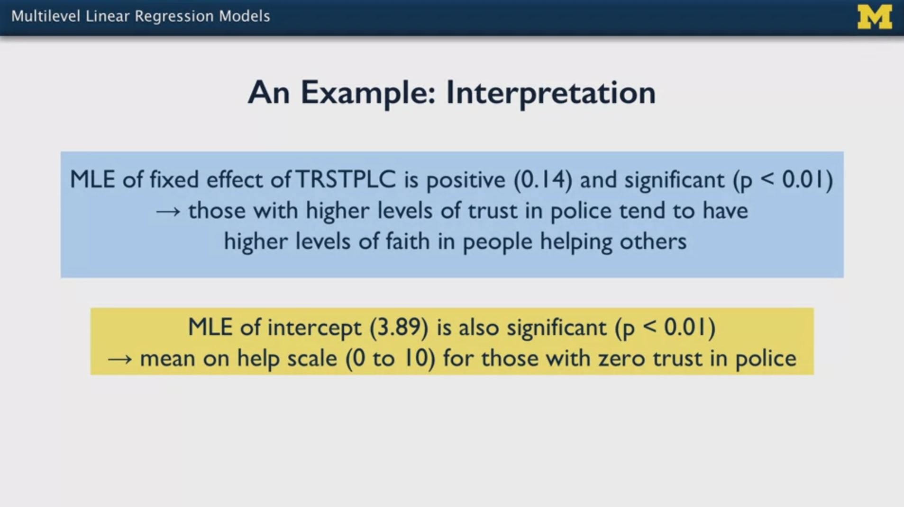


Additionally, we need to check all assumptions of the model, i.e., **model diagnostics**:


### 3.2 Multilevel Logistic Regression Models - Binary Dependent Variables (Outcome)

The multi-level logistic regression model is equivalent to the linear regression with random effects: we have the same coefficients, but the `logit(p)` of the outcome is the predicted variable (i.e., log-odds). Assumptions and motivations hold.


Model parameter estimation is more difficult; often it is not possible to write closed-form likelihood equations. Thus, these are first approximated and then optimized to obtain the parameter values.

We can use the **likelihood ratio testing** for testing the obtained paramaters (hypothesis tests).

An example is commented in the videos: NHANES dataset, smoker ratio; correlations are assumed within clusters. Always plot first the total proportions by cluster! We can see there if there are large variances -- that would be indicative of within-cluster correlations.

### 3.3 Hiearchical Models Web App from Cal Poly

A web app in which we can compute our own multi-level models in a web GUI. The results are shown in tables and plots. Also, case studies are provided (i.e., examples).

[Hiearchical Models Web App](http://shiny.calpoly.sh/Hierarchical_Models/)

### 3.4 What are Marginal Models and Why Do We Fit Them?

As an alternative to multi-level models, **marginal models** can be used with dependent data, too. Marginal models do not account random effects, but they model within-cluster correlations.

The goal is that the standard errors reflect the clustering so that we don't fall into understatements.

We don't allow coefficients to randomly vary across clusters; instead, overall relationships are looked and the standard errors are computed so that they reflect the dependencies.

Example: subject measurements across time

- A multilevel model would yield a regression line for each subject across the time
- A marginal model yields a unique overall regression line for all subjects across the time

So, as far as I understandd, the fit is like in an ordinary linear regression? The main difference, as I understand, is that the covariance matrix of the predictions is modelled?

Marginal models are used when

- We have clusters
- We have no interest in modelling between-subject or between-cluster variance

### 3.5 Marginal Linear Regression Models - Continuous Dependent Variables (Outcome)

The **Generalized Estimating Equations (GEE)** are used to compute linear regression with marginal models.

The following slide summarizes the model:


Variables and notation:

- `i`: cluster `i` (recall, it can be a subject)
- `p`: independent variables
- `y_ti`: outcome for time point `t` within cluster `i`
- `y_i`: all `n_i` measurements of the outcome within cluster `i`; the mean value is the result of multiplying the independent variable matrix with the estimated parameter vector: `X_i * B`
- `V_i`: variance matrix associated with `y_i`

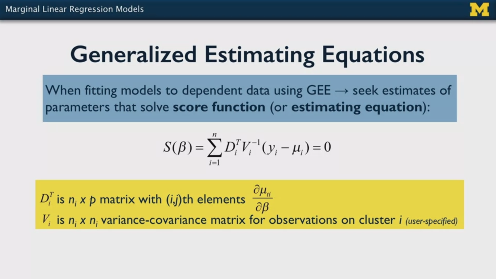


The key idea, as I understand, is the choice of the variance matrix structure; instead of working with the variance, it is worked eauivalently with the correlations. The structure can be:

- Independence: independent observations, no correlations
- Exchangeable: constant correlation of observations in the same cluster
- Auto-regression (first order): deyaing correlation over time
- Unstructured: generalized structure, any correlations of observations

We choose different strcutures for the variance/correlation matric and the **QIC** value of each variance structure is computed; the we select the structure that yields the **lowest value of QIC, because it is associated to the best fit**.

### 3.6 Marginal Logistic Regression - Binary Dependent Variables (Outcome)

The **Generalized Estimating Equations (GEE)** already account for non-normal distirbutions, thus we can work with binary outcomes.

The assumptions and notes done for the linear regression with margin models apply here, too.

Since in logistic repression we are predicting log-odds or `logit(p)`, we need to invert it to get the final parameters using the sigmoid:

`mu_ti = E(y_ti | X_ti) = sigmoid(X_ti * B) = exp(X_ti * B) / (1 + exp(X_ti * B))`

Binary variables follow a Bernoulli distribution; we know that those variables the variance can be obtained with the mean:

`mean = p -> variance = p(1-p)`

Thus, we just need to choose the structure of the variance/correlation matrix for optimization and the model is fit.

The estimated parameters are very simiar to the ones in multi-level modelling approach. The main difference is that in the multi-level approach we model random effects and account for between-subject differences. In the marginal model with GEE the overall variance is modelled, without evaluating between-subject variations.

### 3.7 Python Lab: Multi-Level and Marginal Models for Dependent Data

I have two notebooks covering multi-level and marginal models for dependent data:

- `./lab/03_Marginal_and_Multilevel_Models.ipynb`
- `./lab/04_Marginal_and_Multilevel_Models_NHANES.ipynb`

The second one (`04`) is more applied and uses the NHANES dataset. The reader should use it for more realistic bluesprints. However, I copy here the first (`03`), since it contains the most basic commands and comparisons.

Note that this week 3 covering multi-level and marginal models is poorer that I expected - the quality of the explanations is not good, and the level of detail is lower than usual; therefore, I won't extend with that topic. The code snippets here are just and introduction.

In contrast to ordinary linear and logistic regression, these models make the assumption that the variables are somehow correlated; that can be due to:

- Correlations within clusters; that happens when a clustered complex sample is done by dividing in neighborhoods, etc.
- Repeated measures along the time, typical in longitudinal studies that measure variable evolution during time.

Marginal and multi-level models differentiate from each other in these aspects:

- Multi-level models use random coefficients, i.e., variances between clusters (subject, neighborhood, etc.) are captured as random variables or effects; in addition to them, we also have the regular fixed effects or constant coefficients. All in all, the variance of the random effects is estimated. Thus, as a result, each cluster has its own model.
- Marginal models do not have random coefficients; instead, they have the regular linear/lohgistic regression parameters or coefficients. However, the variance between the variables is also computed to adjust the standard error of the coefficients. This allows for a more realistic inference (i.e., hypothesis testing or confidence interval computation). Additionally, that variance is computed overall, i.e., between-cluster variations are not computed, as it is done by multi-level models.

The notebook `./lab/03_Marginal_and_Multilevel_Models.ipynb` uses the dataset from this publication:

> Anderson, D., Oti, R., Lord, C., and Welch, K. (2009). Patterns of growth in adaptive social abilities among children with autism spectrum disorders. Journal of Abnormal Child Psychology, 37(7), 1019-1034.

Variables:

- AGE: the age of a child which (2-13).
- VSAE: child's socialization.
- SICDEGP: expressive language group at age two (1:low - 3:high).
- CHILDID: unique child ID.

Note that we have multiple measurements per child.

Overview of contents:

1. Multi-level Model
    - 1.1 Significance Testing - Comparison to Regular Linear Regression
2. Marginal Model
    - 2.1 Comparison of Model Parameters and Standard Errors

```python

# Import the libraries that we will need for the analysis
import csv 
import numpy as np
import pandas as pd
import statsmodels.api as sm
import seaborn as sns
from sklearn import linear_model
import matplotlib.pyplot as plt
import patsy
from scipy.stats import chi2 # for sig testing
from IPython.display import display, HTML # for pretty printing

# Read in the Autism Data
dat = pd.read_csv("autism.csv")
# Drop NA's from the data
dat = dat.dropna()

dat.head()
dat.describe()
sns.histplot(dat['vsae'])

### --- 1. Multi-level Model

# Build the model
# The formula follows the same syntax as in R
#   V1*V2 == V1 + V2 + V1V2
#   V1V2 is the interaction betweem variables, aka V1:V2
# C(): treat as categorical even though it is an integer
#   categorical variables are transformed into dummy variables: one binary variable per level
# re_formula: random effects formula
#   if we say '1 + age' the random intercept is computed, but it does not make sense
#   for ager = 0 to have any value, thus we remove the intercept;
#   besides, we'd have convergence issues
# I understand that the re_formula is the level 2 equation for the random effects?
mlm_mod = sm.MixedLM.from_formula(
    formula = 'vsae ~ age * C(sicdegp)', 
    groups = 'childid', 
    re_formula= "0 + age", 
    data=dat
)
# Run the fit
mlm_result = mlm_mod.fit()
# Print out the summary of the fit
mlm_result.summary()

# Age as the variable is always dangerous in relation to the intercept
# Example: here, intercept can be interpreted as 
# the mean socialization 
# when a child in the first expressive language group is zero years old
# Thus, to improve the interpretation we center the variable
dat["age"] = dat.groupby("childid")["age"].transform(lambda x: x - x.mean())

# Refit the model, again, without the random intercepts
# Now, age is centered around 0
# But 0 means the original mean: 5.77
mlm_mod = sm.MixedLM.from_formula(
    formula = 'vsae ~ age * C(sicdegp)', 
    groups = 'childid', 
    re_formula="0 + age", 
    data=dat
)
# Run the fit
mlm_result = mlm_mod.fit()
# Print out the summary of the fit
mlm_result.summary()

### --  1.1 Significance Testing - Comparison to Regular Linear Regression

# Random Effects Mixed Model
mlm_mod = sm.MixedLM.from_formula(
    formula = 'vsae ~ age * C(sicdegp)', 
    groups = 'childid', 
    re_formula="0 + age", 
    data=dat
)

# OLS model - no mixed effects
ols_mod = sm.OLS.from_formula(
    formula = "vsae ~ age * C(sicdegp)",
    data = dat
)

# Run each of the fits
mlm_result = mlm_mod.fit()
ols_result = ols_mod.fit()

# Print out the summary of the fit
print(mlm_result.summary())
print(ols_result.summary())

### --- 2. Marginal Model

# Fit the exchangable covariance GEE
model_exch = sm.GEE.from_formula(
    formula = "vsae ~ age * C(sicdegp)",
    groups="childid",
    cov_struct=sm.cov_struct.Exchangeable(), 
    data=dat
    ).fit()

# Fit the independent covariance GEE
model_indep = sm.GEE.from_formula(
    "vsae ~ age * C(sicdegp)",
    groups="childid",
    cov_struct = sm.cov_struct.Independence(), 
    data=dat
    ).fit()

# We cannot fit an autoregressive model, but this is how 
# we would fit it if we had equally spaced ages
# model_indep = sm.GEE.from_formula(
#     "vsae ~ age * C(sicdegp)",
#     groups="age",
#     cov_struct = sm.cov_struct.Autoregressive(), 
#     data=dat
#     ).fit()

### --- 2.1 Comparison of Model Parameters and Standard Errors

# Construct a datafame of the parameter estimates
# and their standard errors
x = pd.DataFrame(
    {
        "OLS_Params": ols_result.params,
        "OLS_SE": ols_result.bse,
        "MLM_Params": mlm_result.params,
        "MLM_SE": mlm_result.bse,
        "GEE_Exch_Params": model_exch.params, 
        "GEE_Exch_SE": model_exch.bse,
        "GEE_Indep_Params": model_indep.params, 
        "GEE_Indep_SE": model_indep.bse
    }
)
# Ensure the ordering is logical
x = x[["OLS_Params", "OLS_SE", "MLM_Params", "MLM_SE", "GEE_Exch_Params", 
       "GEE_Exch_SE", "GEE_Indep_Params", "GEE_Indep_SE"]]
# Round the results of the estimates to two decimal places
x = np.round(x, 2)
# Print out the results in a pretty way
display(HTML(x.to_html()))

```

## 4. Special Topics

### 4.1 Other Types of Dependent Variables

Some minor comments and links are provided to other typed of dependent variables (outcomes):

- Multinonial response models: categorical response/outcome variables with more than 2 levels
- Ordinal responses: categorical response/outcome variables with ordered levels, even though the distances between levels are unknown (e.g., Likert scalas in questionnaires).
- Count responses: integers are the outcome.
- Time to event response: Time to event data describes how long it takes for an event occurs. One of the most common examples is time until death being used as an outcome to assess the effectiveness of a new therapy or treatment.

### 4.2 Should We Use Survey Weights When Fitting Models?

Survey weights can remove the bias introduced by the design of the study: if certain subject groups are less represented in the sample in proportion to their presence in the real population, the corresponding weight is assigned to each of those subjects (i.e., the weight would increase its effect). So with weights it is possible to get **the model parameters of an unbiased dataset**.

However, using weights is not enough. We still need to define/specify a correct model and we need to use it (e.g., carry out inferences) properly:

- are the correct variables in the model?
- is it linear the relationship between the variables or a curve?
- ...

Important notes:

- It is possible that the correct model of the biased dataset (without weights) is not valid for the unbiased dataset (with weights).
- Using weights inflates the standard error of the coefficients.

Therefore, in practice, the general suggestion is the following:

1. Define the model correctly.
2. Fit the model without weights.
3. Fut the model with weights.
4. Now, two options:
   - If the coefficients of both are similar but the standard errors are larger for the weighted case, report the unweighted case.
   - If the coefficients are different, report the weighted case.

That follows the quote: "All models are wring, but some are useful". In fact, we don't know truly when a model is correct.

### 4.3 Bayesian Approaches to Statistics and Modeling: Introduction

There are two main approaches for modeling the data:

- The **Frequentist** approach, which is the one used in these courses until now: we have a population, we sample it (randomly) and compute parameters as constants: mean, proportion, etc. The approach considers that if we would run that infinitely we could get the true parameters. Thus, for a sample, the standard error of the parameters can be computed, which is the estimated spread of the sampling distirbution. At the end, we have point estimates and that's it.
- The **Bayesian** approach does not yield point estimates of the parameters, but it rather produces distirbutions of the parameters which are updated as more data comes in.

Example: we want to estimate the IQ scores at the university:

1. First, we define a **prior** belief of the distribution, e.g. `N(mean=100,std=10)`. It does not matter if it's not correct.
2. We start collecting data of IQs: 125, 115, 115, 120, 125, 117, ... We see that our Gaussian starts shifting to the right and shrinking as we get more data (because we are more certain and the measurements are more centered).
3. With the new data we **update** our belief. Thus, the **posterior** belief or distirbution is generated.
4. We repeat steps 2 and 3 using our last posterior as our new prior.


Note that the posterior model or distirbution is very powerfful: in contrast to the frequestist approach, we can compute the **credible interval** in which 95% of the IQs lie in our model. In the frequentist approach, we woul compute the **confidence interval**, but it is not the same: the confidence inteval tells us the interval in which the point estimeate will be 95% of the time if we repeat the process of measuring new equivalent samples many times.

However, the bayesian approach has some drawbacks:

- Unless we use simple beliefs/priors (e.g., the normal), the math gets very complicated very quickly.
- Most models are so complex that we need to use sampling methods: the parameter distributions are not used as parametric models but as histograms.
- They are computationally more expensive.

### 4.4 Bayesian Approaches to Statistics and Modeling: Case Study

We work on a case study: we want to predict a child's IQ based on

- mom's age
- whether mom went to highschool
- mom's IQ

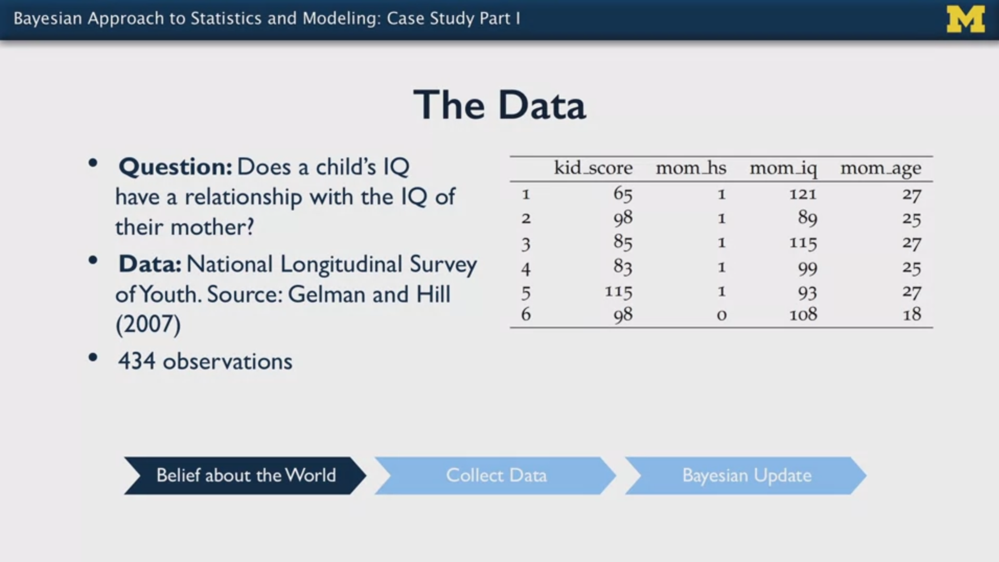

The prediction is modelled as a linear regression (we drop the highschool variable):

`ChildIQ = beta_0 + beta_1 * MomIQ + beta_2 * MomAge`

All parameters of the model are a distirbution!

Now, we need to define: (1) the distirbution (2) and our beliefs (prior) on its parameters: belief and uncertainty.

Any prior is valid, but we need to base them in reasons; each scientist can have different priors -- that's OK: priors are subjective, specially at the beginning. The more uncertain we are, the more spread we add to the distributions. If we can get information from other sources (e.g., papers, experts, etc.) to make better educated guesses, perfect. Example:

- `beta_0 = N(0,20)`: we consider there is not intercept, but we're not sure.
- `beta_1 = N(1,5)`: we thinks the mom's IQ can be the most relevant predictor.
- `beta_2 = N(0,5)`: we think the mom's age should not have an effect.

The regression model is then:

`ChildIQ ~ N(beta_0 + beta_1 * MomIQ + beta_2 * MomAge, sigma_error)`.

Note that it is a distirbution itself! The mean is the regression line and we have `sigma_error` as the spread of the model (i.e., the standard deviation).

To fit the model, [Stan](https://mc-stan.org) is used: a domain specific language for bayesian statistics which can be interfaced with python. However, no code is shown, just the results.

#### Parameter Estimates after Fitting the Model

In the frequentist approach we have one point testimate and its standard error; now, we have a complete distirbution for each parameter! These distributions are computed as histograms after sampling the underlying distributions, since parametric computation would be very expensive.

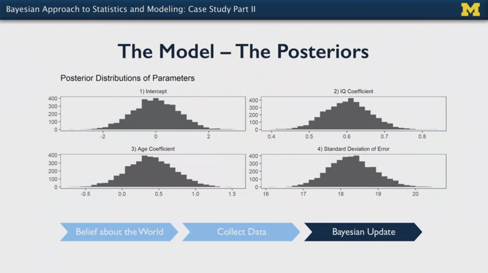

Having a complete distribution/histogram is very powerful: it gives us a lot of information: 

- If we make a simplified use of it, we can always take the mean (and std. deviation) of the histogram of each parameter and estimate the `ChildIQ`.
- By observing each distribution, we can see how important or significant a parameter is: if the 0 value is contained in a cenetered region of the histogram, then, it could be that tht parameter is not significant, i.e., it has no effetct in the outcome.

We can plot the samples of the parameter distributions against each other to see whether there is any relationship. In our case, we see visually that there is no colinearity -- that is good!

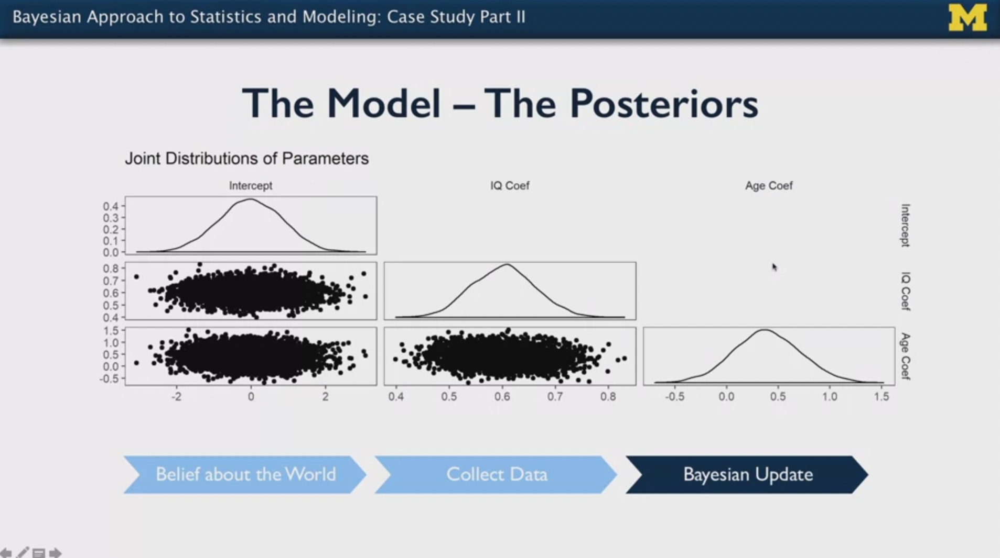

We can plot the so called **normalized posterior intervals**: as far as I understand, we simulate the moddel for each observation and plot where the observed point is in the expected distribution; each time the expected distribution is different, but they are nomalized to the range `[-1,1]`. Red points lie outside the 95% credible intervals.

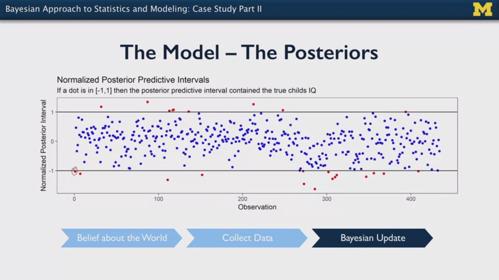

A very important plot is the **posterior predictive check**: it plots the outcome distribution of each simulation and the outcome distribution of the real data.

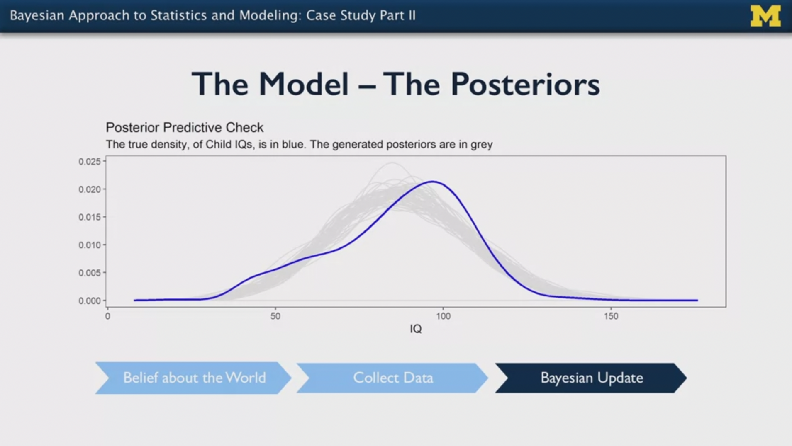

In the plot we see some improvements/differences we should consider:

- The real distirbution is skewed.
- There is a thick tail on the left: we underpredict the occurrences around IQ 50 and overpredict IQs around 75.

Next section explains what is done to address that.

#### Improving the Model

We define 6 models in total, as follows:

- According to the until now unused high school binary variable: 2x
- We group IQs in 3 clusters: low (< 85), medium (85-115), high (>115)

Each model has its own parameters, which are again distributions. It is like a multi-level regression. Additionally, we allow the distributions to be *skew-normal*, not only normal.

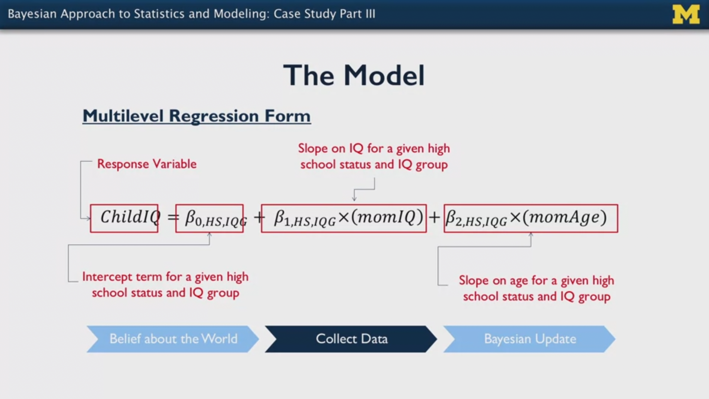

Thus, we get a lot of parameter distributions; by using them, we sample from each off the 6 models and we get our final response distribution. That is better than the original one.

Next figure shown the 6 intercepts of teh 6 models, all centered around 0; note that the larger the spread, the larger the uncertainty.

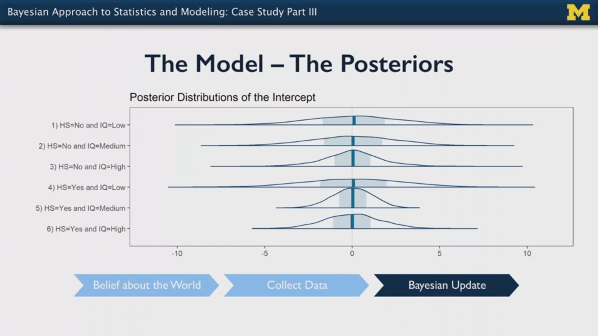

The **posterior predictive check** of the improved model looks better:

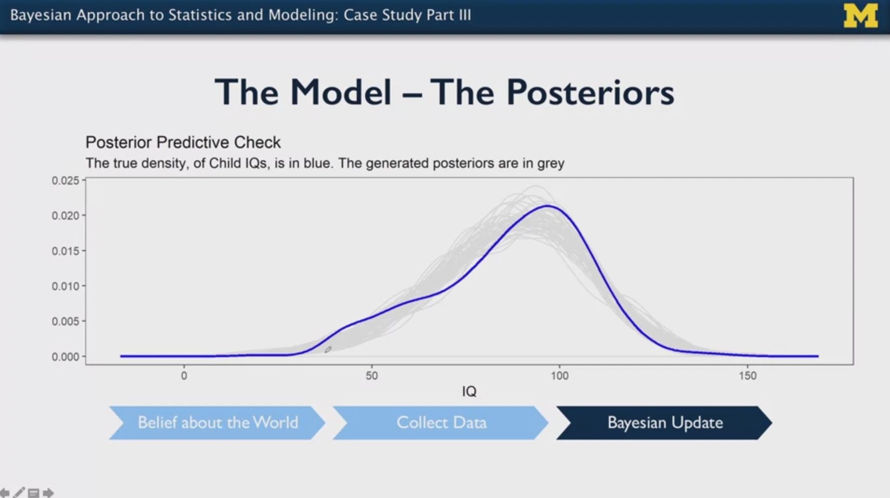

### 4.5 Forum Question

#### Question

Hello everybody,

In the video Bayesian Approaches Case Study: Part II (min 11 approx), the instructor says that normalized posterior intervals are plotted for each observation. 

I'm a bit confused with the explanation: A simulation is done for each data-point, i.e., we get an outcome distribution for each data-point after sampling our prior prameter distributions? Or instead, a simulation is done after fitting the entire dataset and then each datapoint yields a distribution, because the model is a linear combination of distributions?

Thank you,

Mikel

#### Answer

Hi Mikel :)

This video from Ben Lambert does a great job of walking through the process...

https://www.youtube.com/watch?v=TMnXQ6G6E5Y&list=PLwJRxp3blEvZ8AKMXOy0fc0cqT61GsKCG

The video is part of a series...

https://www.youtube.com/playlist?list=PLwJRxp3blEvZ8AKMXOy0fc0cqT61GsKCG

The series roughly follows the content of Lambert's text - A Student's Guide to Bayesian Statistics, which is also excellent.

Did the video address your question?  Please let me know!

Best, Brian

### 4.6 Python Lab - `./lab/05_Bayesian_Framework.ipynb`

The notebook from last week came out of the blue: in the explanation viddeo they assume some concepts were explained -- but they were not.

All in all, the notebook explains how to apply Bayesian statistics: a prior belief is updated with observations to better represent the reality.

I won't paste the code here, since I see no real use with such a tiny introduction.

Overview of contents from `./lab/05_Bayesian_Framework.ipynb`:

0. Definitions
1. Example 1: Coin Tosses
2. Example 2: IQ Values at University